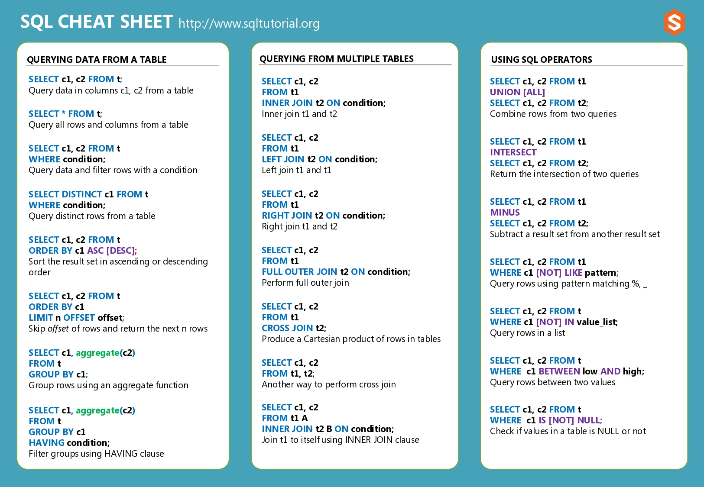
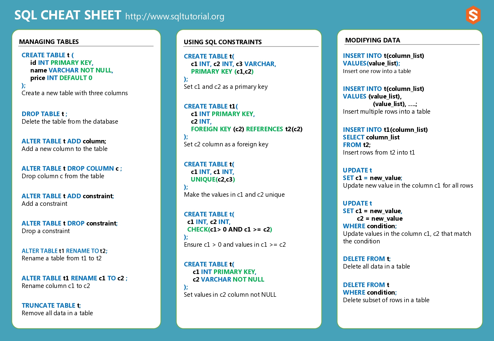
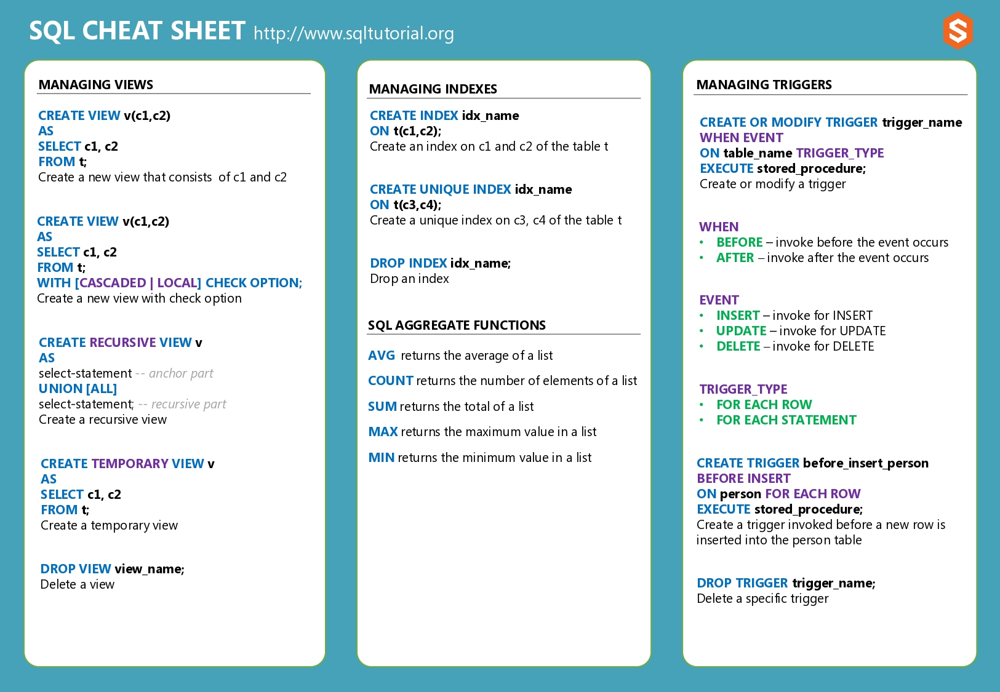
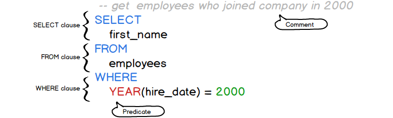

| **Inicio**            | **Siguiente 2**            |
| --------------------- | -------------------------- |
| [🏠](../../README.md) | [⏩](./2_Consultas_SQL.md) |

---

## **Índice**

| Temario                                                                |
| ---------------------------------------------------------------------- |
| [1. ¿Qué es SQL?](#1-¿qué-es-sql)                                      |
| [2. Base de datos de muestra SQL](#2-base-de-datos-de-muestra-sql)     |
| [3. Sintaxis SQL](#3-sintaxis-sql)                                     |
| [4. SQL SELECT](#4-sql-select)                                         |
| [5. SQL ORDER BY](#5-sql-order-by)                                     |
| [6. SQL DISTINCT](#6-sql-distinct)                                     |
| [7. SQL LIMIT](#7-sql-limit)                                           |
| [8. SQL FETCH](#8-sql-fetch)                                           |
| [9. SQL WHERE](#9-sql-where)                                           |
| [10. Operadores de comparación SQL](#10-operadores-de-comparación-sql) |

---

# **Tutorial de SQL**






## **1. ¿Qué es SQL?**

**Resumen :** Le presentaremos el lenguaje SQL, analizaremos el SQL estándar y algunos dialectos SQL populares.

**Introducción al lenguaje SQL**

SQL es un lenguaje de programación diseñado para gestionar datos almacenados en un sistema de gestión de bases de datos relacionales (RDBMS).

SQL significa lenguaje de consulta estructurado. Se pronuncia como `/ˈɛs kjuː ˈɛl/ o /ˈsiːkwəl/`.

SQL consta de un lenguaje de definición de datos, un lenguaje de manipulación de datos y un lenguaje de control de datos.

- El lenguaje de definición de datos se ocupa de la creación y modificación del esquema, por ejemplo, la instrucción `CREATE TABLE` le permite crear una nueva tabla en la base de datos y la instrucción `ALTER TABLE` cambia la estructura de una tabla existente.

- El lenguaje de manipulación de datos proporciona las construcciones para consultar datos como la instrucción `SELECT` y para actualizar datos como las instrucciones `INSERT` , `UPDATE` y `DELETE`.

- El lenguaje de control de datos consta de declaraciones que tratan de la autorización y la seguridad del usuario, como las declaraciones `GRANT` y `REVOKE`.

**Estándar SQL**

SQL fue uno de los primeros lenguajes de bases de datos comerciales desde 1970. Desde entonces, diferentes proveedores de bases de datos implementaron SQL en sus productos con algunas variaciones. Para lograr una mayor conformidad entre los proveedores, el American Standards Institute (ANSI) publicó el primer estándar SQL en 1986.

Luego, `ANSI` actualizó el estándar SQL en 1992, conocido como SQL92 y SQL2, y nuevamente en 1999 como SQL99 y SQL3. Cada vez, `ANSI` agregó nuevas funciones y comandos al lenguaje SQL.

El estándar SQL ahora lo mantienen tanto `ANSI` como la Organización Internacional de Estándares como estándar `ISO/IEC 9075`. El último estándar de versión es `SQL:2011`.

El estándar SQL formaliza las estructuras y comportamientos de sintaxis SQL en todos los productos de bases de datos. Se vuelve aún más importante para las bases de datos de código abierto como `MySQL` y `PostgreSQL` , donde los `RDBMS` son desarrollados principalmente por comunidades y no por grandes corporaciones.

**Dialectos SQL**

La comunidad solicita constantemente nuevas características y capacidades que aún no existen en el estándar SQL; por lo tanto, incluso con el estándar SQL implementado, existen muchos dialectos SQL en varios productos de bases de datos.

Debido a que `ANSI` e `ISO` aún no han desarrollado estas importantes características, los proveedores (o comunidades) de `RDBMS` son libres de inventar su propia estructura de sintaxis nueva.

**Los siguientes son los dialectos más populares de SQL:**

- **PL/SQL** significa lenguaje procedimental/SQL. Está desarrollado por Oracle para la base de datos Oracle .

- **Transact-SQL o T-SQL** es desarrollado por Microsoft para Microsoft SQL Server .

- **PL/pgSQL** significa lenguaje de procedimiento/PostgreSQL que consta de dialecto SQL y extensiones implementadas en PostgreSQL.

- **MySQL** tiene su propio lenguaje de procedimientos desde la versión 5. Tenga en cuenta que MySQL fue adquirido por Oracle.

[🔼](#índice)

---

## **2. Base de datos de muestra SQL**

**Resumen :** Aprenderá sobre una base de datos de muestra SQL llamada [Recursos_Humanos](../../Data/Recursos_Humanos.sql)
que administra los datos de recursos humanos de las pequeñas empresas.

El siguiente diagrama de base de datos ilustra la base de datos de ejemplo de Recursos Humanos:


La base de datos de muestra de recursos humanos tiene siete tablas:

- La **employees** esta tabla almacena los datos de los empleados.

- La **jobs** esta tabla almacena los datos del puesto, incluido el título del puesto y el rango salarial.

- La **departments** esta tabla almacena datos del departamento.

- La **dependents** esta tabla almacena los dependientes del empleado.

- La **locations** esta tabla almacena la ubicación de los departamentos de la empresa.

- La **countries** esta tabla almacena los datos de los países donde la empresa realiza negocios.

- La **regions** esta tabla almacena los datos de regiones como Asia, Europa, América, Medio Oriente y África. Los países están agrupados en regiones.

La siguiente imagen muestra los nombres de las tablas y sus registros.

| **Table**   | **Rows** |
| ----------- | -------- |
| employees   | 40       |
| dependents  | 30       |
| departments | 11       |
| jobs        | 11       |
| locations   | 7        |
| countries   | 25       |
| regions     | 4        |

Normalmente, necesita instalar un sistema de gestión de bases de datos relacionales (RDBMS) para trabajar con SQL.

Si ha trabajado con un `RDBMS` como MySQL, PostgreSQL, Oracle Database y SQL Server, puede utilizar el siguiente script para crear la base de datos de muestra en una de estas bases de datos. [Recursos_Humanos](../../Data/Recursos_Humanos.sql)

[🔼](#índice)

---

## **3. Sintaxis SQL**

**Resumen :** Le presentaremos la sintaxis SQL que le ayudará a comprender los detalles de las declaraciones SQL.

SQL es un lenguaje declarativo, por lo tanto, su sintaxis se lee como un lenguaje natural. Una declaración SQL comienza con un verbo que describe la acción, por ejemplo, `SELECT`, `INSERT`, `UPDATE` o `DELETE`. Después del verbo están el sujeto y el predicado.

Un predicado especifica condiciones que pueden evaluarse como verdaderas, falsas o desconocidas.

Consulte la siguiente declaración SQL:

```
SELECT
    first_name
FROM
    employees
WHERE
    YEAR(hire_date) = 2000;
```

Como puede ver, se lee como una oración normal.

Obtenga los nombres de los empleados que fueron contratados en 2000.

`SELECT first_name`, `FROM employees` y `WHERE` son cláusulas de la declaración SQL. Algunas cláusulas son obligatorias, por ejemplo, las cláusulas `SELECT` y `FROM` , mientras que otras son opcionales, como la cláusula `WHERE`.



Debido a que SQL fue diseñado específicamente para personas sin conocimientos técnicos, es muy simple y fácil de entender. Para escribir una declaración SQL, sólo necesita decir lo que quiere en lugar de cómo lo quiere, como otros lenguajes imperativos como `PHP`, `Java` y `C++`.

SQL es un lenguaje fácil de usar porque está dirigido principalmente a usuarios que realizan consultas `ad hoc` y generan informes.

Hoy en día, SQL es utilizado por personas altamente técnicas como analistas de datos, científicos de datos, desarrolladores y administradores de bases de datos.

**Comandos SQL**

SQL se compone de muchos comandos. Cada comando SQL normalmente termina con un punto y coma (;). Por ejemplo, los siguientes son dos comandos SQL diferentes separados por un punto y coma (;).

```
SELECT
    first_name, last_name
FROM
    employees;

DELETE FROM employees
WHERE
    hire_date < '1990-01-01';
```

SQL usa el punto y coma (;) para marcar el final de un comando.

Cada comando se compone de tokens que pueden ser literales, palabras clave, identificadores o expresiones. Los tokens están separados por espacios, tabulaciones o nuevas líneas.

**Literales**

Los literales son valores explícitos que también se conocen como constantes. SQL proporciona tres tipos de literales: de cadena, numéricos y binarios.

El literal de cadena consta de uno o más caracteres alfanuméricos entre comillas simples, por ejemplo:

```
'John'
'1990-01-01'
'50'
```

`50` es un número. Sin embargo, si lo rodea con comillas simples, por ejemplo `'50'`, SQL lo trata como una cadena literal.

Normalmente, SQL distingue entre mayúsculas y minúsculas con respecto a los literales de cadena, por lo que el valor `'John'` no es el mismo que `'JOHN'`.

Los literales numéricos son la notación entera, decimal o científica, por ejemplo:

```
200
-5
6.0221415E23
```

SQL representa un valor binario usando la notación `x'0000'`, donde cada dígito es un valor hexadecimal, por ejemplo:

```
x'01'
x'0f0ff'
```

**Palabras clave**

SQL tiene muchas palabras clave que tienen significados especiales como `SELECT` , `INSERT` , `UPDATE` , `DELETE` y `DROP`. Estas palabras clave son palabras reservadas, por lo tanto, no puede utilizarlas como nombre de tablas, columnas, índices, vistas, procedimientos almacenados, activadores u otros objetos de base de datos.

**Identificadores**

Los identificadores se refieren a objetos específicos en la base de datos, como tablas, columnas, índices, etc. SQL no distingue entre mayúsculas y minúsculas con respecto a palabras clave e identificadores.

Las siguientes declaraciones son equivalentes.

```
Select  * From employees;

SELECT * FROM EMPLOYEES;

select * from employees;

SELECT * FROM employees;
```

Para que los comandos SQL sean más legibles y claros, usaremos las palabras clave SQL en mayúsculas y los identificadores en minúsculas a lo largo de los tutoriales.

**Comentarios**

Para documentar declaraciones SQL, utilice los comentarios SQL. Al analizar declaraciones SQL con comentarios, el motor de la base de datos ignora los caracteres de los comentarios.

Un comentario se indica con dos guiones consecutivos ( --) que le permiten comentar la línea restante. Vea el siguiente ejemplo.

```
SELECT
    employee_id, salary
FROM
    employees
WHERE
    salary < 3000;-- employees with low salary
```

Este es un comentario SQL.

```
-- employees with low salary
```

Para documentar el código que puede abarcar varias líneas, utilice la notación de estilo `C` multilínea `( /**/)` como se muestra en la siguiente declaración:

```
/* increase 5% for employees whose salary is less than 3,000 */

UPDATE employees
SET
    salary = salary * 1.05
WHERE
    salary < 3000;
```

En este tutorial, le presentamos la sintaxis SQL que le ayuda a comprender cada componente de una declaración SQL.

[🔼](#índice)

---

## **4. SQL SELECT**

**Resumen :** Aprenderá a utilizar la declaración `SELECT` para consultar datos de una sola tabla.

**Introducción a la declaración SELECT**

La declaración `SELECT` selecciona datos de una o más tablas. A continuación se muestra la sintaxis básica de la declaración `SELECT` que selecciona datos de una sola tabla.

```
SELECT
    select_list
FROM
    table_name;
```

En esta sintaxis:

- Primero, especifique una lista de columnas separadas por comas de la tabla en la cláusula `SELECT`.

- Luego, especifique el nombre de la tabla en la cláusula `FROM`.

Al evaluar la declaración `SELECT`, el sistema de base de datos evalúa primero la cláusula `FROM` y luego la cláusula `SELECT`. Es como de una tabla, selecciona datos de estas columnas.

El punto y coma (;) no forma parte de una consulta. El servidor de la base de datos lo utiliza para separar dos declaraciones SQL.

Por ejemplo, si ejecuta dos declaraciones SQL `SELECT`, debe separarlas mediante punto y coma `( ;)`.

Si desea consultar datos de todas las columnas de la tabla, puede utilizar el operador asterisco `(*)` en su lugar si especifica todos los nombres de las columnas:

`SELECT * FROM table_name;`

SQL no distingue entre mayúsculas y minúsculas. Por lo tanto, las palabras clave `SELECT` y `select` tienen el mismo significado.

Por convención, usaremos letras mayúsculas para las palabras clave SQL, como `SELECT` y `FROM` y letras minúsculas para identificadores como nombres de tablas y columnas. Esta convención hace que las declaraciones SQL sean más legibles.

**Ejemplos de sentencias `SELECT` de SQL**

Usaremos la tabla `employees` de la base de datos de muestra con fines de demostración.


**1) SQL SELECT: ejemplo de selección de datos de todas las columnas**

El siguiente ejemplo utiliza la declaración `SELECT` para obtener datos de todas las filas y columnas de la tabla `employees`:

`SELECT * FROM employees;`

A continuación se muestran los conjuntos de resultados devueltos por el servidor de la base de datos. Es como una hoja de cálculo que contiene filas y columnas con un encabezado:

| **employee_id** | **first_name** | **last_name** | **email**                        | **phone_number** | **hire_date** | **job_id** | **salary** | **manager_id** | **department_id** |
| --------------- | -------------- | ------------- | -------------------------------- | ---------------- | ------------- | ---------- | ---------- | -------------- | ----------------- |
| 100             | Steven         | King          | steven.king@sqltutorial.org      | 515.123.4567     | 1987-06-17    | 4          | 24000.00   | NULL           | 9                 |
| 101             | Neena          | Kochhar       | neena.kochhar@sqltutorial.org    | 515.123.4568     | 1989-09-21    | 5          | 17000.00   | 100            | 9                 |
| 102             | Lex            | De Haan       | lex.dehaan@sqltutorial.org       | 515.123.4569     | 1993-01-13    | 5          | 17000.00   | 100            | 9                 |
| 103             | Alexander      | Hunold        | alexander.hunold@sqltutorial.org | 590.423.4567     | 1990-01-03    | 9          | 9000.00    | 102            | 6                 |
| 104             | Bruce          | Ernst         | bruce.ernst@sqltutorial.org      | 590.423.4568     | 1991-05-21    | 9          | 6000.00    | 103            | 6                 |
| 105             | David          | Austin        | david.austin@sqltutorial.org     | 590.423.4569     | 1997-06-25    | 9          | 4800.00    | 103            | 6                 |
| 106             | Valli          | Pataballa     | valli.pataballa@sqltutorial.org  | 590.423.4560     | 1998-02-05    | 9          | 4800.00    | 103            | 6                 |
| 107             | Diana          | Lorentz       | diana.lorentz@sqltutorial.org    | 590.423.5567     | 1999-02-07    | 9          | 4200.00    | 103            | 6                 |
| 108             | Nancy          | Greenberg     | nancy.greenberg@sqltutorial.org  | 515.124.4569     | 1994-08-17    | 7          | 12000.00   | 101            | 10                |

...

El `SELECT *` se lee como la estrella seleccionada. La estrella de selección es útil solo para consultas `ad hoc`.

Para el desarrollo de la aplicación, debe evitar el uso de la estrella de selección por el siguiente motivo.

El `select *` devuelve datos de todas las columnas de una tabla. A menudo, la aplicación no necesita datos de todas las columnas sino de una o algunas columnas.

Si utiliza `select *`, la base de datos necesita más tiempo para leer los datos del disco y transferirlos a la aplicación. Esto a menudo da como resultado un rendimiento deficiente si la tabla contiene muchas columnas con muchos datos.

**2) SQL SELECT: selección de datos de columnas específicas**

Para seleccionar datos de columnas específicas, puede especificar la lista de columnas después de la cláusula `SELECT`.

Por ejemplo, lo siguiente selecciona datos de la identificación del empleado, nombre, apellido y fecha de contratación de todas las filas de la tabla `employees`:

```
SELECT
    employee_id,
    first_name,
    last_name,
    hire_date
FROM
    employees;
```

Ahora, el conjunto de resultados incluye sólo cuatro columnas especificadas en la cláusula `SELECT`:

| **employee_id** | **first_name** | **last_name** | **hire_date** |
| --------------- | -------------- | ------------- | ------------- |
| 100             | Steven         | King          | 1987-06-17    |
| 101             | Neena          | Kochhar       | 1989-09-21    |
| 102             | Lex            | De Haan       | 1993-01-13    |
| 103             | Alexander      | Hunold        | 1990-01-03    |
| 104             | Bruce          | Ernst         | 1991-05-21    |
| 105             | David          | Austin        | 1997-06-25    |
| 106             | Valli          | Pataballa     | 1998-02-05    |
| 107             | Diana          | Lorentz       | 1999-02-07    |
| 108             | Nancy          | Greenberg     | 1994-08-17    |
| 109             | Daniel         | Faviet        | 1994-08-16    |
| 110             | John           | Chen          | 1997-09-28    |

...

**3) SQL SELECT – realizar un cálculo simple**

El siguiente ejemplo utiliza la declaración `SELECT` para obtener el nombre, apellido, salario y nuevo salario:

```
SELECT
    first_name,
    last_name,
    salary,
    salary * 1.05
FROM
    employees;
```

La expresión `salary * 1.05` se suma `5%` al salario de cada empleado. De forma predeterminada, SQL utiliza la expresión como encabezado de columna:

| **first_name** | **last_name** | **salary** | **salary \* 1.05** |
| -------------- | ------------- | ---------- | ------------------ |
| Steven         | King          | 24000.00   | 25200.0000         |
| Neena          | Kochhar       | 17000.00   | 17850.0000         |
| Lex            | De Haan       | 17000.00   | 17850.0000         |
| Alexander      | Hunold        | 9000.00    | 9450.0000          |
| Bruce          | Ernst         | 6000.00    | 6300.0000          |
| David          | Austin        | 4800.00    | 5040.0000          |
| Valli          | Pataballa     | 4800.00    | 5040.0000          |
| Diana          | Lorentz       | 4200.00    | 4410.0000          |
| Nancy          | Greenberg     | 12000.00   | 12600.0000         |

...

Para asignar un alias a una expresión o columna, especifique la palabra `AS` clave seguida del alias de la columna de la siguiente manera:

`expression AS column_alias`

Por ejemplo, la siguiente declaración `SELECT` utiliza `new_salary` como alias de columna para la expresión `salary * 1.05`:

```
SELECT
    first_name,
    last_name,
    salary,
    salary * 1.05 AS new_salary
FROM
    employees;
```

**Producción:**

| **first_name** | **last_name** | **salary** | **new_salary** |
| -------------- | ------------- | ---------- | -------------- |
| Steven         | King          | 24000.00   | 25200.0000     |
| Neena          | Kochhar       | 17000.00   | 17850.0000     |
| Lex            | De Haan       | 17000.00   | 17850.0000     |
| Alexander      | Hunold        | 9000.00    | 9450.0000      |
| Bruce          | Ernst         | 6000.00    | 6300.0000      |
| David          | Austin        | 4800.00    | 5040.0000      |
| Valli          | Pataballa     | 4800.00    | 5040.0000      |
| Diana          | Lorentz       | 4200.00    | 4410.0000      |
| Nancy          | Greenberg     | 12000.00   | 12600.0000     |

**Resumen**

- Utilice la declaración `SELECT` para seleccionar datos de una tabla.

- Para seleccionar datos de una tabla, especifique el nombre de la tabla en la cláusula `FROM` y una lista de columnas en la cláusula `SELECT`.

- Es la abreviatura de `SELECT *` para seleccionar todas las columnas de una tabla.

[🔼](#índice)

---

## **5. SQL ORDER BY**

**Resumen :** Le muestra cómo utilizar la cláusula SQL `ORDER BY` para ordenar el conjunto de resultados según criterios específicos en orden ascendente o descendente.

**Introducción a la cláusula ORDER BY**

El `ORDER BY` es una cláusula opcional de la declaración `SELECT`. La cláusula `ORDER BY` le permite ordenar las filas devueltas por la cláusula `SELECT` mediante una o más expresiones de clasificación en orden ascendente o descendente.

A continuación se muestra la sintaxis de la cláusula `ORDER BY`:

```
SELECT
    select_list
FROM
    table_name
ORDER BY
    sort_expression [ASC | DESC];
```

En esta sintaxis:

- Primero, coloque la cláusula `ORDER BY` después de la cláusula `FROM`. La base de datos evaluará la declaración `SELECT` con la cláusula `ORDER BY *` en el siguiente orden: `FROM> SELECT> ORDER BY`.

- En segundo lugar, especifique una expresión de clasificación después de la cláusula `ORDER BY`. La expresión de clasificación especifica los criterios de clasificación.

- En tercer lugar, utilice la opción `ASC` para ordenar el resultado establecido por la expresión de clasificación en orden ascendente y `DESC` para ordenar el resultado establecido por la expresión de clasificación en orden descendente.

Tenga en cuenta que la cláusula `ORDER BY` utiliza la opción `ASC` de forma predeterminada si no utiliza `ASC` o `DESC`.

La cláusula `ORDER BY` también le permite ordenar el conjunto de resultados por múltiples expresiones. En este caso, deberá utilizar una coma para separar dos expresiones de clasificación:

```
SELECT
    select_list
FROM
    table_name
ORDER BY
    sort_expression_1 [ASC | DESC],
    sort_expression_2 [ASC | DESC];
```

En esta sintaxis, la cláusula `ORDER BY` ordena el resultado establecido por el `sort_expression_1` primero y luego ordena el resultado ordenado establecido por el `sort_expression_2`.

Tenga en cuenta que si no especifica la cláusula `ORDER BY`, la declaración `SELECT` no ordenará el conjunto de resultados. Significa que las filas del conjunto de resultados no tienen un orden específico.

**Ejemplos de cláusulas ORDER BY**

Usaremos la tabla `employees` en la base de datos de muestra para la demostración.


**1) Ejemplo de uso de la cláusula `ORDER BY` para ordenar valores en una columna**

La siguiente declaración `SELECT` devuelve los datos de la columna de identificación del empleado, nombre, apellido, fecha de contratación y salario de la tabla `employees`:

```
SELECT
	employee_id,
	first_name,
	last_name,
	hire_date,
	salary
FROM
	employees;
```

| **employee_id** | **first_name** | **last_name** | **hire_date** | **salary** |
| --------------- | -------------- | ------------- | ------------- | ---------- |
| 100             | Steven         | King          | 1987-06-17    | 24000.00   |
| 101             | Neena          | Kochhar       | 1989-09-21    | 17000.00   |
| 102             | Lex            | De Haan       | 1993-01-13    | 17000.00   |
| 103             | Alexander      | Hunold        | 1990-01-03    | 9000.00    |
| 104             | Bruce          | Ernst         | 1991-05-21    | 6000.00    |
| 105             | David          | Austin        | 1997-06-25    | 4800.00    |
| 106             | Valli          | Pataballa     | 1998-02-05    | 4800.00    |
| 107             | Diana          | Lorentz       | 1999-02-07    | 4200.00    |
| 108             | Nancy          | Greenberg     | 1994-08-17    | 12000.00   |
| 109             | Daniel         | Faviet        | 1994-08-16    | 9000.00    |
| 110             | John           | Chen          | 1997-09-28    | 8200.00    |

...

Como puede ver claramente en el resultado, las filas no tienen ningún orden.

El siguiente ejemplo utiliza la cláusula `ORDER BY` para ordenar los empleados por nombres en orden alfabético:

```
SELECT
	employee_id,
	first_name,
	last_name,
	hire_date,
	salary
FROM
	employees
ORDER BY
	first_name;
```

| **employee_id** | **first_name** | **last_name** | **hire_date** | **salary** |
| --------------- | -------------- | ------------- | ------------- | ---------- |
| 121             | Adam           | Fripp         | 1997-04-10    | 8200.00    |
| 115             | Alexander      | Khoo          | 1995-05-18    | 3100.00    |
| 103             | Alexander      | Hunold        | 1990-01-03    | 9000.00    |
| 193             | Britney        | Everett       | 1997-03-03    | 3900.00    |
| 104             | Bruce          | Ernst         | 1991-05-21    | 6000.00    |
| 179             | Charles        | Johnson       | 2000-01-04    | 6200.00    |
| 109             | Daniel         | Faviet        | 1994-08-16    | 9000.00    |
| 105             | David          | Austin        | 1997-06-25    | 4800.00    |
| 114             | Den            | Raphaely      | 1994-12-07    | 11000.00   |
| 107             | Diana          | Lorentz       | 1999-02-07    | 4200.00    |

...

Ordena `ORDER BY` las filas por los valores de la columna `first_name`.

**2) Ejemplo de uso de la cláusula ORDER BY para ordenar valores en varias columnas**

El siguiente ejemplo utiliza la cláusula `ORDER BY` para ordenar los empleados por el nombre en orden ascendente y el apellido en orden descendente:

```
SELECT
	employee_id,
	first_name,
	last_name,
	hire_date,
	salary
FROM
	employees
ORDER BY
	first_name,
	last_name DESC;
```

| **employee_id** | **first_name** | **last_name** | **hire_date** | **salary** |
| --------------- | -------------- | ------------- | ------------- | ---------- |
| 121             | Adam           | Fripp         | 1997-04-10    | 8200.00    |
| 115             | Alexander      | Khoo          | 1995-05-18    | 3100.00    |
| 103             | Alexander      | Hunold        | 1990-01-03    | 9000.00    |
| 193             | Britney        | Everett       | 1997-03-03    | 3900.00    |
| 104             | Bruce          | Ernst         | 1991-05-21    | 6000.00    |
| 179             | Charles        | Johnson       | 2000-01-04    | 6200.00    |
| 109             | Daniel         | Faviet        | 1994-08-16    | 9000.00    |
| 105             | David          | Austin        | 1997-06-25    | 4800.00    |
| 114             | Den            | Raphaely      | 1994-12-07    | 11000.00   |
| 107             | Diana          | Lorentz       | 1999-02-07    | 4200.00    |
| 118             | Guy            | Himuro        | 1998-11-15    | 2600.00    |

...

En este ejemplo, la cláusula `ORDER BY` ordena el resultado establecido por el nombre en orden ascendente y luego ordena el resultado ordenado establecido por el apellido en orden descendente.

Observe el cambio de posición de dos empleados: `Alexander Khooy` `Alexander Hunolden` el conjunto de resultados.

**3) Uso de la cláusula `ORDER BY` para ordenar valores en un ejemplo de columna numérica**

El siguiente ejemplo utiliza la cláusula `ORDER BY` para ordenar a los empleados por salario de mayor a menor:

```
SELECT
	employee_id,
	first_name,
	last_name,
	hire_date,
	salary
FROM
	employees
ORDER BY
	salary DESC;
```

| **employee_id** | **first_name** | **last_name** | **hire_date** | **salary** |
| --------------- | -------------- | ------------- | ------------- | ---------- |
| 100             | Steven         | King          | 1987-06-17    | 24000.00   |
| 101             | Neena          | Kochhar       | 1989-09-21    | 17000.00   |
| 102             | Lex            | De Haan       | 1993-01-13    | 17000.00   |
| 145             | John           | Russell       | 1996-10-01    | 14000.00   |
| 146             | Karen          | Partners      | 1997-01-05    | 13500.00   |
| 201             | Michael        | Hartstein     | 1996-02-17    | 13000.00   |
| 205             | Shelley        | Higgins       | 1994-06-07    | 12000.00   |
| 108             | Nancy          | Greenberg     | 1994-08-17    | 12000.00   |
| 114             | Den            | Raphaely      | 1994-12-07    | 11000.00   |

...

**4) Ejemplo de uso de `ORDER BY` para ordenar por fechas**

Además de los datos numéricos y de caracteres, puede utilizar la cláusula `ORDER BY` para ordenar filas por fecha. Por ejemplo, la siguiente declaración utiliza la cláusula `ORDER BY` para ordenar los empleados por valores en la columna de `hire_date`:

```
SELECT
	employee_id,
	first_name,
	last_name,
	hire_date,
	salary
FROM
	employees
ORDER BY
	hire_date;
```

| **employee_id** | **first_name** | **last_name** | **hire_date** | **salary** |
| --------------- | -------------- | ------------- | ------------- | ---------- |
| 100             | Steven         | King          | 1987-06-17    | 24000.00   |
| 200             | Jennifer       | Whalen        | 1987-09-17    | 4400.00    |
| 101             | Neena          | Kochhar       | 1989-09-21    | 17000.00   |
| 103             | Alexander      | Hunold        | 1990-01-03    | 9000.00    |
| 104             | Bruce          | Ernst         | 1991-05-21    | 6000.00    |
| 102             | Lex            | De Haan       | 1993-01-13    | 17000.00   |
| 203             | Susan          | Mavris        | 1994-06-07    | 6500.00    |
| 204             | Hermann        | Baer          | 1994-06-07    | 10000.00   |

...

Para ver los empleados que se unieron a la empresa del último al primero, ordene los empleados por fechas de contratación en orden descendente:

```
SELECT
	employee_id,
	first_name,
	last_name,
	hire_date,
	salary
FROM
	employees
ORDER BY
	hire_date DESC;
```

| **employee_id** | **first_name** | **last_name** | **hire_date** | **salary** |
| --------------- | -------------- | ------------- | ------------- | ---------- |
| 179             | Charles        | Johnson       | 2000-01-04    | 6200.00    |
| 113             | Luis           | Popp          | 1999-12-07    | 6900.00    |
| 119             | Karen          | Colmenares    | 1999-08-10    | 2500.00    |
| 178             | Kimberely      | Grant         | 1999-05-24    | 7000.00    |
| 107             | Diana          | Lorentz       | 1999-02-07    | 4200.00    |
| 118             | Guy            | Himuro        | 1998-11-15    | 2600.00    |
| 126             | Irene          | Mikkilineni   | 1998-09-28    | 2700.00    |
| 177             | Jack           | Livingston    | 1998-04-23    | 8400.00    |
| 176             | Jonathon       | Taylor        | 1998-03-24    | 8600.00    |

...

**Resumen**

- Utilice la cláusula `ORDER BY` para ordenar las filas devueltas por la cláusula `SELECT`.

- Utilice la opción `ASC` para ordenar filas en orden ascendente y la opción `DESC` para ordenar filas en orden descendente.

[🔼](#índice)

---

## **6. SQL DISTINCT**

**Resumen :** Aprenderá cómo utilizar el operador `DISTINCT` para eliminar duplicados de un conjunto de resultados.

**Introducción al operador DISTINCT**

Para eliminar filas duplicadas de un conjunto de resultados, utilice el operador `DISTINCT` en la cláusula `SELECT` de la siguiente manera:

```
SELECT DISTINCT
    column1, column2, ...
FROM
    table1;
```

Si usa una columna después del operador `DISTINCT`, el operador `DISTINCT` usa valores en esa columna para evaluar duplicados.

Si usa dos o más columnas, usará `DISTINCT` la combinación de valores en esas columnas para evaluar el duplicado.

> **NOTA**
>
> Tenga en cuenta que `DISTINCT` solo elimina las filas duplicadas del conjunto de resultados. No elimina filas duplicadas en la tabla..

Si desea seleccionar dos columnas y eliminar duplicados en una columna, debe utilizar la cláusula `GROUP BY` en su lugar.

**Ejemplos de DISTINCT SQL**

Usaremos la tabla `employees` de la base de datos de ejemplo para demostrar cómo funciona el operador `DISTINCT`.


**1) Ejemplo de DISTINCT uso del operador SQL en una columna**

La siguiente declaración selecciona los datos salariales de la columna de salario de la tabla `employees` y los ordena de mayor a menor:

```
SELECT
    salary
FROM
    employees
ORDER BY salary DESC;
```

| **salary** |
| ---------- |
| 24000.00   |
| 17000.00   |
| 17000.00   |
| 14000.00   |
| 13500.00   |
| 13000.00   |
| 12000.00   |
| 12000.00   |
| 11000.00   |
| 10000.00   |
| 9000.00    |
| 9000.00    |

...

El conjunto de resultados tiene algunos duplicados. Por ejemplo, 17000, 12000 y 9000.

La siguiente declaración utiliza el operador `DISTINCT` para seleccionar valores únicos de la columna de salario de la tabla `employees`:

```
SELECT
    DISTINCT salary
FROM
    employees
ORDER BY salary DESC;
```

| **salary** |
| ---------- |
| 24000.00   |
| 17000.00   |
| 14000.00   |
| 13500.00   |
| 13000.00   |
| 12000.00   |
| 11000.00   |
| 10000.00   |
| 9000.00    |

Como puede ver, el conjunto de resultados no contiene ningún valor salarial duplicado.

**2) Ejemplo de uso del operador DISTINCT en varias columnas**

La siguiente declaración selecciona la identificación del trabajo y el salario de la tabla `employees`:

```
SELECT
	job_id,
	salary
FROM
	employees
ORDER BY
	job_id,
	salary DESC;
```

| **job_id** | **salary** |
| ---------- | ---------- |
| 1          | 8300.00    |
| 2          | 12000.00   |
| 3          | 4400.00    |
| 4          | 24000.00   |
| 5          | 17000.00   |
| 5          | 17000.00   |
| 6          | 9000.00    |
| 6          | 8200.00    |

...

El conjunto de resultados tiene algunas filas duplicadas, por ejemplo, identificación de trabajo 5 salario 17000. Significa que hay dos empleados con la misma identificación de trabajo y salario.

La siguiente declaración utiliza el operador `DISTINCT` para eliminar los valores duplicados en la identificación del trabajo y el salario:

```
SELECT DISTINCT
	job_id,
	salary
FROM
	employees
ORDER BY
	job_id,
	salary DESC;
```

| **job_id** | **salary** |
| ---------- | ---------- |
| 1          | 8300.00    |
| 2          | 12000.00   |
| 3          | 4400.00    |
| 4          | 24000.00   |
| 5          | 17000.00   |
| 6          | 9000.00    |
| 6          | 8200.00    |

...

Tenga en cuenta que todavía ve el duplicado en la columna `job_id` porque el operador `DISTINCT` usa valores de ambos `job_id` y `salary` para evaluar el duplicado, no solo los valores de la columna `job_id`.

**SQL DISTINCT y NULL**

En la base de datos, `NULL` significa datos desconocidos o faltantes.

A diferencia de valores como números, cadenas, fechas, etc. `NULL` no es igual a nada, ni siquiera a sí mismo. La siguiente expresión devolverá desconocido (o NULL):

`NULL=NULL`

Normalmente, el operador `DISTINCT` trata todos los `NULL` por igual. Por lo tanto, el operador `DISTINCT` conserva sólo uno `NULL` en el conjunto de resultados.

> **NOTA**
>
> Tenga en cuenta que este comportamiento puede ser diferente entre productos de bases de datos..

Por ejemplo, la siguiente declaración devuelve los distintos números de teléfono de los empleados:

```
SELECT DISTINCT phone_number
FROM employees
ORDER BY phone_number;
```

| **phone_number** |
| ---------------- |
| NULL             |
| 515.123.4444     |
| 515.123.4567     |
| 515.123.4568     |
| 515.123.4569     |
| 515.123.5555     |

...

Observe que la consulta devuelve solo uno `NULL` en el conjunto de resultados.

**Resumen**

- Utilice el operador `DISTINCT` en la `SELECT` cláusula para eliminar filas duplicadas del conjunto de resultados.

[🔼](#índice)

---

## **7. SQL LIMIT**

**Resumen :** Aprenderá a utilizar la cláusula `LIMIT` para limitar la cantidad de filas devueltas por una consulta.

**Introducción a la cláusula `LIMIT` de SQL**

Para limitar el número de filas devueltas por una declaración de selección , utilice las cláusulas `LIMIT` y `OFFSET`.

A continuación se muestra la sintaxis de las cláusulas `LIMIT & OFFSET`:

```
SELECT
    column_list
FROM
    table1
ORDER BY column_list
LIMIT row_count OFFSET offset;
```

En esta sintaxis:

- Determina `LIMIT row_countel` número de filas ( `row_count`) devueltas por la consulta.

- La cláusula `OFFSET offset` omite las filas `offset` antes de comenzar a devolverlas.

La cláusula `OFFSET` es opcional. Si lo omite, la consulta devolverá las filas `row_count` de la primera fila devuelta por la cláusula `SELECT`.

Cuando utiliza la cláusula `LIMIT`, es importante utilizar una cláusula `ORDER BY` para garantizar el orden de las filas en el conjunto de resultados.

No todos los sistemas de bases de datos admiten la cláusula `LIMIT`. Por lo tanto, la cláusula `LIMIT` está disponible solo en algunos sistemas de bases de datos, como `MySQL` , `PostgreSQL` , `SQLite` , `Sybase SQL Anywhere` y `HSQLDB`. Si usa SQL Server, puede usar en `SELECT TOP` su lugar.

**Ejemplos de cláusulas LIMIT de SQL**

Usaremos la tabla `employees` de la base de datos de ejemplo para demostrar las cláusulas `LIMIT & OFFSET`.


La siguiente declaración devuelve todas las filas de la tabla `employees` ordenadas por columna `first_name`.

```
SELECT
    employee_id,
    first_name,
    last_name
FROM
    employees
ORDER BY
	first_name;
```

El siguiente ejemplo utiliza la cláusula `LIMIT` para devolver las primeras 5 filas del conjunto de resultados devuelto por la cláusula `SELECT`:

```
SELECT TOP 5
    employee_id,
    first_name,
    last_name
FROM
    employees
ORDER BY
    first_name;
```

El siguiente ejemplo utiliza ambas cláusulas `LIMIT & OFFSET` para devolver cinco filas a partir de la cuarta fila:

```
SELECT
    employee_id,
    first_name,
    last_name
FROM
    employees
ORDER BY
    first_name
OFFSET 3 ROWS
FETCH NEXT 5 ROWS ONLY;
```

**Usando SQL LIMIT para obtener las N filas superiores con el valor más alto o más bajo**

Puede utilizar la cláusula `LIMIT` para obtener las `N` filas superiores con el valor más alto o más bajo. Por ejemplo, la siguiente declaración muestra los cinco empleados con los salarios más altos.

```
SELECT TOP 5
    employee_id,
    first_name,
    last_name,
    salary
FROM
    employees
ORDER BY
    salary DESC;
```

Primero, la cláusula `ORDER BY` clasifica a los empleados por salario en orden descendente y luego `LIMIT` restringe cinco filas devueltas por la consulta.

Para obtener los cinco empleados con el salario más bajo, ordene los empleados por salario en orden ascendente.

**Obtener las filas con el enésimo valor más alto**

Supongamos que tiene que conseguir empleados que tengan el segundo salario más alto de la empresa. Para hacerlo, utilice las cláusulas `LIMIT OFFSET` de la siguiente manera.

```
SELECT
    employee_id,
    first_name,
    last_name,
    salary
FROM
    employees
ORDER BY
    salary DESC
OFFSET 1 ROWS
FETCH NEXT 1 ROWS ONLY;
```

La cláusula `ORDER BY` clasifica a los empleados por salario en orden descendente. Y la cláusula `LIMIT 1 OFFSET 1` obtiene la segunda fila del conjunto de resultados.

Esta consulta funciona asumiendo que cada empleado tiene un salario diferente. Fracasará si hay dos empleados que tengan el mismo salario más alto.

Además, si tiene dos o más empleados que tienen el mismo segundo salario más alto, la consulta solo devuelve el primero.

Para solucionar este problema, puede obtener primero el segundo salario más alto utilizando la siguiente declaración.

```
SELECT DISTINCT
    salary
FROM
    employees
ORDER BY
    salary DESC
OFFSET 1 ROWS
FETCH NEXT 1 ROWS ONLY;
```

| **salary** |
| ---------- |
| 17000.00   |

Y pasar el resultado a otra consulta:

```
SELECT
    employee_id, first_name, last_name, salary
FROM
    employees
WHERE
    salary = 17000;
```

Si conoce la subconsulta , puede combinar ambas consultas en una sola consulta de la siguiente manera:

```
SELECT
    employee_id,
    first_name,
    last_name,
    salary
FROM
    employees
WHERE
    salary = (SELECT TOP 1 salary
              FROM (SELECT DISTINCT TOP 2 salary
                    FROM employees
                    ORDER BY salary DESC) AS temp
              ORDER BY salary ASC);

```

**Resumen**

- Utilice cláusulas `LIMIT & OFFSET` para limitar el número de filas devueltas por una consulta.

- `LIMIT & OFFSET` no es un estándar SQL.

[🔼](#índice)

---

## **8. SQL FETCH**

**Resumen :** Aprenderá a utilizar la cláusula `FETCH` para limitar el número de filas devueltas por una consulta.

**Introducción a la cláusula `FETCH` de SQL**

Para limitar el número de filas devueltas por una consulta, utilice la cláusula `LIMIT`. La cláusula `LIMIT` es ampliamente compatible con muchos sistemas de bases de datos como MySQL, H2 y HSQLDB. Sin embargo, la cláusula `LIMIT` no está en el estándar SQL.

`SQL:2008` introdujo la cláusula `OFFSET FETCH` que tiene una función similar a la cláusula `LIMIT`. La cláusula `OFFSET FETCH` le permite omitir las `N` primeras filas en un conjunto de resultados antes de comenzar a devolver cualquier fila.

A continuación se muestra la sintaxis de la cláusula `FETCH`:

```
OFFSET offset_rows { ROW | ROWS }
FETCH { FIRST | NEXT } [ fetch_rows ] { ROW | ROWS } ONLY
```

En esta sintaxis:

- Los `ROW` y `ROWS`, `FIRST` y `NEXT` son sinónimos. Por lo tanto, puedes usarlos indistintamente.

- Es `offset_row` sun número entero que debe ser cero o positivo. En caso de que `offset_rows` sea mayor que el número de filas en el conjunto de resultados, no se devolverá ninguna fila.

- También es `fetch_rows` un número entero que determina el número de filas que se devolverán. El valor de `fetch_rows` es igual o mayor que uno.

Debido a que las filas se almacenan en la tabla en un orden no especificado, siempre debe usar la cláusula `FETCH` con la cláusula `ORDER BY` para obtener resultados consistentes.

Muchos sistemas de bases de datos admiten la cláusula `OFFSET FETCH`, incluidos Oracle Database 12c+ , PostgreSQL 10+ y Microsoft SQL Server 2012+ . Sin embargo, cada sistema de base de datos implementa la cláusula `OFFSET FETCH` de manera diferente con algunas variaciones.

La cláusula `OFFSET FETCH` se utiliza normalmente en el cliente o en aplicaciones web que requieren paginación. Por ejemplo, si cada página tiene diez filas, para obtener las filas de la segunda página, puede omitir las primeras diez filas y devolver las diez filas siguientes.

**Ejemplos de búsqueda de SQL**

Usaremos la tabla `employees` en la base de datos de muestra para la demostración.


La siguiente declaración devuelve el primer empleado que tiene el salario más alto:

```
SELECT
    employee_id,
    first_name,
    last_name,
    salary
FROM employees
ORDER BY
    salary DESC
OFFSET 0 ROWS
FETCH NEXT 1 ROWS ONLY;
```

En este ejemplo, primero, la cláusula `ORDER BY` clasifica a los empleados por salario de mayor a menor. La cláusula `OFFSET` omite cero filas y `FETCH` devuelve la primera fila.

La siguiente declaración clasifica a los empleados por salario, omite los primeros cinco empleados con el salario más alto y recupera los cinco siguientes.

```
SELECT
    employee_id,
    first_name,
    last_name,
    salary
FROM employees
ORDER BY
    salary DESC
OFFSET 5 ROWS
FETCH NEXT 5 ROWS ONLY;
```

**Resumen**

- Utilice la cláusula `FETCH` para limitar el número de filas devueltas por una consulta.

- La cláusula `FETCH` omite `N` filas en un conjunto de resultados antes de comenzar a devolver filas.

[🔼](#índice)

---

## **9. SQL WHERE**

**Resumen :** Aprenderá a utilizar la cláusula `WHERE` para filtrar filas según condiciones específicas.

**Introducción a la cláusula WHERE**

Para seleccionar filas específicas de una tabla, se utiliza una cláusula `WHERE` en la declaración `SELECT`. A continuación se ilustra la sintaxis de la cláusula `WHERE` de la declaración `SELECT`:

```
SELECT
    column1, column2, ...
FROM
    table_name
WHERE
    condition;
```

La cláusula `WHERE` aparece inmediatamente después de la cláusula `FROM`. La cláusula `WHERE` contiene una o más expresiones lógicas que evalúan cada fila de la tabla. Si una fila que causa la condición se evalúa como verdadera, se incluirá en el conjunto de resultados; en caso contrario, quedará excluido.

Tenga en cuenta que SQL tiene una lógica de tres valores que son `TRUE`, `FALSE`, y `UNKNOWN`. Significa que si una fila hace que la condición se evalúe como `FALSA` o `NULL`, la fila no se devolverá.

Tenga en cuenta que la expresión lógica que sigue a la cláusula `WHERE` también se conoce como predicado. Puede utilizar varios operadores para formar los criterios de selección de filas utilizados en la cláusula `WHERE`.

La siguiente tabla muestra los operadores de comparación SQL :

| **Operador** | **Significado**   |
| ------------ | ----------------- |
| =            | Igual a           |
| <> (!=)      | No igual a        |
| <            | Menos que         |
| >            | Mas grande que    |
| <=           | Menor o igual     |
| >=           | Mayor que o igual |

Para formar una expresión simple, use uno de los operadores anteriores con dos operandos que pueden ser el nombre de la columna en un lado y un valor literal en el otro, por ejemplo:

`salary > 1000`

Hace una pregunta: "¿El salario es superior a 1000?".

O puede utilizar nombres de columnas en ambos lados de un operador, como por ejemplo:

`min_salary < max_salary`

Esta expresión plantea otra pregunta: "¿El salario mínimo es menor que el salario máximo?".

Los valores literales que utiliza en una expresión pueden ser números, caracteres, fechas y horas, según el formato que utilice:

- **Número:** utilice un número que pueda ser un número entero o un decimal sin ningún formato, por ejemplo, 100, 200,5

- **Carácter:** utilice caracteres entre comillas simples o dobles, por ejemplo, "100", "John Doe".

- **Fecha:** utiliza el formato que almacena la base de datos. Depende del sistema de base de datos, por ejemplo, MySQL usa 'yyyy-mm-dd'el formato para almacenar los datos de fecha.

- **Hora:** utilice el formato que utiliza el sistema de base de datos para almacenar la hora. Por ejemplo, MySQL utiliza 'HH:MM:SS'para almacenar datos de tiempo.

Además de la declaración `SELECT`, puede utilizar la cláusula `WHERE` de la declaración `UPDATE` o `DELETE` para especificar qué filas se actualizarán o eliminarán.

**Ejemplos de WHERE**

Usaremos la table `employees` para demostrar cómo seleccionar datos de la tabla usando la cláusula `WHERE`.


**Cláusula WHERE con ejemplos de comparación numérica**

La siguiente consulta busca empleados que tienen salarios superiores a 14.000 y ordena el conjunto de resultados según el salario en orden descendente.

```
SELECT
    employee_id,
    first_name,
    last_name,
    salary
FROM
    employees
WHERE
    salary > 14000
ORDER BY
    salary DESC;
```

La siguiente consulta busca todos los empleados que trabajan en el departamento id 5.

```
SELECT
	employee_id,
	first_name,
	last_name,
	department_id
FROM
	employees
WHERE
	department_id = 5
ORDER BY
	first_name;
```

**Ejemplo de cláusula WHERE con caracteres**

SQL no distingue entre mayúsculas y minúsculas. Sin embargo, cuando se trata de los valores en las comparaciones, se distingue entre mayúsculas y minúsculas. Por ejemplo, la siguiente consulta busca el empleado cuyo apellido es Chen.

```
SELECT
	employee_id,
	first_name,
	last_name
FROM
	employees
WHERE
	last_name = 'Chen';
```

| **employee_id** | **first_name** | **last_name** |
| --------------- | -------------- | ------------- |
| 110             | Jhon           | Chen          |

Sin embargo, si usa `CHEN` o `chen`, no se devolverá ninguna fila.

**Cláusula WHERE con ejemplos de fechas**

Para obtener todos los empleados que se unieron a la empresa después de January 1st, 1999, utilice la siguiente consulta:

```
SELECT
	employee_id,
	first_name,
	last_name,
	hire_date
FROM
	employees
WHERE
	hire_date >= '1999-01-01'
ORDER BY
	hire_date DESC;
```

Si quieres encontrar a los empleados que se incorporaron a la empresa en 1999, tienes varias formas:

- Utilice la función `YEAR` para obtener los datos del año de la columna `hire_date` y utilice el operador igual a `(=)` para formar la expresión.

- Utilice dos expresiones con el operador `AND`.

- Utilice el operador `BETWEEN`.

La siguiente declaración ilustra la primera manera:

```
SELECT
	employee_id,
	first_name,
	last_name,
	hire_date
FROM
	employees
WHERE
	YEAR (hire_date) = 1999
ORDER BY
	hire_date DESC;
```

[🔼](#índice)

---

## **10. Operadores de comparación SQL**

**Resumen :** Aprenderá sobre los operadores de comparación SQL y cómo usarlos para formar condiciones para filtrar datos.

Los operadores de comparación SQL le permiten probar si dos expresiones son iguales. La siguiente tabla ilustra los operadores de comparación en SQL:

| **Operador** | **Significado**     |
| ------------ | ------------------- |
| =            | Igual               |
| <>           | No igual a          |
| >            | Mas grande que      |
| >=           | Mayor qué o igual a |
| <            | Menos que           |
| <=           | Menos que o igual a |

El resultado de un operador de comparación tiene uno de tres valores: verdadero, falso y desconocido.

**Operador igual a(=)**

El operador igual a compara la igualdad de dos expresiones:

`expression1 = expression2`

Devuelve verdadero si el valor de la expresión de la izquierda es igual al valor de la expresión de la derecha; de lo contrario, devuelve falso.

Por ejemplo, la siguiente declaración busca el empleado cuyo apellido es `Himuro`:

```
SELECT
    employee_id, first_name, last_name
FROM
    employees
WHERE
    last_name = 'Himuro';
```

| **employee_id** | **first_name** | **last_name** |
| --------------- | -------------- | ------------- |
| 118             | Guy            | Himuro        |

En este ejemplo, la consulta busca la cadena `Himuro` en la columna `last_name` de la tabla `employees`.

Tenga en cuenta que el operador igual no se puede utilizar para comparar valores nulos. Por ejemplo, la intención de la siguiente consulta es encontrar todos los empleados que no tienen números de teléfono:

```
SELECT
    employee_id, first_name, last_name, phone_number
FROM
    employees
WHERE
    phone_number = NULL;
```

Sin embargo, devuelve un conjunto de resultados vacío porque la siguiente expresión siempre devuelve falso.

`phone_number = NULL`

Para comparar valores nulos, utilice el operador `IS NULL` en su lugar:

```
SELECT
    employee_id, first_name, last_name, phone_number
FROM
    employees
WHERE
    phone_number IS NULL;
```

**No es igual al operador (<>)**

El operador distinto de `(<>)` compara dos expresiones no nulas y devuelve verdadero si el valor de la expresión de la izquierda no es igual al de la derecha; de lo contrario, devuelve falso.

`expression1 <> expression2`

Por ejemplo, la siguiente declaración devuelve todos los empleados cuyo `ID` de departamento no es `8`.

```
SELECT
    employee_id, first_name, last_name, department_id
FROM
    employees
WHERE
    department_id <> 8
ORDER BY first_name , last_name;
```

Puede utilizar el operador `AND` para combinar varias expresiones que utilicen el operador distinto de `(<>)`. Por ejemplo, la siguiente declaración busca todos los empleados cuyo `ID` de departamento no es ocho ni diez.

```
SELECT
    employee_id, first_name, last_name, department_id
FROM
    employees
WHERE
    department_id <> 8
        AND department_id <> 10
ORDER BY first_name , last_name;
```

**Operador mayor que (>)**

El operador mayor que `(>)` compara dos expresiones no nulas y devuelve verdadero si el operando izquierdo es mayor que el operando derecho; de lo contrario, el resultado es falso.

`expression1 > expression2`

Por ejemplo, para encontrar los empleados cuyo salario es superior a 10 000, se utiliza el operador mayor que en la cláusula `WHERE` de la siguiente manera:

```
SELECT
    employee_id, first_name, last_name, salary
FROM
    employees
WHERE
    salary > 10000
ORDER BY salary DESC;
```

Puede combinar expresiones que utilizan varios operadores de comparación utilizando el operador `AND` o `OR`. Por ejemplo, la siguiente declaración encuentra empleados en el departamento 8 y tienen un salario superior a 10,000:

```
SELECT
    employee_id, first_name, last_name, salary
FROM
    employees
WHERE
    salary > 10000 AND department_id = 8
ORDER BY salary DESC;
```

**Operador menor que (<)**

El operador menor que compara dos expresiones no nulas. El resultado es verdadero si el operando izquierdo se evalúa como un valor menor que el valor del operando derecho; de lo contrario, el resultado es falso.

A continuación se muestra la sintaxis del operador menor que:

`expression1 < expression2`

Por ejemplo, la siguiente declaración devuelve todos los empleados cuyos salarios son inferiores a 10.000:

```
SELECT
    employee_id, first_name, last_name, salary
FROM
    employees
WHERE
    salary < 10000
ORDER BY salary DESC;
```

**Operador mayor o igual que (>=)**

El operador mayor o igual `(>=)` compara dos expresiones no nulas. El resultado es verdadero si la expresión de la izquierda se evalúa como un valor mayor que el valor de la expresión de la derecha.

A continuación se ilustra la sintaxis del operador mayor o igual:

`expression1 >= expression2`

Por ejemplo, la siguiente declaración encuentra empleados cuyos salarios son mayores o iguales a 9000:

```
SELECT
    employee_id, first_name, last_name, salary
FROM
    employees
WHERE
    salary >= 9000
ORDER BY salary;
```

**Operador menor o igual que (<=)**

El operador menor o igual que compara dos expresiones no nulas y devuelve verdadero si la expresión de la izquierda tiene un valor menor o igual que el valor de la expresión de la derecha; de lo contrario, devuelve verdadero.

A continuación se muestra la sintaxis del operador menor o igual que:

`expression1 <= expression2`

Por ejemplo, la siguiente declaración encuentra empleados cuyos salarios son menores o iguales a 9000:

[🔼](#índice)

---

| **Inicio**            | **Siguiente 2**            |
| --------------------- | -------------------------- |
| [🏠](../../README.md) | [⏩](./2_Consultas_SQL.md) |
