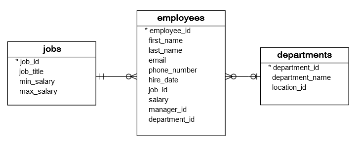

| **Inicio**            | **atrás 1**               | **Siguiente 3**            |
| --------------------- | ------------------------- | -------------------------- |
| [🏠](../../README.md) | [⏪](./1_Aprender_SQL.md) | [⏩](./3_Consultas_SQL.md) |

---

## **Índice**

| Temario                                                  |
| -------------------------------------------------------- |
| [11. Operadores lógicos SQL](#11-operadores-lógicos-sql) |
| [12. SQL AND](#12-sql-and)                               |
| [13. SQL OR](#13-sql-or)                                 |
| [14. SQL BETWEEN](#14-sql-between)                       |
| [15. SQL IN](#15-sql-in)                                 |
| [16. SQL LIKE](#16-sql-like)                             |
| [17. SQL IS NULL](#17-sql-is-null)                       |
| [18. SQL NOT](#18-sql-not)                               |
| [19. SQL Alias](#19-sql-alias)                           |
| [20. SQL INNER JOIN](#20-sql-inner-join)                 |

---

# **Tutorial de SQL**

## **11. Operadores lógicos SQL**

**Resumen :** Aprenderá sobre los operadores lógicos de SQL y cómo usarlos para probar la veracidad de una condición.

Un operador lógico le permite probar la verdad de una condición. Similar a un operador de comparación , un operador lógico devuelve un valor verdadero, falso o desconocido.

La siguiente tabla ilustra los operadores lógicos de SQL:

| **Operador** | **Significado**                                                              |
| ------------ | ---------------------------------------------------------------------------- |
| ALL          | Devuelve verdadero si todas las comparaciones son verdaderas                 |
| AND          | Devuelve verdadero si ambas expresiones son verdaderas                       |
| ANY          | Devuelve verdadero si alguna de las comparaciones es verdadera               |
| BETWEEN      | Devuelve verdadero si el operando está dentro de un rango                    |
| EXISTS       | Devuelve verdadero si una subconsulta contiene filas                         |
| IN           | Devuelve verdadero si el operando es igual a uno de los valores de una lista |
| LIKE         | Devuelve verdadero si el operando coincide con un patrón                     |
| NOT          | Invierta el resultado de cualquier otro operador booleano                    |
| OR           | Devuelve verdadero si alguna de las expresiones es verdadera                 |
| SOME         | Devuelve verdadero si algunas de las expresiones son verdaderas              |

**AND**

El operador `AND` le permite construir múltiples condiciones en la cláusula `WHERE` de una declaración SQL como `SELECT`, `UPDATE` y `DELETE`:

`expression1 AND expression2`

El operador `AND` devuelve verdadero si ambas expresiones se evalúan como verdaderas.

El siguiente ejemplo encuentra todos los empleados cuyos salarios son superiores a 5.000 y inferiores a 7.000:

```
SELECT
    first_name, last_name, salary
FROM
    employees
WHERE
    salary > 5000 AND salary < 7000
ORDER BY salary;
```

**OR**

De manera similar al operador `AND`, el operador `OR` combina múltiples condiciones en la cláusula `WHERE` de una declaración SQL:

`expression1 OR expression2`

Sin embargo, el operador `OR` devuelve verdadero si al menos una expresión se evalúa como verdadera.

Por ejemplo, la siguiente declaración busca empleados cuyo salario es 7000 u 8000:

```
SELECT
    first_name, last_name, salary
FROM
    employees
WHERE
    salary = 7000 OR salary = 8000
ORDER BY salary;
```

**IS NULL**

El operador `IS NULL` compara un valor con un valor nulo y devuelve verdadero si el valor comparado es nulo; de lo contrario, devuelve falso.

Por ejemplo, la siguiente declaración busca todos los empleados que no tienen un número de teléfono:

```
SELECT
    first_name, last_name, phone_number
FROM
    employees
WHERE
    phone_number IS NULL
ORDER BY first_name , last_name;
```

**BETWEEN**

El operador `BETWEEN` busca valores que están dentro de un conjunto de valores, dado el valor mínimo y el valor máximo. Tenga en cuenta que los valores mínimo y máximo se incluyen como parte del conjunto condicional.

Por ejemplo, la siguiente declaración busca todos los empleados cuyos salarios están entre 9.000 y 12.000.

```
SELECT
    first_name, last_name, salary
FROM
    employees
WHERE
    salary BETWEEN 9000 AND 12000
ORDER BY salary;
```

Observe que los valores 9000 y 12000 están incluidos en el resultado.

**IN**

El operador `IN` compara un valor con una lista de valores especificados. El operador `IN` devuelve verdadero si el valor comparado coincide con al menos un valor de la lista; de lo contrario, devuelve falso.

La siguiente declaración busca todos los empleados que trabajan en el departamento id 8 o 9.

```
SELECT
    first_name, last_name, department_id
FROM
    employees
WHERE
    department_id IN (8, 9)
ORDER BY department_id;
```

**LIKE**

El operador `LIKE` compara un valor con valores similares utilizando un operador comodín. SQL proporciona dos comodines que se utilizan junto con el operador `LIKE`:

- El signo de porcentaje `(%)` representa cero, uno o varios caracteres.

- El signo de subrayado `(_)` representa un solo carácter.

- La siguiente declaración busca todos los empleados cuyo nombre comienza con la cadena `jo`:

```
SELECT
    employee_id, first_name, last_name
FROM
    employees
WHERE
    first_name LIKE 'jo%'
ORDER BY first_name;
```

El siguiente ejemplo busca todos los empleados con nombres cuyo segundo carácter es `h`:

```
SELECT
    employee_id, first_name, last_name
FROM
    employees
WHERE
    first_name LIKE '_h%'
ORDER BY first_name;
```

**ALL**

El operador `ALL` compara un valor con todos los valores de otro conjunto de valores. El operador `ALL` debe ir precedido de un operador de comparación y seguido de una subconsulta .

A continuación se ilustra la sintaxis del operador `ALL`:

`comparison_operator ALL (subquery)`

Tenga en cuenta que aprenderá sobre la subconsulta en el tutorial de subconsulta .

El siguiente ejemplo encuentra todos los empleados cuyos salarios son mayores que todos los salarios de los empleados en el departamento 8:

```
SELECT
    first_name, last_name, salary
FROM
    employees
WHERE
    salary >= ALL (SELECT
            salary
        FROM
            employees
        WHERE
            department_id = 8)
ORDER BY salary DESC;
```

**ANY**

El operador `ANY` compara un valor con cualquier valor de un conjunto según la condición que se muestra a continuación:

`comparison_operator ANY(subquery)`

Similar al operador `ALL`, el operador `ANY` debe ir precedido de un operador de comparación y seguido de una subconsulta.

Por ejemplo, la siguiente declaración busca todos los empleados cuyos salarios son mayores que el salario promedio de cada departamento:

```
SELECT
    first_name, last_name, salary
FROM
    employees
WHERE
    salary > ANY(SELECT
            AVG(salary)
        FROM
            employees
        GROUP BY department_id)
ORDER BY first_name , last_name;
```

Tenga en cuenta que `SOME` es un alias de `ANY`, por lo tanto, puede usarlos indistintamente.

**EXISTS**

El operador `EXISTS` prueba si una subconsulta contiene filas:

`EXISTS (subquery)`

Si la subconsulta devuelve una o más filas, el resultado `EXISTS` es verdadero; de lo contrario, el resultado es falso.

Por ejemplo, la siguiente declaración busca todos los empleados que tienen dependientes:

```
SELECT
    first_name, last_name
FROM
    employees e
WHERE
    EXISTS( SELECT
            1
        FROM
            dependents d
        WHERE
            d.employee_id = e.employee_id);
```

[🔼](#índice)

---

## **12. SQL AND**

**Resumen :** Le presenta el operador `AND` de SQL y le muestra cómo aplicarlo para formar condiciones flexibles en la cláusula `WHERE` de una declaración SQL.

**Introducción al operador SQL AND**

El operador `AND` es un operador lógico que combina dos expresiones booleanas en la cláusula `WHERE` de la declaración `SELECT`, `UPDATE` o `DELETE`. A continuación se ilustra la sintaxis del operador `AND`:

`expression1 AND expression2;`

El operador `AND` devuelve verdadero si ambas expresiones se evalúan como verdaderas. Si una de las dos expresiones es falsa, entonces el operador `AND` devuelve falso incluso si una de las expresiones es `NULL`.

La siguiente tabla ilustra los resultados del operador `AND` al comparar valores `TRUE`, `FALSE` y `NULL`:

|       | **TRUE** | **FALSE** | **NULL** |
| ----- | -------- | --------- | -------- |
| TRUE  | TRUE     | FALSE     | NULL     |
| FALSE | FALSE    | FALSE     | FALSE    |
| NULL  | NULL     | FALSE     | NULL     |

**Ejemplos de operadores AND**

Usaremos la tabla `employees` de la base de datos de muestra para demostrar el operador `AND`.


La siguiente declaración encuentra todos los empleados que tienen identificación de trabajo 9 y salario superior a 5000:

```
SELECT
	first_name,
	last_name,
	job_id,
	salary
FROM
	employees
WHERE
	job_id = 9
AND salary > 5000;
```

Para encontrar todos los empleados que se incorporaron a la empresa entre 1997 y 1998, se utiliza el operador `AND` de la siguiente manera:

```
SELECT
	first_name,
	last_name,
	hire_date
FROM
	employees
WHERE
	YEAR (hire_date) >=1997
AND YEAR (hire_date) <= 1998;
```

**Operador AND y evaluación de cortocircuito**

La función de cortocircuito permite que el sistema de base de datos deje de evaluar las partes restantes de una expresión lógica tan pronto como pueda determinar el resultado.

Echemos un vistazo a un ejemplo para comprender mejor cómo funciona la función de evaluación de cortocircuito.

Vea la siguiente condición:

`1 = 0 AND 1 = 1;`

El sistema de base de datos procesa primero las dos comparaciones y utiliza el operador `AND` para evaluar los dos resultados.

Sin embargo, con la función de evaluación de cortocircuito, el sistema de base de datos solo tiene que evaluar la parte izquierda de la expresión porque la parte izquierda `(1 = 0)` devuelve falso, lo que hace que toda la condición devuelva falso independientemente del resultado de la parte derecha de la condición.

Por lo tanto, la función de cortocircuito reduce el tiempo de cálculo de la `CPU` y, en algunos casos, ayuda a evitar errores de tiempo de ejecución. Considere la siguiente condición:

`1 = 0 AND 1/0;`

Si el sistema de base de datos admite la función de cortocircuito, no evaluará la parte derecha de la expresión `(1/0)` que provoca el error de división por cero.

Ahora debe comprender cómo funciona el operador `AND` de SQL y cómo aplicarlo para formar una condición compleja en sus consultas.

## **13. SQL OR**

**Resumen :** Aprenderá a utilizar el operador `OR` de SQL para combinar dos expresiones booleanas.

**Introducción al operador OR**

El `OR` es un operador lógico que combina dos expresiones booleanas. El operador `OR` devuelve verdadero o falso según los resultados de las expresiones.

El operador `OR` se utiliza normalmente en la cláusula `WHERE` de la declaración `SELECT`, `UPDATE` o `DELETE` para formar una condición flexible.

A continuación se ilustra la sintaxis del operador `OR`:

```
SELECT
	column1,
	column2,
        ...
FROM
	table1
WHERE
	expression1
OR expression2;
```

La siguiente tabla muestra el resultado del operadoR `OR` cuando comparamos los valores `TRUE`, `FALSE` y `NULL`.

|       | **TRUE** | **FALSE** | **NULL** |
| ----- | -------- | --------- | -------- |
| TRUE  | TRUE     | TRUE      | TRUE     |
| FALSE | TRUE     | FALSE     | NULL     |
| NULL  | TRUE     | NULL      | NULL     |

Observe que el operador `OR` siempre devuelve verdadero si alguna de las expresiones es verdadera.

Si el sistema de base de datos admite la función de cortocircuito, el operador `OR` deja de evaluar las partes restantes de la condición tan pronto como una expresión es verdadera.

Tenga en cuenta que la función de cortocircuito ayuda al sistema de base de datos a ahorrar cálculos de la `CPU` al abortar el procesamiento de la parte restante de una expresión lógica tan pronto como pueda determinar el resultado. Para obtener más información sobre la función de cortocircuito, consulte el tutorial del operador `AND`.

Cuando utiliza el operador `OR` con el operador `AND`, el sistema de base de datos evalúa el operador `OR` después del operador `AND`. Esto se conoce como regla de precedencia. Sin embargo, puede utilizar paréntesis para cambiar el orden de evaluación.

**Ejemplos de operador OR**

Usaremos la tabla `employees` de la base de datos de muestra para la demostración del operador `OR`.


La siguiente declaración encuentra todos los empleados que se incorporaron a la empresa en 1997 o 1998.

```
SELECT
	first_name,
	last_name,
	hire_date
FROM
	employees
WHERE
	YEAR (hire_date) = 1997 OR YEAR (hire_date) = 1998
ORDER BY
	first_name,
	last_name;
```

Para encontrar todos los empleados que se unieron a la empresa en 1997 o 1997 y trabajaron en el departamento id 3, utilice los operadores `AND` y de la siguiente manera: `OR`

```
SELECT
	first_name,
	last_name,
	hire_date,
	department_id
FROM
	employees
WHERE
	department_id = 3
AND (
	YEAR (hire_date) = 1997
	OR YEAR (hire_date) = 1998
)
ORDER BY
	first_name,
	last_name;
```

Si no utiliza los paréntesis, la consulta recuperará los empleados que se unieron a la empresa en 1997 y trabajaron en el departamento 3 o los empleados que se unieron a la empresa en 1998, independientemente de los departamentos.

Esto se debe a que el sistema de base de datos evalúa operador `OR` tras operador `AND`.

```
SELECT
	first_name,
	last_name,
	hire_date,
	department_id
FROM
	employees
WHERE
	department_id = 3
AND YEAR (hire_date) = 1997
OR YEAR (hire_date) = 1998
ORDER BY
	first_name,
	last_name;
```

Si una consulta utiliza muchos operadores `OR`, será difícil de leer. Para que la consulta sea más legible, puede utilizar el operador `IN` en su lugar.

Por ejemplo, la siguiente consulta busca todos los empleados que se incorporaron a la empresa en 1990, 1999 o 2000.

```
SELECT
	first_name,
	last_name,
	hire_date
FROM
	employees
WHERE
	YEAR (hire_date) = 2000
OR YEAR (hire_date) = 1999
OR YEAR (hire_date) = 1990;
```

Puede reemplazar los operadores `OR` por el operador `IN` de la siguiente manera:

```
SELECT
	first_name,
	last_name,
	hire_date
FROM
	employees
WHERE
	YEAR (hire_date) IN (1990, 1999, 2000)
ORDER BY
	hire_date;
```

[🔼](#índice)

---

## **14. SQL BETWEEN**

**Resumen :** Aprenderá a utilizar el operador `BETWEEN` para comprobar si un valor se encuentra dentro de un rango específico.

**Introducción al operador BETWEEN**

El operador `BETWEEN` es uno de los operadores lógicos en SQL . El operador `BETWEEN` verifica si un valor está dentro de un rango de valores.

La sintaxis del operador `BETWEEN` es la siguiente:

`expression BETWEEN low AND high;`

El operador `BETWEEN` devuelve verdadero si expressiones mayor o igual a `(>=)` el valor bajo y menor o igual a `(<=)` el valor alto.

Técnicamente, `BETWEEN` es el equivalente a la siguiente expresión que utiliza los operadores mayor o igual a `(>=)` y menor o igual a `(<=)`:

`expression >= low AND expression <= high`

Para comparar un valor con un rango exclusivo, debe utilizar los operadores de comparación menor que `(<)` y mayor que `(>)`.

**NOT BETWEEN**

Para negar el resultado del operador `BETWEEN`, se utiliza el operador `NOT`:

`expression NOT BETWEEN low AND high`

Devuelve `NOT BETWEEN` verdadero si la expresión es menor `low` o mayor que (>) `high`; de lo contrario, devuelve falso.

Al igual que el operador `BETWEEN`, puede reescribir el operador `NOT BETWEEN` utilizando los operadores menor que (<) y mayor que (>) con el operador `OR` de la siguiente manera:

`expression < low OR expression > high`

En la práctica, a menudo se utiliza el operador `BETWEEN` y `NOT BETWEEN` en la cláusula `WHERE` de `SELECT` para seleccionar filas cuyo valor de una columna está dentro de un rango específico.

**Ejemplos de operador BETWEEN**

Usaremos la tabla `employees` de la base de datos de muestra para ilustrar cómo funciona el operador `BETWEEN`.


**1) Ejemplo de uso del operador BETWEEN con números**

La siguiente declaración utiliza el operador `BETWEEN` para encontrar todos los empleados cuyos salarios están entre 2500 y 2900:

```
SELECT
    employee_id,
    first_name,
    last_name,
    salary
FROM
    employees
WHERE
    salary BETWEEN 2500 AND 2900
ORDER BY
	salary DESC;
```

| **employee_id** | **first_name** | **last_name** | **salary** |
| --------------- | -------------- | ------------- | ---------- |
| 116             | Shelli         | Baida         | 2900.00    |
| 117             | Sigal          | Tobias        | 2800.00    |
| 126             | Irene          | Mikkilineni   | 2700.00    |
| 118             | Guy            | Himuro        | 2600.00    |
| 119             | Karen          | Colmenares    | 2500.00    |

Observe que el conjunto de resultados incluye los empleados cuyos salarios son 2500 y 2900.

La siguiente consulta devuelve el mismo conjunto de resultados que la consulta anterior. Sin embargo, utiliza operadores de comparación mayor o igual a (>=) y menor o igual a (<=) en su lugar:

```
SELECT
    employee_id,
    first_name,
    last_name,
    salary
FROM
    employees
WHERE
    salary >= 2500 AND salary <= 2900
ORDER BY
	salary;
```

**2) Usando NOT BETWEEN el ejemplo**

El siguiente ejemplo utiliza el operador `NOT BETWEEN` para buscar todos los empleados cuyos salarios no están en el rango de 2500 y 2900:

```
SELECT
    employee_id,
    first_name,
    last_name,
    salary
FROM
    employees
WHERE
    salary NOT BETWEEN 2500 AND 2900
ORDER BY salary DESC;
```

| **employee_id** | **first_name** | **last_name** | **salary** |
| --------------- | -------------- | ------------- | ---------- |
| 100             | Steven         | King          | 24000.00   |
| 101             | Neena          | Kochhar       | 17000.00   |
| 102             | Lex            | De Haan       | 17000.00   |
| 145             | John           | Russell       | 14000.00   |
| 146             | Karen          | Partners      | 13500.00   |
| 201             | Michael        | Hartstein     | 13000.00   |
| 205             | Shelley        | Higgins       | 12000.00   |
| 108             | Nancy          | Greenberg     | 12000.00   |
| 114             | Den            | Raphaely      | 11000.00   |
| 204             | Hermann        | Baer          | 10000.00   |
| 109             | Daniel         | Faviet        | 9000.00    |
| 103             | Alexander      | Hunold        | 9000.00    |
| 176             | Jonathon       | Taylor        | 8600.00    |
| 177             | Jack           | Livingston    | 8400.00    |
| 206             | William        | Gietz         | 8300.00    |
| 121             | Adam           | Fripp         | 8200.00    |
| 110             | John           | Chen          | 8200.00    |
| 120             | Matthew        | Weiss         | 8000.00    |
| 122             | Payam          | Kaufling      | 7900.00    |
| 112             | Jose Manuel    | Urman         | 7800.00    |
| 111             | Ismael         | Sciarra       | 7700.00    |
| 178             | Kimberely      | Grant         | 7000.00    |
| 113             | Luis           | Popp          | 6900.00    |
| 123             | Shanta         | Vollman       | 6500.00    |
| 203             | Susan          | Mavris        | 6500.00    |
| 179             | Charles        | Johnson       | 6200.00    |
| 202             | Pat            | Fay           | 6000.00    |
| 104             | Bruce          | Ernst         | 6000.00    |
| 106             | Valli          | Pataballa     | 4800.00    |
| 105             | David          | Austin        | 4800.00    |
| 200             | Jennifer       | Whalen        | 4400.00    |
| 107             | Diana          | Lorentz       | 4200.00    |
| 192             | Sarah          | Bell          | 4000.00    |
| 193             | Britney        | Everett       | 3900.00    |
| 115             | Alexander      | Khoo          | 3100.00    |

**3) Uso del operador BETWEEN con rangos de fechas**

El siguiente ejemplo utiliza el operador `BETWEEN` para buscar todos los empleados que se unieron a la empresa entre January 1, 1999 y December 31, 2000:

```
SELECT
    employee_id,
    first_name,
    last_name,
    hire_date
FROM
    employees
WHERE
    hire_date BETWEEN '1999-01-01' AND '2000-12-31'
ORDER BY
	hire_date;
```

| **employee_id** | **first_name** | **last_name** | **hire_date** |
| --------------- | -------------- | ------------- | ------------- |
| 107             | Diana          | Lorentz       | 1999-02-07    |
| 178             | Kimberely      | Grant         | 1999-05-24    |
| 119             | Karen          | Colmenares    | 1999-08-10    |
| 113             | Luis           | Popp          | 1999-12-07    |
| 179             | Charles        | Johnson       | 2000-01-04    |

El siguiente ejemplo utiliza el operador `NOT BETWEEN` para buscar empleados que no se han unido a la empresa desde January 1, 1989 hasta December 31, 1999:

```
SELECT
    employee_id,
    first_name,
    last_name,
    hire_date
FROM
    employees
WHERE
    hire_date NOT BETWEEN '1989-01-01' AND '1992-12-31'
ORDER BY
	hire_date;
```

| **employee_id** | **first_name** | **last_name** | **hire_date** |
| --------------- | -------------- | ------------- | ------------- |
| 100             | Steven         | King          | 1987-06-17    |
| 200             | Jennifer       | Whalen        | 1987-09-17    |
| 179             | Charles        | Johnson       | 2000-01-04    |

3 rows in set (0.00 sec)

**4) Uso del operador BETWEEN con un ejemplo de función**

El siguiente ejemplo utiliza el operador `BETWEEN` con la función AÑO para buscar empleados que se incorporaron a la empresa entre 1990 y 1993:

```
SELECT
    employee_id,
    first_name,
    last_name,
    year(hire_date) joined_year
FROM
    employees
WHERE
    year(hire_date) BETWEEN 1990 and 1993
ORDER BY
    hire_date;
```

| **employee_id** | **first_name** | **last_name** | **joined_year** |
| --------------- | -------------- | ------------- | --------------- |
| 103             | Alexander      | Hunold        | 1990            |
| 104             | Bruce          | Ernst         | 1991            |
| 102             | Lex            | De Haan       | 1993            |

**En este ejemplo:**

- Primero, la función `YEAR()` devuelve el año desde la fecha de contratación.

- En segundo lugar, el operador `BETWEEN` utiliza el resultado de la función `YEAR()` y comprueba si está dentro del rango 1990 y 1993.

- Si su base de datos no admite la función `YEAR()`, debe utilizar una función similar:

| **Database** | **La función para extraer el año de una fecha** |
| ------------ | ----------------------------------------------- |
| PostgreSQL   | DATE_PART('year', hire_date)                    |
| Oracle       | EXTRACT(year from hire_date)                    |
| SQL Server   | YEAR(hire_date)                                 |

**Resumen**

- El operador `BETWEEN` devuelve verdadero si un valor está dentro de un rango específico.

- Utilice el operador `NOT` para negar el operador `BETWEEN`.

[🔼](#índice)

---

## **15. SQL IN**

**Resumen :** Aprenderá a utilizar el operador `IN` para comprobar si un valor está en un conjunto de valores.

**Introducción al operador IN**

El `IN` es un operador lógico en SQL. El operador `IN` devuelve verdadero si un valor está en un conjunto de valores o falso en caso contrario.

A continuación se ilustra la sintaxis del operador `IN`:

`expression IN (value1,value2,...)`

Técnicamente, puede sustituir el operador `IN` por los operadores `=` y `OR` La condición que utiliza el operador `IN` se puede reescribir utilizando uno o más operadores `OR` de la siguiente manera:

`expression = value1 OR expression = value2 OR ...`

Para negar el operador `IN`, usa el operador `NOT`:

`expression NOT IN (value1, value2,...)`

El operador `NOT IN` devuelve verdadero si expression no es igual a ningún valor de la lista o falso en caso contrario.

Para sustituir el operador `IN`, puede utilizar los operadores `!=` y `AND` de la siguiente manera:

`expression != value1 AND expression != value2 AND...`

Observe que si algún valor de la lista `(value1,value2,...)` es nulo, el operador `IN` no devuelve ninguna fila.

En la práctica, a menudo se utilizan los operadores `IN` y `NOT IN` en la cláusula `WHERE` de la declaración `SELECT` para seleccionar filas con un valor en un conjunto de valores. Además, utilizará el operador `IN` en subconsultas .

**Ejemplos de SQL IN**

Usaremos la tabla `employees` en la base de datos de muestra para demostrar la funcionalidad del operador `IN`.


El siguiente ejemplo utiliza el operador `IN` para buscar empleados con el `ID` de trabajo 8, 9 o 10:

```
SELECT
	employee_id,
	first_name,
	last_name,
	job_id
FROM
	employees
WHERE
	job_id IN (8, 9, 10)
ORDER BY
	job_id;
```

| **employee_id** | **first_name** | **last_name** | **job_id** |
| --------------- | -------------- | ------------- | ---------- |
| 203             | Susan          | Mavris        | 8          |
| 103             | Alexander      | Hunold        | 9          |
| 104             | Bruce          | Ernst         | 9          |
| 105             | David          | Austin        | 9          |
| 106             | Valli          | Pataballa     | 9          |
| 107             | Diana          | Lorentz       | 9          |
| 201             | Michael        | Hartstein     | 10         |

El siguiente ejemplo utiliza el operador `NOT IN` para buscar empleados cuyo `ID` de trabajo no sea 7, 8 ni 9:

```
SELECT
	employee_id,
	first_name,
	last_name,
	job_id
FROM
	employees
WHERE
	job_id NOT IN (7, 8, 9)
ORDER BY
	job_id;
```

| **employee_id** | **first_name** | **last_name** | **job_id** |
| --------------- | -------------- | ------------- | ---------- |
| 206             | William        | Gietz         | 1          |
| 205             | Shelley        | Higgins       | 2          |
| 200             | Jennifer       | Whalen        | 3          |
| 100             | Steven         | King          | 4          |
| 102             | Lex            | De Haan       | 5          |
| 101             | Neena          | Kochhar       | 5          |
| 109             | Daniel         | Faviet        | 6          |
| 113             | Luis           | Popp          | 6          |
| 110             | John           | Chen          | 6          |
| 111             | Ismael         | Sciarra       | 6          |
| 112             | Jose Manuel    | Urman         | 6          |
| 201             | Michael        | Hartstein     | 10         |
| 202             | Pat            | Fay           | 11         |
| 204             | Hermann        | Baer          | 12         |
| 118             | Guy            | Himuro        | 13         |

...

**2) Uso del operador IN con un ejemplo de subconsulta**

Una subconsulta es una consulta anidada dentro de otra consulta. Echemos un vistazo a un ejemplo:


La siguiente consulta devuelve la identificación del departamento de los departamentos `Marketing` y `Sales`:

```
SELECT
    department_id
FROM
    departments
WHERE
    department_name = 'Marketing'
        OR department_name = 'Sales'
```

| **department_id** |
| ----------------- |
| 2                 |
| 8                 |

La consulta devuelve una lista de dos identificadores de departamento.

Y puede pasar la lista de identificación al operador `IN` para encontrar empleados que trabajan en `Marketing` y `Sales` `departments` así:

```
SELECT
	employee_id,
	first_name,
	last_name,
	department_id
FROM
	employees
WHERE
	department_id IN (2, 8);
```

| **employee_id** | **first_name** | **last_name** | **department_id** |
| --------------- | -------------- | ------------- | ----------------- |
| 145             | John           | Russell       | 8                 |
| 146             | Karen          | Partners      | 8                 |
| 176             | Jonathon       | Taylor        | 8                 |
| 177             | Jack           | Livingston    | 8                 |
| 178             | Kimberely      | Grant         | 8                 |
| 179             | Charles        | Johnson       | 8                 |
| 201             | Michael        | Hartstein     | 2                 |
| 202             | Pat            | Fay           | 2                 |

Para combinar dos consultas anteriores en una sola consulta, puede usar la primera consulta en lugar de la lista entre paréntesis seguida del operador `IN`:

```
SELECT
    employee_id, first_name, last_name, salary
FROM
    employees
WHERE
    department_id IN (SELECT
            department_id
        FROM
            departments
        WHERE
            department_name = 'Marketing'
                OR department_name = 'Sales')
```

**Resumen**

- Utilice el operador `IN` para comprobar si un valor está en un conjunto de valores.

- Utilice el operador `NOT` para negar el operador `IN`, `NOT IN`.

- Utilice `IN` con una subconsulta para combinar dos consultas en una sola consulta.

[🔼](#índice)

---

## **16. SQL LIKE**

**Resumen :** Aprenderá a utilizar el operador `LIKE` para probar si un valor coincide con un patrón.

**Introducción al operador LIKE**

El operador `LIKE` es uno de los operadores lógicos de SQL. El operador `LIKE` devuelve verdadero si un valor coincide con un patrón o falso en caso contrario.

La sintaxis del operador `LIKE` es la siguiente:

`expression LIKE pattern`

En esta sintaxis, el operador `LIKE` prueba si una expresión coincide con el patrón. El estándar SQL le proporciona dos caracteres comodín para crear un patrón:

- `%` El comodín de porcentaje coincide con cero, uno o más caracteres.

- `_` El comodín de subrayado coincide con un solo carácter.

A continuación se muestra un ejemplo del uso de los caracteres comodín `%` y `_`:

| **Expresión** | **Significado**                                                                                                 |
| ------------- | --------------------------------------------------------------------------------------------------------------- |
| LIKE 'Kim%'   | coincidir con una cadena que comienza con Kim                                                                   |
| LIKE '%er'    | unir una cadena que termina con er                                                                              |
| LIKE '%ch%'   | coincide con una cadena que contiene ch                                                                         |
| LIKE 'Le\_'   | haga coincidir una cadena que comience con un carácter Le y le siga un carácter, por ejemplo, Les, Len...       |
| LIKE '\_uy'   | coincide con una cadena que termina con uy y está precedida por un carácter, por ejemplo, chico                 |
| LIKE '%are\_' | coincide con una cadena que contiene are y termina con un carácter                                              |
| LIKE '\_are%' | coincide con una cadena que contiene are, comienza con un carácter y termina con cualquier número de caracteres |

> **NOTA**
>
> Tenga en cuenta que además de los comodines `%` y `_`, algunos sistemas de bases de datos pueden tener otros caracteres comodín que son específicos de esas bases de datos.

**NOT LIKE**

Para negar el operador `LIKE`, usa el operador `NOT`:

`expression NOT LIKE pattern`

El operador `NOT LIKE` devuelve verdadero si la expresión no coincide con el patrón o falso en caso contrario.

**Escape character**

Para hacer coincidir una cadena que contiene un comodín, por ejemplo `10%`, debe indicarle al operador `LIKE` que trate la `%` entrada `10%` como un carácter normal.

Para hacer eso, necesitas especificar explícitamente un carácter de escape después de la cláusula `ESCAPE`:

`expression LIKE pattern ESCAPE escape_character`

Por ejemplo:

`value LIKE '%10!%%' ESCAPE '!'`

En este ejemplo, el `!` es un personaje de escape. Le indica al operador `LIKE` que trate el `%` del `10%` como un carácter normal.

En la práctica, a menudo se utiliza el operador `LIKE` en la cláusula `WHERE` de las declaraciones `SELECT`, `UPDATE` y `DELETE`.

**Ejemplos de operador LIKE**

Usaremos la tabla `employees` en la base de datos de muestra para la demostración.


El siguiente ejemplo utiliza el operador `LIKE` para buscar todos los empleados cuyos nombres comienzan con `Da`:

```
SELECT
	employee_id,
	first_name,
	last_name
FROM
	employees
WHERE
	first_name LIKE 'Da%';
```

| **employee_id** | **first_name** | **last_name** |
| --------------- | -------------- | ------------- |
| 105             | David          | Austin        |
| 109             | Daniel         | Faviet        |

El siguiente ejemplo utiliza el operador `LIKE` para buscar todos los empleados cuyos nombres terminan en `er`:

```
SELECT
	employee_id,
	first_name,
	last_name
FROM
	employees
WHERE
	first_name LIKE '%er';
```

| **employee_id** | **first_name** | **last_name** |
| --------------- | -------------- | ------------- |
| 103             | Alexander      | Hunold        |
| 115             | Alexander      | Khoo          |
| 200             | Jennifer       | Whalen        |

El siguiente ejemplo utiliza el operador `LIKE` para buscar empleados cuyos apellidos contengan la palabra `an`:

```
SELECT
	employee_id,
	first_name,
	last_name
FROM
	employees
WHERE
	last_name LIKE '%an%';
```

| **employee_id** | **first_name** | **last_name** |
| --------------- | -------------- | ------------- |
| 102             | Lex            | De Haan       |
| 112             | Jose Manuel    | Urman         |
| 123             | Shanta         | Vollman       |
| 178             | Kimberely      | Grant         |

La siguiente declaración recupera empleados cuyos nombres comienzan con `Jo` 2 caracteres seguidos como máximo:

```
SELECT
	employee_id,
	first_name,
	last_name
FROM
	employees
WHERE
	first_name LIKE 'Jo__';
```

| **employee_id** | **first_name** | **last_name** |
| --------------- | -------------- | ------------- |
| 110             | John           | Chen          |
| 145             | John           | Russell       |

La siguiente declaración utiliza el operador `LIKE` con el comodín `%` y `_` para buscar empleados cuyos nombres comiencen con cualquier número de caracteres y estén seguidos de como máximo un carácter:

```
SELECT
	employee_id,
	first_name,
	last_name
FROM
	employees
WHERE
	first_name LIKE '%are_';
```

| **employee_id** | **first_name** | **last_name** |
| --------------- | -------------- | ------------- |
| 119             | Karen          | Colmenares    |
| 146             | Karen          | Partners      |

**Ejemplo de operador NOT LIKE**

El siguiente ejemplo utiliza el operador `NOT LIKE` para buscar todos los empleados cuyos nombres comienzan con la letra `S` pero no comienzan con `Sh`:

```
SELECT
	employee_id,
	first_name,
	last_name
FROM
	employees
WHERE
	first_name LIKE 'S%'
AND first_name NOT LIKE 'Sh%'
ORDER BY
	first_name;
```

| **employee_id** | **first_name** | **last_name** |
| --------------- | -------------- | ------------- |
| 192             | Sarah          | Bell          |
| 117             | Sigal          | Tobias        |
| 100             | Steven         | King          |
| 203             | Susan          | Mavris        |

**Resumen**

- El operador `LIKE` devuelve verdadero si un valor coincide con un patrón o falso en caso contrario.

- Utilice el operador `NOT` para negar el operador `LIKE`.

- Utilice el comodín `%` para hacer coincidir uno o más caracteres

- Utilice el comodín `_` para hacer coincidir un solo carácter.

[🔼](#índice)

---

## **17. SQL IS NULL**

**Resumen:** Aprenderá sobre `NULL` y cómo usar `IS NULL` y los operadores `IS NOT NULL` para probar si una expresión lo es `NULL` o no.

**¿Qué es NULL?**

`NULL` es especial en SQL. `NULL` indica que los datos son desconocidos, inaplicables o incluso no existen. En otras palabras, `NULL` representa los datos faltantes en la base de datos.

Por ejemplo, si los empleados no tienen números de teléfono, puede almacenar sus números de teléfono como cadenas vacías.

Sin embargo, si no conoce sus números de teléfono cuando guarda los registros de los empleados, deberá utilizar el `NULL` para los números de teléfono desconocidos.

Esto `NULL` es especial porque cualquier comparación con a `NULL` nunca puede dar como resultado verdadero o falso, sino un tercer resultado lógico, desconocido.

Devuelve la siguiente declaración `NULL`:

`SELECT NULL = 5;`

El valor `NULL` ni siquiera es igual a sí mismo, como se muestra en la siguiente declaración:

`SELECT NULL = NULL;`

En este ejemplo, el resultado es `NULL`.

No puede utilizar el operador de comparación igual a `(=)` para comparar un valor con un valor `NULL`. Por ejemplo, la siguiente declaración no devolverá el resultado correcto:

```
SELECT
	employee_id,
	first_name,
	last_name,
	phone_number
FROM
	employees
WHERE
	phone_number = NULL;
```

**Los operadores IS NULL y IS NOT NULL**

Para determinar si una expresión o columna lo es `NULL` o no, utiliza el operador `IS NULL` de la siguiente manera:

`expression IS NULL`

Si el resultado de la expresión es `NULL`, el operador `IS NULL` devuelve `true`; de lo contrario, regresa `false`.

Para comprobar si una expresión o columna no lo es `NULL`, utiliza el operador `IS NOT`:

`expression IS NOT NULL`

Los `IS NOT NULL` retornos `false` si el valor de la expresión es `NULl`; de lo contrario, devuelve verdadero;

**Ejemplos de NULL y IS NOT NULL**

En estos ejemplos, usaremos la tabla `employees` de la base de datos de muestra para la demostración.


Para encontrar todos los empleados que no tienen los números de teléfono, utilice el operador `IS NULL` de la siguiente manera:

```
SELECT
	employee_id,
	first_name,
	last_name,
	phone_number
FROM
	employees
WHERE
	phone_number IS NULL;
```

Para encontrar todos los empleados que tienen números de teléfono, utilice `IS NOT NULL` como se muestra en la siguiente declaración:

```
SELECT
	employee_id,
	first_name,
	last_name,
	phone_number
FROM
	employees
WHERE
	phone_number IS NOT NULL;
```

Ahora deberías entender el concepto `NULL` y saber cómo utilizar el operador `IS` para comprobar si un valor es `NULL` o no

[🔼](#índice)

---

## **18. SQL NOT**

**Resumen :** Aprenderá a utilizar el operador `NOT` de SQL para negar una expresión booleana en la cláusula `WHERE` de la instrucción `SELECT`.

**Introducción al operador NOT**

Ha aprendido a utilizar varios operadores lógicos como `AND` , `OR` , `LIKE` , `BETWEEN` , `IN` y `EXISTS`. Estos operadores le ayudan a crear condiciones flexibles en la cláusula `WHERE`.

Para negar el resultado de cualquier expresión booleana, se utiliza el operador `NOT`. A continuación se ilustra cómo utilizar el operador `NOT`:

`NOT [Boolean_expression]`

La siguiente tabla muestra el resultado del operador `NOT`.

|       | **NOT** |
| ----- | ------- |
| TRUE  | FALSE   |
| FALSE | TRUE    |
| NULL  | NULL    |

**Ejemplos de operador NOT**

Usaremos la tabla `employees` para ayudarlo a comprender mejor al operador `NOT`.


La siguiente declaración recupera todos los empleados que trabajan en el departamento `id` 5.

```
SELECT
	employee_id,
	first_name,
	last_name,
	salary
FROM
	employees
WHERE
	department_id = 5
ORDER BY
	salary;
```

Para obtener los empleados que laboran en el departamento `id` 5 y con un salario no mayor a 5000.

```
SELECT
	employee_id,
	first_name,
	last_name,
	salary
FROM
	employees
WHERE
	department_id = 5
AND NOT salary > 5000
ORDER BY
	salary;
```

**Ejemplo de NOT con operador IN**

Para negar el operador `IN`, se utiliza el operador `NOT`. Por ejemplo, la siguiente declaración obtiene todos los empleados que no trabajan en los departamentos 1, 2 o 3.

```
SELECT
	employee_id,
	first_name,
	last_name,
	department_id
FROM
	employees
WHERE
	department_id NOT IN (1, 2, 3)
ORDER BY
	first_name;
```

**Ejemplo de operador NOT LIKE**

Puede negar el operador `LIKE` utilizando `NOT LIKE`. Por ejemplo, la siguiente declaración recupera todos los empleados cuyos nombres no comienzan con la letra `D`.

```
SELECT
	first_name,
	last_name
FROM
	employees
WHERE
	first_name NOT LIKE 'D%'
ORDER BY
	first_name;
```

**NOT BETWEEN ejemplo**

El siguiente ejemplo le muestra cómo utilizar `NOT` para negar el operador `BETWEEN` para obtener empleados cuyos salarios no estén entre 5000 y 1000.

```
SELECT
	employee_id,
	first_name,
	last_name,
	salary
FROM
	employees
WHERE
	salary NOT BETWEEN 3000
AND 5000
ORDER BY
	salary;
```

**Ejemplo de SQL NOT EXISTS**

Consulte lo siguiente `employees` y dependentslas tablas:


La siguiente consulta utiliza el operador `NOT EXISTS` para obtener los empleados que no tienen dependientes.

```
SELECT
	employee_id,
	first_name,
	last_name
FROM
	employees e
WHERE
	NOT EXISTS (
		SELECT
			employee_id
		FROM
			dependents d
		WHERE
			d.employee_id = e.employee_id
	);
```

[🔼](#índice)

---

## **19. SQL Alias**

**Resumen :** Aprenderá sobre los `alias` de SQL, incluidos los `alias` de tablas y columnas, para que sus consultas sean más breves y comprensibles.

El `alias` le permite asignar un nombre temporal a una tabla o columna durante la ejecución de una consulta . SQL tiene dos tipos de `alias`: alias de tabla y columna.

**Alias ​​de columnas SQL**

Al diseñar tablas de bases de datos, puede utilizar abreviaturas para los nombres de las columnas para que sean breves. Por ejemplo:

- Significa `so_no` número de orden de venta.

- Significa `qt` y cantidad.

O es posible que tenga que trabajar con sistemas heredados que utilizan abreviaturas de manera agresiva para nombrar columnas y tablas.

Por ejemplo, `SAP ERP` utiliza abreviaturas (en alemán) para nombrar todas las columnas y tablas, como `VBELN` para nombrar la columna del número del documento de ventas.

Cuando utiliza SQL para consultar datos de estas tablas, el resultado no es obvio. Para solucionarlo, puede utilizar `alias` de columna que proporcionen nombres temporales a las columnas durante la ejecución de la consulta.

A continuación se muestra la sintaxis del uso de alias de columna:

`column_name AS alias_name`

En esta sintaxis, especifica el `alias` de la columna después de la palabra `AS` clave seguido del nombre de la columna. La palabra `AS` clave es opcional. Entonces puedes omitirlo así:

`column_name alias_name`

Si el `alias` contiene espacios, debes colocarlo entre comillas simples (o comillas dobles) de esta manera:

`column_name AS 'Alias Name'`

El siguiente ejemplo muestra cómo utilizar los alias de columna:

```
SELECT
	inv_no AS invoice_no,
	amount,
	due_date AS 'Due date',
	cust_no 'Customer No'
FROM
	invoices;
```

Esta consulta tiene varios alias de columnas:

- Es `invoice_no` el alias de la columna `inv_no`.

- Es `'Due date'` el alias de la columna `due_date`. Debido a que el alias contiene espacio, debe colocarlo entre comillas simples (') o dobles (“).

- Es `'Customer no'` el alias de la columna `cust_no`. Tenga en cuenta que no tiene la palabra clave `AS`.

**Alias ​​para expresiones**

Si una consulta contiene expresiones, puede asignar alias de columna a las expresiones. Por ejemplo:

```
SELECT
    first_name,
    last_name,
    salary * 1.1 AS new_salary
FROM
    employees;
```

En este ejemplo, la base de datos utilizará los alias de columna como encabezado de las expresiones en el conjunto de resultados.

**Errores comunes de los alias de columnas**

Dado que asigna alias a las columnas de la cláusula `SELECT`, solo puede hacer referencia a los alias en las cláusulas que se evalúan después de la cláusula `SELECT`.

La siguiente consulta generará un error:

```
SELECT
    first_name,
    last_name,
    salary * 1.1 AS new_salary
FROM
    employees
WHERE new_salary > 5000
```

**Error:**

`Unknown column 'new_salary' in 'where clause'`

**¿Por qué?**

En esta declaración `SELECT`, la base de datos evalúa las cláusulas en el siguiente orden:

`FROM > WHERE > SELECT`

La base de datos evalúa la cláusula `WHERE` antes de la cláusula `SELECT`. Por lo tanto, al momento de evaluar la cláusula `WHERE`, la base de datos no tiene la información del alias `new_salary` de la columna. Entonces emitió un error.

Sin embargo, la siguiente consulta funciona correctamente:

```
SELECT
    first_name,
    last_name,
    salary * 1.1 AS new_salary
FROM
    employees
ORDER BY new_salary;
```

En este ejemplo, la base de datos evalúa las cláusulas de la consulta en el siguiente orden:

`FROM > SELECT > ORDER BY`

La base de datos evalúa la cláusula `SELECT` antes de la cláusula `ORDER BY`. Por lo tanto al momento de evaluar la cláusula `ORDER BY` la base de datos tiene la información del alias `new_salary`, que es el alias de la expresión `salary * 1.1`. Por lo tanto, funciona como se esperaba.

**Alias ​​de tablas SQL**

Al igual que las columnas, puede asignar alias a las tablas. Y estos alias se denominan alias de tabla.

Para asignar un alias a una tabla, utilice la siguiente sintaxis:

`table_name AS table_alias`

En esta sintaxis, la palabra clave `AS` también es opcional. Entonces puedes omitirlo de la siguiente manera:

`table_name table_alias`

Tenga en cuenta que asignar un alias a una tabla no cambia el nombre de la tabla de forma permanente. Simplemente le da a la tabla otro nombre temporalmente durante la ejecución de una consulta.

Entonces, ¿por qué necesitas alias de tabla?

Al especificar los nombres de las columnas en la cláusula `SELECT`, puede utilizar la siguiente sintaxis:

`table_name.column_name`

En esta sintaxis, la columna tiene un nombre completo que incluye nombres de tabla y columna. Por ejemplo:

```
SELECT
    employees.first_name,
    employees.last_name
FROM
    employees;
```

En este ejemplo, la consulta selecciona los datos de las columnas `first_name` y `last_name` de la tabla `employees`. A diferencia de una consulta típica, especificamos los nombres completos para las columnas `first_name` y `last_name`.

En la cláusula `SELECT`, en lugar de usar el nombre de la tabla `employees`, puede usar el alias de la tabla `employees`. Por ejemplo:

```
SELECT
    e.first_name,
    e.last_name
FROM
    employees AS e;
```

En este ejemplo, asignamos eun alias de tabla a `employees` la cláusula `FROM` y hacemos referencia a ella en la cláusula `SELECT`.

Pero, ¿por qué es necesario utilizar nombres completos para las columnas?

Consulte lo siguiente `employees` y `departments` las tablas de la base de datos de ejemplo :


Ambas tablas `employees` y `departments` tienen columnas con el mismo nombre: `id_departamento`.

Al consultar datos de ambas tablas, debe especificar la tabla exacta a la que `department_id` pertenece la columna. De lo contrario, obtendrá un error porque la base de datos no sabe a qué tabla debe ir para seleccionar datos.

Si desea seleccionar datos de la tabla `employees`, puede hacer referencia a ellos en la cláusula `SELECT` de la siguiente manera:

`employees.department_id`

Lo mismo se aplica al `department_id` de la tabla `departments`:

`departments.department_id`

Si `e` y `d` son alias de tabla de las tablas `employees` y `departments`, puede hacer referencia a la columna `department_id` de cada tabla utilizando los alias de tabla de la siguiente manera:

```
e.department_id
d.department_id
```

En el siguiente tutorial, aprenderá cómo utilizar las cláusulas de unión para seleccionar datos de ambas tablas y aplicar los alias de las tablas. Además, aprenderá a hacer referencia a la misma tabla dos veces en una sola consulta utilizando la técnica de autounión . En este caso, deberá utilizar los alias de la tabla.

**Resumen**

- SQL tiene dos tipos de alias: alias de columna y de tabla.

- Haga referencia a los alias de columna en las cláusulas que se evalúan después de la cláusula `SELECT`.

- Utilice alias de tabla para calificar los nombres de las columnas.

[🔼](#índice)

---

## **20. SQL INNER JOIN**

**Resumen :** Le mostraremos cómo utilizar la cláusula SQL `INNER JOIN` para consultar datos de dos o más tablas.

**Introducción a la cláusula SQL INNER JOIN**

Hasta ahora, ha aprendido a utilizar la instrucción `SELECT` para consultar datos de una sola tabla. Sin embargo, la declaración `SELECT` no se limita a consultar datos de una sola tabla. La declaración `SELECT` puede vincular varias tablas.

El proceso de vincular tablas se llama unión. SQL proporciona muchos tipos de uniones, como unión interna, unión izquierda , unión derecha, unión externa completa, etc. Este tutorial se centra en la unión interna.

Supongamos que tiene dos tablas: `A` y `B`.

La tabla `A` tiene cuatro filas: `(1,2,3,4)` y la tabla `B` tiene cuatro filas: `(3,4,5,6)`

Cuando la tabla `A` se une con la tabla `B` mediante la combinación interna, se obtiene el conjunto de resultados `(3,4)` que es la intersección de la tabla `A` y la tabla `B`.

Vea la siguiente imagen.


Para cada fila de la tabla `A`, la cláusula de unión interna busca las filas coincidentes en la tabla `B`. Si una fila coincide, se incluye en el conjunto de resultados final.

Supongamos que las columnas de las tablas `A` y `B` son `a` y `b`. La siguiente declaración ilustra la cláusula de unión interna:

```
SELECT a
FROM A
INNER JOIN B ON b = a;
```

La cláusula `INNER JOIN` aparece después de la cláusula `FROM`. La condición para que coincida entre la tabla `A` y la tabla `B` se especifica después de la palabra clave `ON`. Esta condición se llama condición de unión , es decir, `B.n = A.n`

La cláusula `INNER JOIN` puede unir tres o más tablas siempre que tengan relaciones, normalmente relaciones de clave externa.

Por ejemplo, la siguiente declaración ilustra cómo unir 3 tablas: `A`, `B` y `C`:

```
SELECT
  A.n
FROM A
INNER JOIN B ON B.n = A.n
INNER JOIN C ON C.n = A.n;
```

**Ejemplos de unión interna de SQL**

Tomemos algunos ejemplos prácticos del uso de la cláusula `INNER JOIN`.

**1) Ejemplo de uso de SQL INNER JOIN para unir dos tablas**

Usaremos las tablas `employees` y `departments` de la base de datos de muestra para demostrar cómo funciona la cláusula `INNER JOIN`.


Cada empleado pertenece a un solo departamento, mientras que cada departamento puede tener más de un empleado. La relación entre `departments` y `employees` es de uno a muchos.

La columna `department_id` de la tabla `employees` es la columna de clave externa que vincula `employees` a la tabla `departments`.

Para obtener la información de los `ID` de departamento 1, 2 y 3, utilice la siguiente declaración.

```
SELECT
	department_id,
	department_name
FROM
	departments
WHERE
	department_id IN (1, 2, 3);
```

Observe que utilizamos el operador `IN` en la cláusula `WHERE` para obtener filas con `id_departamento` 1, 2 y 3.

Para obtener la información de los empleados que trabajan en el departamento `id` 1, 2 y 3, se utiliza la siguiente consulta:

```
SELECT
	first_name,
	last_name,
	department_id
FROM
	employees
WHERE
	department_id IN (1, 2, 3)
ORDER BY
	department_id;
```

Para combinar datos de estas dos tablas, utilice una cláusula de combinación interna como la siguiente consulta:

```
SELECT
    first_name,
    last_name,
    employees.department_id,
    departments.department_id,
    department_name
FROM
    employees
        INNER JOIN
    departments ON departments.department_id = employees.department_id
WHERE
    employees.department_id IN (1 , 2, 3);
```

Para cada fila de la tabla `employees`, la declaración verifica si el valor de la columna `department_id` es igual al valor de la columna `department_id` de la tabla `departments`. Si la condición

Si `employees.department_id = departments.department_id` se cumple la condición, la fila combinada que incluye datos de filas en ambas tablas `employees` y `departments` se incluye en el conjunto de resultados.

Observe que ambas tablas `employees` y `departments` tienen el mismo nombre de columna `department_id`, por lo tanto tuvimos que calificar la columna `department_id` usando la sintaxis `table_name.column_name`.

**Ejemplo de SQL INNER JOIN 3 tablas**

Cada empleado tiene un trabajo, mientras que un trabajo puede estar ocupado por muchos empleados. La relación entre `jobs` y `employees` es de uno a muchos.

El siguiente diagrama de base de datos ilustra las relaciones entre `employees` y `departments` tablas `jobs`:



La siguiente consulta utiliza las cláusulas de unión internas para unir 3 tablas: empleados, departamentos y trabajos para obtener el nombre, apellido, cargo y nombre del departamento de los empleados que trabajan en los ID de departamento 1, 2 y 3.

```
SELECT
	first_name,
	last_name,
	job_title,
	department_name
FROM
	employees e
INNER JOIN departments d ON d.department_id = e.department_id
INNER JOIN jobs j ON j.job_id = e.job_id
WHERE
	e.department_id IN (1, 2, 3);
```

[🔼](#índice)

---

| **Inicio**            | **atrás 1**               | **Siguiente 3**            |
| --------------------- | ------------------------- | -------------------------- |
| [🏠](../../README.md) | [⏪](./1_Aprender_SQL.md) | [⏩](./3_Consultas_SQL.md) |
