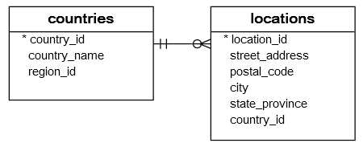
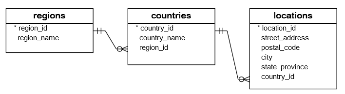
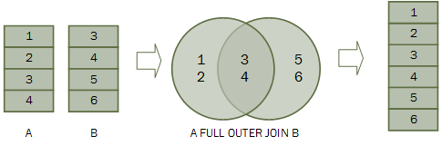
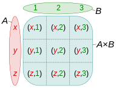
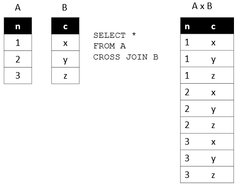

| **Inicio**            | **atrás 2**                | **Siguiente 4**            |
| --------------------- | -------------------------- | -------------------------- |
| [🏠](../../README.md) | [⏪](./2_Consultas_SQL.md) | [⏩](./4_Consultas_SQL.md) |

---

## **Índice**

| Temario                                                    |
| ---------------------------------------------------------- |
| [21. SQL LEFT JOIN](#21-sql-left-join)                     |
| [22. SQL SELF JOIN](#22-sql-self-join)                     |
| [23. SQL FULL OUTER JOIN](#23-sql-full-outer-join)         |
| [24. SQL CROSS JOIN](#24-sql-cross-join)                   |
| [25. SQL GROUP BY](#25-sql-group-by)                       |
| [26. SQL HAVING](#26-sql-having)                           |
| [27. SQL ROLLUP](#27-sql-rollup)                           |
| [28. SQL CUBE](#28-sql-cube)                               |
| [29. SQL Subquery](#29-sql-subquery)                       |
| [30. SQL Correlated Subquery](#30-sql-correlated-subquery) |

---

# **Tutorial de SQL**

## **21. SQL LEFT JOIN**

**Resumen :** Le presentaremos otro tipo de combinaciones llamadas SQL `LEFT JOIN` que le permite recuperar datos de varias tablas.

**Introducción a la cláusula LEFT JOIN de SQL**

En el tutorial anterior, aprendió acerca de la unión interna que devuelve filas si hay, al menos, una fila en ambas tablas que coincide con la condición de unión. La cláusula de unión interna elimina las filas que no coinciden con una fila de la otra tabla.

La combinación izquierda, sin embargo, devuelve todas las filas de la tabla de la izquierda, haya o no una fila coincidente en la tabla de la derecha.

Supongamos que tenemos dos tablas `A` y `B`. La tabla `A` tiene cuatro filas 1, 2, 3 y 4. La tabla `B` también tiene cuatro filas 3, 4, 5, 6.

Cuando unimos la tabla `A` con la tabla `B`, todas las filas de la tabla `A` (la tabla de la izquierda) se incluyen en el conjunto de resultados, haya o no una fila coincidente en la tabla `B`.


En SQL, utilizamos la siguiente sintaxis para unir la tabla `A` con la tabla `B`.

```
SELECT
	A.n
FROM
	A
LEFT JOIN B ON B.n = A.n;
```

La cláusula `LEFT JOIN` aparece después de la cláusula `FROM`. La condición que sigue a la palabra clave `ON` se llama condición de unión `B.n = A.n`

**Ejemplos de unión izquierda de SQL**

**SQL LEFT JOIN dos ejemplos de tablas**

Echemos un vistazo a las tablas `countries` y `locations`.



Cada ubicación pertenece a un solo país, mientras que cada país puede tener cero o más ubicaciones. La relación entre las tablas de países y ubicaciones es de uno a muchos.

La columna `country_id` en la tabla de ubicaciones es la clave externa que se vincula a la columna `country_id` en la tabla de países.

Para consultar los nombres de países de EE. UU., Reino Unido y China, utilice la siguiente declaración.

```
SELECT
	country_id,
	country_name
FROM
	countries
WHERE
	country_id IN ('US', 'UK', 'CN');
```

La siguiente consulta recupera las ubicaciones ubicadas en EE. UU., Reino Unido y China:

```
SELECT
	country_id,
	street_address,
	city
FROM
	locations
WHERE
	country_id IN ('US', 'UK', 'CN');
```

Ahora, usamos la cláusula `LEFT JOIN` para unir la tabla de países con la tabla de ubicaciones como la siguiente consulta:

```
SELECT
	c.country_name,
	c.country_id,
	l.country_id,
	l.street_address,
	l.city
FROM
	countries c
LEFT JOIN locations l ON l.country_id = c.country_id
WHERE
	c.country_id IN ('US', 'UK', 'CN')
```

La condición de la cláusula `WHERE` se aplica para que la declaración solo recupere los datos de las filas de EE. UU., Reino Unido y China.

Como utilizamos la cláusula `LEFT JOIN`, todas las filas que cumplen la condición de la cláusula `WHERE` de la tabla de países se incluyen en el conjunto de resultados.

Para cada fila de la tabla de países, la cláusula `LEFT JOIN` busca las filas coincidentes en la tabla de ubicaciones.

Si se encuentra al menos una fila coincidente, el motor de base de datos combina los datos de las columnas de las filas coincidentes en ambas tablas.

En caso de que no se encuentre una fila coincidente, por ejemplo, con `country_id` `CN`, la fila de la tabla de países se incluye en el conjunto de resultados y la fila de la tabla de ubicaciones se completa con valores `NULL`.

Debido a que las filas que no coinciden en la tabla derecha se completan con valores `NULL`, puede aplicar la cláusula `LEFT JOIN` para que las filas que no coincidan entre tablas.

Por ejemplo, para buscar el país que no tiene ninguna ubicación en la tabla de ubicaciones, utilice la siguiente consulta:

**Ejemplo de SQL LEFT JOIN 3 tablas**

Consulte las siguientes tablas: regiones, países y ubicaciones.



Una región puede tener cero o muchos países, mientras que cada país está ubicado en una región. La relación entre las tablas de países y regiones es de uno a muchos. La columna region_id en la tabla de países es el vínculo entre la tabla de países y regiones.

La siguiente declaración demuestra cómo unir 3 tablas: regiones, países y ubicaciones:

```
SELECT
	r.region_name,
	c.country_name,
	l.street_address,
	l.city
FROM
	regions r
LEFT JOIN countries c ON c.region_id = r.region_id
LEFT JOIN locations l ON l.country_id = c.country_id
WHERE
	c.country_id IN ('US', 'UK', 'CN');
```

[🔼](#índice)

---

## **22. SQL SELF JOIN**

**Resumen :** Le muestra cómo unir una tabla a sí misma mediante la técnica de autounión de SQL.

**Introducción a la SELF JOIN de SQL**

A veces resulta útil unir una mesa a sí misma. Este tipo de unión se conoce como autounión.

Unimos una tabla a sí misma para evaluar las filas con otras filas de la misma tabla. Para realizar la autounión, utilizamos una cláusula de `SELF JOIN` o de `left join`.

Debido a que la misma tabla aparece dos veces en una sola consulta, tenemos que usar alias de tabla. La siguiente declaración ilustra cómo unir una tabla consigo misma.

```
SELECT
	column1,
	column2,
	column3,
        ...
FROM
	table1 A
INNER JOIN table1 B ON B.column1 = A.column2;
```

En esta declaración une la `tabla1` consigo misma mediante una cláusula `INNER JOIN`. `A` y `B` son los alias de tabla de `table1`. La `B.column1 = A.column2` es la condición de unión.

Además de la cláusula `INNER JOIN`, puede utilizar la cláusula `LEFT JOIN`.

Tomemos algunos ejemplos del uso de la técnica de autounión.

**Ejemplos de self join de SQL**

Consulte la siguiente `employees` `tabla`.


La columna `manager_id` especifica el gerente de un empleado. La siguiente declaración une la tabla de empleados consigo misma para consultar la información de quién reporta a quién.

```
SELECT
    e.first_name + ' ' + e.last_name AS employee,
    m.first_name + ' ' + m.last_name AS manager
FROM
    employees e
        INNER JOIN
    employees m ON m.employee_id = e.manager_id
ORDER BY
    manager;
```

El presidente no tiene ningún manager. En la tabla de empleados, el `manager_id` de la fila que contiene al presidente es `NULL`.

Debido a que la cláusula de unión interna solo incluye las filas que tienen filas coincidentes en la otra tabla, el presidente no apareció en el conjunto de resultados de la consulta anterior.

Para incluir al presidente en el conjunto de resultados, utilizamos la cláusula `LEFT JOIN` en lugar de la cláusula `INNER JOIN` como en la siguiente consulta.

```
SELECT
    e.first_name + ' ' + e.last_name AS employee,
    m.first_name + ' ' + m.last_name AS manager
FROM
    employees e
    LEFT JOIN
    employees m ON m.employee_id = e.manager_id
ORDER BY
    manager;
```

[🔼](#índice)

---

## **23. SQL FULL OUTER JOIN**

**Resumen :** Aprenderá a utilizar la cláusula SQL `FULL OUTER JOIN` para consultar datos de varias tablas.

**Introducción a la cláusula SQL FULL OUTER JOIN**

En teoría, una unión externa completa es la combinación de una unión izquierda y una unión derecha. La combinación externa completa incluye todas las filas de las tablas unidas, independientemente de que la otra tabla tenga la fila coincidente o no.

Si las filas de las tablas unidas no coinciden, el conjunto de resultados de la combinación externa completa contiene valores `NULL` para cada columna de la tabla que carece de una fila coincidente. Para las filas coincidentes, se incluye en el conjunto de resultados una única fila que tiene las columnas completadas desde la tabla unida.

La siguiente declaración ilustra la sintaxis de la unión externa completa de dos tablas:

```
SELECT column_list
FROM A
FULL OUTER JOIN B ON B.n = A.n;
```

Tenga en cuenta que la palabra `OUTER` clave es opcional.

El siguiente diagrama de Venn ilustra la unión exterior completa de dos tablas.



**Ejemplos de FULL OUTER JOIN de SQL**

Tomemos un ejemplo del uso de la cláusula `FULL OUTER JOIN` para ver cómo funciona.

Primero, cree dos tablas nuevas : `baskets` y `fruits` para la demostración. Cada canasta almacena cero o más frutas y cada fruta se puede almacenar en cero o en una canasta.

```
CREATE TABLE fruits (
	fruit_id INTEGER PRIMARY KEY,
	fruit_name VARCHAR (255) NOT NULL,
	basket_id INTEGER
);
```

```
CREATE TABLE baskets (
	basket_id INTEGER PRIMARY KEY,
	basket_name VARCHAR (255) NOT NULL
);
```

En segundo lugar, inserte algunos datos de muestra en las tablas `baskets` y `fruits`.

```
INSERT INTO baskets (basket_id, basket_name)
VALUES
	(1, 'A'),
	(2, 'B'),
	(3, 'C');
```

```
INSERT INTO fruits (
	fruit_id,
	fruit_name,
	basket_id
)
VALUES
	(1, 'Apple', 1),
	(2, 'Orange', 1),
	(3, 'Banana', 2),
	(4, 'Strawberry', NULL);
```

En tercer lugar, la siguiente consulta devuelve cada fruta que está en una cesta y cada cesta que tiene una fruta, pero también devuelve cada fruta que no está en ninguna cesta y cada cesta que no tiene ninguna fruta.

```
SELECT
	basket_name,
	fruit_name
FROM
	fruits
FULL OUTER JOIN baskets ON baskets.basket_id = fruits.basket_id;
```

| **basket_name** | **fruit_name** |
| --------------- | -------------- |
| A               | Apple          |
| A               | Orange         |
| B               | Banana         |
| (null)          | Strawberry     |
| C               | (null)         |

Como ves, la canasta `Cno` tiene ninguna fruta y `Strawberry` no está en ninguna canasta.

Puede agregar una cláusula `WHERE` a la declaración que utiliza la cláusula `FULL OUTER JOIN` para obtener información más específica.

Por ejemplo, para encontrar la cesta vacía, en la que no hay fruta, se utiliza la siguiente afirmación:

```
SELECT
    basket_name,
    fruit_name
FROM
    fruits
    FULL OUTER JOIN baskets ON baskets.basket_id = fruits.basket_id
WHERE
    fruit_name IS NULL;
```

| **basket_name** | **fruit_name** |
| --------------- | -------------- |
| C               | (null)         |

(1 row)

De manera similar, si quieres ver qué fruta no está en ninguna canasta, utiliza la siguiente declaración:

```
SELECT
	basket_name,
	fruit_name
FROM
	fruits
FULL OUTER JOIN baskets ON baskets.basket_id = fruits.basket_id
WHERE
	basket_name IS NULL;
```

| **basket_name** | **fruit_name** |
| --------------- | -------------- |
| (null)          | Strawberry     |

(1 row)

[🔼](#índice)

---

## **24. SQL CROSS JOIN**

**Resumen :** Le muestra cómo utilizar SQL `CROSS JOIN` para crear un producto cartesiano de las tablas unidas.

**Introducción a la cláusula SQL CROSS JOIN**

Una unión cruzada es una operación de unión que produce el producto cartesiano de dos o más tablas.

En matemáticas, un producto cartesiano es una operación matemática que devuelve un conjunto de productos de múltiples conjuntos.

Por ejemplo, con dos conjuntos `A` {x,y,z} y `B` {1,2,3}, el producto cartesiano de `A x B` es el conjunto de todos los pares ordenados (x,1), (x,2), (x,3), (y,1) (y,2), (y,3), (z,1), (z,2), (z,3).

La siguiente imagen ilustra el producto cartesiano de `A` y `B`:



De manera similar, en SQL, un producto cartesiano de dos tablas `A` y `B` es un conjunto de resultados en el que cada fila de la primera tabla `(A)` está emparejada con cada fila de la segunda tabla `(B)`. Supongamos que la tabla `A` tiene `n` filas y la tabla `B` tiene `m` filas, el resultado de la unión cruzada de las tablas `A` y `B` tiene `n x m` filas.

A continuación se ilustra la sintaxis de la cláusula `CROSS JOIN`:

```
SELECT column_list
FROM A
CROSS JOIN B;
```

La siguiente imagen ilustra el resultado de la unión cruzada entre la tabla `A` y la tabla `B`. En esta ilustración, la tabla `A` tiene tres filas 1, 2 y 3 y la tabla `B` también tiene tres filas `x`, `y` y `z`. Como resultado, el producto cartesiano tiene nueve filas:



Tenga en cuenta que, a diferencia de `INNER JOIN`, `LEFT JOIN` y `FULL OUTER JOIN`, la cláusula `CROSS JOIN` no tiene una condición de unión.

La siguiente declaración es equivalente a la que utiliza la cláusula `CROSS JOIN` anterior:

```
SELECT
    column_list
FROM
    A,
    B;
```

**Ejemplo de CROSS JOIN de SQL**

Crearemos dos nuevas tablas para la demostración de la unión cruz ada:

- `sales_organization` La tabla almacena las organizaciones de venta.

- `sales_channel` La tabla almacena los canales de venta.

Las siguientes declaraciones crean las tablas `sales_organization` y `sales_channel`:

```
CREATE TABLE sales_organization (
	sales_org_id INT PRIMARY KEY,
	sales_org VARCHAR (255)
);
```

```
CREATE TABLE sales_channel (
	channel_id INT PRIMARY KEY,
	channel VARCHAR (255)
);
```

Supongamos que la empresa tiene dos organizaciones de ventas que son `Domesticy Export`, que están a cargo de las ventas en el mercado nacional e internacional.

La siguiente declaración inserta dos organizaciones de ventas en la TABLA `sales_organization`:

```
INSERT INTO sales_organization (sales_org_id, sales_org)
VALUES
	(1, 'Domestic'),
	(2, 'Export');
```

La empresa puede distribuir productos a través de varios canales, como mayorista, minorista, comercio electrónico y compras por televisión. La siguiente declaración inserta canales de ventas en la tabla `sales_channel`:

```
INSERT INTO sales_channel (channel_id, channel)
VALUES
	(1, 'Wholesale'),
	(2, 'Retail'),
	(3, 'eCommerce'),
	(4, 'TV Shopping');
```

Para encontrar todos los canales de venta posibles que puede tener una organización de ventas, utilice `CROSS JOIN` para unir la tabla `sales_organization` con la tabla `sales_channel` de la siguiente manera:

```
SELECT
	sales_org,
	channel
FROM
	sales_organization
CROSS JOIN sales_channel;
```

El conjunto de resultados incluye todas las filas posibles en las tablas `sales_organization` y `sales_channel`.

La siguiente consulta es equivalente a la declaración que utiliza la cláusula `CROSS JOIN` anterior:

```
SELECT
	sales_org,
	channel
FROM
	sales_organization,
	sales_channel;
```

En algunos sistemas de bases de datos como `PostgreSQL` y `Oracle`, puede utilizar la cláusula `INNER JOIN` con la condición que siempre se evalúa como verdadera para realizar una unión cruzada como por ejemplo:

```
SELECT
	sales_org,
	channel
FROM
	sales_organization
INNER JOIN sales_channel ON 1 = 1;
```

[🔼](#índice)

---

## **25. SQL GROUP BY**

**Resumen :** Aprenderá a utilizar la cláusula `GROUP BY` para agrupar filas en función de una o más columnas.

**Introducción a la cláusula SQL GROUP BY**

Es una cláusula opcional `GROUP BY` de la declaración `SELECT`. La cláusula `GROUP BY` le permite agrupar filas según los valores de una o más columnas. Devuelve una fila para cada grupo.

A continuación se muestra la sintaxis básica de la cláusula `GROUP BY`:

```
SELECT
	column1,
	column2,
	aggregate_function(column3)
FROM
	table_name
GROUP BY
	column1,
	column2;
```

La tabla del lado izquierdo tiene dos columnas `id` y `fruit`. Cuando aplica la cláusula `GROUP BY` a la columna `fruit`, devuelve el conjunto de resultados que incluye valores únicos de la columna `fruit`:

```
SELECT
    fruit
FROM
    sample_table
GROUP BY
    fruit;
```

En la práctica, a menudo se utiliza la cláusula `GROUP BY` con una función agregada como `MIN` , `MAX` , `AVG` , `SUM` o `COUNT` para calcular una medida que proporciona la información para cada grupo.

Por ejemplo, lo siguiente ilustra cómo funciona la cláusula `GROUP BY` con la función agregada `COUNT`:

En este ejemplo, agrupamos las filas por los valores de la columna `fruit` y aplicamos la función `COUNT` a la columna `id`. El conjunto de resultados incluye los valores únicos de las columnas de frutas y el número de filas correspondientes.

```
SELECT
   fruit, COUNT(id)
FROM
   sample_table
GROUP BY
   fruit;
```

Las columnas que aparecen en la cláusula `GROUP BY` se denominan columnas de agrupación . Si una columna de agrupación contiene valores `NULL`, todos los valores `NULL` se resumen en un solo grupo porque la cláusula `GROUP BY` considera que todos los valores `NULL` son iguales.

**Ejemplos de GROUP BY SQL**

Usaremos las tablas `employees` y `departments` en la base de datos de muestra para demostrar cómo funciona la cláusula `GROUP BY`.


El siguiente ejemplo utiliza la cláusula `GROUP BY` para agrupar los valores en la columna `department_id` de la tabla `employees`:

```
SELECT
    department_id
FROM
    employees
GROUP BY
    department_id;
```

| **department_id** |
| ----------------- |
| 1                 |
| 2                 |
| 3                 |
| 4                 |
| 5                 |
| 6                 |
| 7                 |
| 8                 |
| 9                 |
| 10                |
| 11                |

11 rows in set (0.00 sec)

En este ejemplo:

- Primero, la cláusula `SELECT` devuelve todos los valores de la columna `id_departamento` de la tabla `employees`.

- En segundo lugar, la cláusula `GROUP BY` agrupa todos los valores en grupos.

La columna `department_id` de la tabla `employees` tiene 40 filas, incluidos valores duplicados `department_id`. Sin embargo, agrupa `GROUP BY` estos valores en grupos.

Sin una función agregada, `GROUP BY` se comporta como la palabra clave `DISTINCT`:

```
SELECT
   DISTINCT department_id
FROM
   employees
ORDER BY
   department_id;
```

La cláusula `GROUP BY` será más útil cuando la use con una función agregada.

Por ejemplo, la siguiente declaración utiliza la cláusula `GROUP BY` con la función de contar `COUNT` el número de empleados por departamento:

```
SELECT
	department_id,
	COUNT(employee_id) headcount
FROM
	employees
GROUP BY
	department_id;
```

| **department_id** | **headcount** |
| ----------------- | ------------- |
| 1                 | 1             |
| 2                 | 2             |
| 3                 | 6             |
| 4                 | 1             |
| 5                 | 7             |
| 6                 | 5             |
| 7                 | 1             |
| 8                 | 6             |
| 9                 | 3             |
| 10                | 6             |
| 11                | 2             |

11 rows in set (0.00 sec)

Cómo funciona.

- Primero, la cláusula `GROUP BY` agrupa las filas de la tabla `employees` por identificación de departamento.

- En segundo lugar, `COUNT(employee_id)` devuelve la cantidad de valores de `id` entificación de empleado en cada grupo.

**SQL GROUP BY con ejemplo de INNER JOIN**

El siguiente ejemplo devuelve el número de empleados por departamento. Y utiliza una cláusula `INNER JOIN` para incluir el nombre del departamento en el resultado:

```
SELECT
	department_name,
	COUNT(employee_id) headcount
FROM
	employees e
INNER JOIN departments d ON d.department_id = e.department_id
GROUP BY
        department_name;
```

| **department_name** | **headcount** |
| ------------------- | ------------- |
| Accounting          | 2             |
| Administration      | 1             |
| Executive           | 3             |
| Finance             | 6             |
| Human Resources     | 1             |
| IT                  | 5             |
| Marketing           | 2             |
| Public Relations    | 1             |
| Purchasing          | 6             |
| Sales               | 6             |
| Shipping            | 7             |

11 rows in set (0.01 sec)

**SQL GROUP BY con ejemplo ORDER BY**

El siguiente ejemplo utiliza una cláusula `ORDER BY` para ordenar los departamentos por plantilla:

```
SELECT
    department_name,
    COUNT(employee_id) headcount
FROM
    employees e
        INNER JOIN
    departments d ON d.department_id = e.department_id
GROUP BY department_name
ORDER BY headcount DESC;
```

| **department_name** | **headcount** |
| ------------------- | ------------- |
| Shipping            | 7             |
| Sales               | 6             |
| Finance             | 6             |
| Purchasing          | 6             |
| IT                  | 5             |
| Executive           | 3             |
| Marketing           | 2             |
| Accounting          | 2             |
| Human Resources     | 1             |
| Administration      | 1             |
| Public Relations    | 1             |

11 rows in set (0.00 sec)

Tenga en cuenta que puede utilizar el `headcount` alias o el `COUNT(employee_id)` en la cláusula `ORDER BY`.

**SQL GROUP BY con ejemplo de HAVING**

El siguiente ejemplo utiliza la cláusula `HAVING` para buscar departamentos con un número mayor de 5:

```
SELECT
    department_name,
    COUNT(employee_id) AS headcount
FROM
    employees e
    INNER JOIN
    departments d ON d.department_id = e.department_id
GROUP BY
    department_name
HAVING
    COUNT(employee_id) > 5
ORDER BY
    headcount DESC;
```

| **department_name** | **headcount** |
| ------------------- | ------------- |
| Shipping            | 7             |
| Sales               | 6             |
| Finance             | 6             |
| Purchasing          | 6             |

4 rows in set (0.00 sec)

**SQL GROUP BY con ejemplo de MIN, MAX y AVG**

La siguiente consulta devuelve el salario mínimo , máximo y promedio de los empleados de cada departamento.

```
SELECT
    department_name,
    MIN(salary) min_salary,
    MAX(salary) max_salary,
    ROUND(AVG(salary), 2) average_salary
FROM
    employees e
        INNER JOIN
    departments d ON d.department_id = e.department_id
GROUP BY
    department_name;
```

| **department_name** | **min_salary** | **max_salary** | **average_salary** |
| ------------------- | -------------- | -------------- | ------------------ |
| Accounting          | 8300.00        | 12000.00       | 10150.00           |
| Administration      | 4400.00        | 4400.00        | 4400.00            |
| Executive           | 17000.00       | 24000.00       | 19333.33           |
| Finance             | 6900.00        | 12000.00       | 8600.00            |
| Human Resources     | 6500.00        | 6500.00        | 6500.00            |
| IT                  | 4200.00        | 9000.00        | 5760.00            |
| Marketing           | 6000.00        | 13000.00       | 9500.00            |
| Public Relations    | 10000.00       | 10000.00       | 10000.00           |
| Purchasing          | 2500.00        | 11000.00       | 4150.00            |
| Sales               | 6200.00        | 14000.00       | 9616.67            |
| Shipping            | 2700.00        | 8200.00        | 5885.71            |

11 rows in set (0.01 sec)

**SQL GROUP BY con ejemplo de función SUM**

Para obtener el salario total por departamento, aplica la función `SUMA` a la columna `salary` y agrupa a los empleados por columna `department_id` de la siguiente manera:

```
SELECT
    department_name,
    SUM(salary) total_salary
FROM
    employees e
        INNER JOIN
    departments d ON d.department_id = e.department_id
GROUP BY
    department_name;
```

| **department_name** | **total_salary** |
| ------------------- | ---------------- |
| Accounting          | 20300.00         |
| Administration      | 4400.00          |
| Executive           | 58000.00         |
| Finance             | 51600.00         |
| Human Resources     | 6500.00          |
| IT                  | 28800.00         |
| Marketing           | 19000.00         |
| Public Relations    | 10000.00         |
| Purchasing          | 24900.00         |
| Sales               | 57700.00         |
| Shipping            | 41200.00         |

11 rows in set (0.01 sec)

**GROUP BY POR varias columnas**

Hasta ahora has visto que hemos agrupado a todos los empleados en una columna. Por ejemplo, la siguiente cláusula coloca todas las filas con los mismos valores en la columna `department_id` en un grupo.

`GROUP BY department_id`

¿Qué tal agrupar a los empleados por valores en las columnas `department_id` y `job_id`?

`GROUP BY department_id, job_id`

Esta cláusula agrupará a todos los empleados con los mismos valores en ambas columnas `department_id` y `job_id` en un grupo.

La siguiente declaración agrupa filas con los mismos valores en ambos `department_id` y `job_id` columnas en el mismo grupo y luego devuelve las filas para cada uno de estos grupos.

```
SELECT
    department_name,
    job_title,
    COUNT(employee_id)
FROM
    employees e
        INNER JOIN
    departments d ON d.department_id = e.department_id
        INNER JOIN
    jobs j ON j.job_id = e.job_id
GROUP BY department_name ,
         job_title;
```

| **department_name** | **job_title**                   | **COUNT(employee_id)** |
| ------------------- | ------------------------------- | ---------------------- |
| Accounting          | Accounting Manager              | 1                      |
| Accounting          | Public Accountant               | 1                      |
| Administration      | Administration Assistant        | 1                      |
| Executive           | Administration Vice President   | 2                      |
| Executive           | President                       | 1                      |
| Finance             | Accountant                      | 5                      |
| Finance             | Finance Manager                 | 1                      |
| Human Resources     | Human Resources Representative  | 1                      |
| IT                  | Programmer                      | 5                      |
| Marketing           | Marketing Manager               | 1                      |
| Marketing           | Marketing Representative        | 1                      |
| Public Relations    | Public Relations Representative | 1                      |
| Purchasing          | Purchasing Clerk                | 5                      |
| Purchasing          | Purchasing Manager              | 1                      |
| Sales               | Sales Manager                   | 2                      |
| Sales               | Sales Representative            | 4                      |
| Shipping            | Shipping Clerk                  | 2                      |
| Shipping            | Stock Clerk                     | 1                      |
| Shipping            | Stock Manager                   | 4                      |

19 rows in set (0.00 sec)

**Resumen**

- La cláusula `GROUP BY` agrupa las filas en grupos según los valores de una o más columnas.

- Utilice una función agregada con la cláusula `GROUP BY` para calcular el valor resumido para cada grupo.

[🔼](#índice)

---

## **26. SQL GROUPING SETS**

**Resumen :** Aprenderá a utilizar el `GROUPING SET` para generar múltiples conjuntos de agrupaciones.

**Configurar una tabla de muestra**

Configuremos una nueva tabla llamada `inventory` para demostrar la funcionalidad de `GROUPING SETS`.

Primero, cree una nueva tabla llamada inventory :

```
CREATE TABLE inventory (
    warehouse VARCHAR(255),
    product VARCHAR(255) NOT NULL,
    model VARCHAR(50) NOT NULL,
    quantity INT,
    PRIMARY KEY (warehouse,product,model)
);
```

Segundo, inserte datos en la tabla `inventory`:

```
INSERT INTO inventory(warehouse, product, model, quantity)
VALUES('San Jose', 'iPhone','6s',100);
INSERT INTO inventory(warehouse, product, model, quantity)
VALUES('San Fransisco', 'iPhone','6s',50);
INSERT INTO inventory(warehouse, product, model, quantity)
VALUES('San Jose','iPhone','7',50);
INSERT INTO inventory(warehouse, product, model, quantity)
VALUES('San Fransisco', 'iPhone','7',10);
INSERT INTO inventory(warehouse, product, model, quantity)
VALUES('San Jose','iPhone','X',150);
INSERT INTO inventory(warehouse, product, model, quantity)
VALUES('San Fransisco', 'iPhone','X',200);
INSERT INTO inventory(warehouse, product, model, quantity)
VALUES('San Jose','Samsung','Galaxy S',200);
INSERT INTO inventory(warehouse, product, model, quantity)
VALUES('San Fransisco','Samsung','Galaxy S',200);
INSERT INTO inventory(warehouse, product, model, quantity)
VALUES('San Fransisco','Samsung','Note 8',100);
INSERT INTO inventory(warehouse, product, model, quantity)
VALUES('San Jose','Samsung','Note 8',150);
```

En tercer lugar, consulte los datos de la tabla `inventory`:

```
SELECT
    *
FROM
    inventory;
```

**Introducción a SQL GROUPING SETS**

Un conjunto de agrupación es un conjunto de columnas por las que se agrupa mediante la cláusula `GROUP BY`. Normalmente, una única consulta agregada define un único conjunto de agrupación.

El siguiente ejemplo define un conjunto de agrupación (almacén, producto). Devuelve el número de unidades de mantenimiento de existencias (SKU) almacenadas en el inventario por almacén y producto.

```
SELECT
    warehouse,
    product,
    SUM (quantity) qty
FROM
    inventory
GROUP BY
    warehouse,
    product;
```

La siguiente consulta encuentra la cantidad de SKU por almacén. Define el conjunto de agrupación (almacén):

```
SELECT
    warehouse,
    SUM (quantity) qty
FROM
    inventory
GROUP BY
    warehouse;
```

La siguiente consulta devuelve el número de SKU por producto. Define el conjunto de agrupación (producto):

```
SELECT
    product,
    SUM (quantity) qty
FROM
    inventory
GROUP BY
    product;
```

La siguiente consulta encuentra la cantidad de SKU para todos los almacenes y productos. Define un conjunto de agrupación vacío ().

```
SELECT
    SUM(quantity) qty
FROM
    inventory;
```

Hasta ahora, tenemos cuatro conjuntos de agrupaciones: (almacén, producto), (almacén), (producto) y (). Para devolver todos los conjuntos de agrupaciones mediante una única consulta, puede utilizar el operador `UNION ALL` para combinar todas las consultas anteriores.

Requiere `UNION ALL` que todos los conjuntos de resultados tengan la misma cantidad de columnas, por lo tanto, debe agregar `NULL` a la lista de selección de cada consulta como se muestra a continuación:

```
SELECT
    warehouse,
    product,
    SUM (quantity) qty
FROM
    inventory
GROUP BY
    warehouse,
    product
UNION ALL
SELECT
    warehouse,
    null,
    SUM (quantity) qty
FROM
    inventory
GROUP BY
    warehouse
UNION ALL
SELECT
    null,
    product,
    SUM (quantity) qty
FROM
    inventory
GROUP BY
    product
UNION ALL
SELECT
    null,
    null,
    SUM(quantity) qty
FROM
    inventory;
```

Como puede ver claramente en el resultado, la consulta generó un único conjunto de resultados con los agregados de todos los conjuntos de agrupación.

Aunque la consulta funciona como se esperaba, tiene dos problemas principales:

- En primer lugar, la consulta es difícil de leer porque es larga.

- En segundo lugar, tiene un problema de rendimiento porque el sistema de base de datos tiene que escanear la tabla de inventario varias veces.
  Para resolver estos problemas, SQL nos proporciona el archivo `GROUPING SETS`.

La `GROUPING SETS` es una opción de la cláusula `GROUP BY`. Define `GROUPING SETS` varios conjuntos de agrupaciones dentro de la misma consulta.

A continuación se ilustra la sintaxis general de la opción `GROUPING SETS`:

```
SELECT
    c1,
    c2,
    aggregate (c3)
FROM
    table
GROUP BY
    GROUPING SETS (
        (c1, c2),
        (c1),
        (c2),
        ()
);
```

Esta consulta define cuatro conjuntos de agrupaciones `(c1,c2)`, `(c1)`, `(c2)` y `()`.

Puede aplicar `GROUPING SETS` para reescribir la consulta con las cláusulas anteriores `UNION ALL`:

```
SELECT
    warehouse,
    product,
    SUM (quantity) qty
FROM
    inventory
GROUP BY
    GROUPING SETS(
        (warehouse,product),
        (warehouse),
        (product),
        ()
    );
```

Esta consulta es más legible y se realiza más rápido que la consulta anterior porque el sistema de base de datos no tiene que leer la tabla `inventory` varias veces.

Ahora, deberías saber cómo usar `GROUPING SETS` para generar múltiples conjuntos de agrupaciones usando una sola consulta.

[🔼](#índice)

---

## **27. SQL ROLLUP**

**Resumen :** Aprenderá a utilizar `ROLLUP` para generar múltiples conjuntos de agrupaciones.

**Introducción al resumen de SQL**

Es `ROLLUP` una extensión de la cláusula `GROUP BY`. La `ROLLUP` opción le permite incluir filas adicionales que representan los subtotales, que comúnmente se denominan filas super agregadas, junto con la fila del total general. Al utilizar la opción `ROLLUP`, puede utilizar una única consulta para generar varios conjuntos de agrupaciones .

Tenga en cuenta que un conjunto de agrupación es un conjunto de columnas por las que se agrupa. Por ejemplo, una consulta que devuelve el inventario por almacén, el conjunto de agrupación es (almacén).

```
SELECT
    warehouse,
    SUM (quantity) qty
FROM
    inventory
GROUP BY
    warehouse;
```

A continuación se ilustra la sintaxis básica de SQL `ROLLUP`:

```
SELECT
    c1, c2, aggregate_function(c3)
FROM
    table
GROUP BY ROLLUP (c1, c2);
```

Se `ROLLUP` supone una jerarquía entre las columnas de entrada. Por ejemplo, si la columna de entrada es `(c1,c2)`, la jerarquía `c1 > c2`. Genera `ROLLUP` todos los conjuntos de agrupaciones que tienen sentido considerando esta jerarquía. Es por eso que a menudo utilizamos `ROLLUP` para generar los subtotales y el total general con fines de generación de informes.

En la sintaxis anterior, `ROLLUP(c1,c2)` genera tres conjuntos de agrupaciones siguientes:

```
(c1,c2)
(c1)
()
```

Esta sintaxis es compatible con Oracle, Microsoft SQL Server y PostgreSQL. Sin embargo, MySQL tiene una sintaxis ligeramente diferente, como se muestra a continuación:

```
SELECT
    c1, c2, aggregate_function(c3)
FROM
    table_name
GROUP BY c1, c2 WITH ROLLUP;
```

**Ejemplos de SQL ROLLUP**

Usaremos la tabla `inventory` que configuramos en el tutorial `GROUPING SETS` para la demostración.

**Ejemplo de SQL ROLLUP con una columna**

La siguiente declaración utiliza lacláusula `GROUP BY` y la función `SUM()` para encontrar el inventario total por almacén:

```
SELECT
    warehouse, SUM(quantity)
FROM
    inventory
GROUP BY warehouse;
```

Para recuperar el total de productos en todos los almacenes, agregue `ROLLUP` a la cláusula `GROUP BY` de la siguiente manera:

```
SELECT
    warehouse, SUM(quantity)
FROM
    inventory
GROUP BY ROLLUP (warehouse);
```

Como puede ver en el resultado, el valor `NULL` en la columna `warehouse` especifica la línea superagregada del total general. En este ejemplo, la opción `ROLLUP` hace que la consulta genere otra fila que muestra el total de productos en todos los almacenes.

Para que la salida sea más legible, puede usar la función `COALESCE()` para sustituir el valor `NULL` por lo `All warehouses` siguiente:

```
SELECT
    COALESCE(warehouse, 'All warehouses') AS warehouse,
    SUM(quantity)
FROM
    inventory
GROUP BY ROLLUP (warehouse);
```

**Ejemplo de SQL ROLLUP con varias columnas**

El siguiente estado de cuenta calcula el inventario por almacén y producto:

```
SELECT
    warehouse, product, SUM(quantity)
FROM
    inventory
GROUP BY warehouse, product;
```

Agreguemos el `ROLLUP` a la cláusula `GROUP BY`:

```
SELECT
    warehouse, product, SUM(quantity)
FROM
    inventory
GROUP BY ROLLUP (warehouse , product);
```

Tenga en cuenta que el resultado consta de información resumida en dos niveles de análisis, no solo en uno:

- Después de cada conjunto de filas de productos para un almacén específico, aparece una fila de resumen adicional que muestra el inventario total. En estas filas, los valores de la columna `product` se establecen en `NULL`.

- Después de todas las filas, aparece una fila de resumen adicional que muestra el inventario total de todos los almacenes y productos. En estas filas, los valores de las columnas `warehouse` y `product` se establecen en `NULL`.

**SQL ROLLUP con ejemplo de resumen parcial**

Puede utilizar `ROLLUP` para realizar un resumen parcial que reduzca el número de subtotales calculados como se muestra en el siguiente ejemplo:

```
SELECT
    warehouse, product, SUM(quantity)
FROM
    inventory
GROUP BY warehouse, ROLLUP (product);
```

En este ejemplo, `ROLLUP only` hace un resumen superagregado para la productcolumna, no para la columna `warehouse`.

[🔼](#índice)

---

## **28. SQL CUBE**

**Resumen :** Aprenderá a utilizar `SQL CUBE` para generar subtotales para el resultado de una consulta.

**Introducción al CUBO SQL**

Similar a `ROLLUP`, `CUBE` es una extensión de la cláusula `GROUP BY`. `CUBE` le permite generar subtotales como la extensión `ROLLUP`. Además, la extensión `CUBE` generará subtotales para todas las combinaciones de columnas de agrupación especificadas en la cláusula `GROUP BY`.

A continuación se ilustra la sintaxis de la extensión `CUBE`:

```
SELECT
    c1, c2, AGGREGATE_FUNCTION(c3)
FROM
    table_name
GROUP BY CUBE(c1 , c2);
```

En esta sintaxis, tenemos dos columnas especificadas en el archivo `CUBE`. El estado de cuenta crea dos combinaciones de subtotales. Generalmente, si tiene `n` números de columnas enumeradas en el estado `CUBE`, la declaración creará $2^n$ combinaciones de subtotales.

**Ejemplos de CUBO SQL**

Reutilizaremos la tabla `inventory` creada en el tutorial `ROLLUP`.

**CUBO SQL con ejemplo de una columna**

La siguiente declaración utiliza la función `SUM()` y la cláusula `GROUP BY` para encontrar el inventario total de cada almacén:

```
SELECT
   warehouse,
   SUM(quantity)
FROM
   inventory
GROUP BY
   warehouse;
```

Si desea conocer el inventario total en todos los almacenes, utilice la extensión `CUBE` en la cláusula `GROUP BY` de la siguiente manera:

```
SELECT
   warehouse,
   SUM(quantity)
FROM
   inventory
GROUP BY
   CUBE(warehouse)
ORDER BY
   warehouse;
```

En este ejemplo, la extensión `CUBE` agrega una fila de inventario total con un valor nulo en la columna de almacén. El efecto es el mismo que la función `ROLLUP`. Para que el resultado sea más legible, puede utilizar la función `COALESCE()` como se muestra a continuación:

```
SELECT
   COALESCE(warehouse,'All warehouses'),
   SUM(quantity)
FROM
   inventory
GROUP BY
   CUBE(warehouse)
ORDER BY
   warehouse;
```

**Ejemplo de CUBO SQL con varias columnas**

El siguiente enunciado encuentra el inventario total por almacén y producto:

```
SELECT
   warehouse,
   product,
   SUM(quantity)
FROM
   inventory
GROUP BY
   warehouse,product
ORDER BY
   warehouse,
   product;
```

Cuando utiliza la función `CUBE`, la consulta genera cuatro subtotales:

```
SELECT
   warehouse,
   product,
   SUM(quantity)
FROM
   inventory
GROUP BY
   CUBE(warehouse,product)
ORDER BY
   warehouse,
   product;
```

Como puede ver en el resultado, tenemos cuatro filas de subtotales:

- Las filas tercera y sexta muestran el inventario total de todos los productos en los almacenes `San Francisco` y `San Jose`. Los valores de la productcolumna son nulos.

- Las filas séptima y octava muestran el inventario total por productos que se encuentran en `Samsung` y `iPhone` todos los almacenes. Por tanto, los valores de las columnas `warehouse` son nulos.

La última columna es el total general que muestra el inventario total en todos los almacenes.

La siguiente declaración utiliza la función `COALESCE()` para sustituir valores nulos por datos más significativos:

```
SELECT
   COALESCE(warehouse, '...All Warehouses') warehouse,
  COALESCE(product, '...All Products') product,
   SUM(quantity)
FROM
   inventory
GROUP BY
   CUBE(warehouse,product)
ORDER BY
   warehouse,
   product;
```

**Crear informes tabulares cruzados**

La siguiente consulta crea un informe cruzado recuperando datos de la tabla `employees` en la base de datos de ejemplo usando la extensión `CUBE`:

```
SELECT
   COALESCE(d.department_name, '-') AS department,
   COALESCE(j.job_title, '-') AS job,
   COUNT(*) AS total,
   SUM(e.salary) AS salary
FROM
   employees e
INNER JOIN departments d ON e.department_id = d.department_id
INNER JOIN jobs j ON e.job_id = j.job_id
GROUP BY CUBE(d.department_name, j.job_title)
ORDER BY
   CASE WHEN d.department_name IS NULL THEN 1 ELSE 0 END,
   d.department_name ASC;

```

En este tutorial, aprendió cómo usar las extensiones SQL `CUBE` para generar el subtotal en el resultado de una consulta.

[🔼](#índice)

---

## **29. SQL Subquery**

**Resumen :** Aprenderá sobre la subconsulta SQL y cómo usar las subconsultas para formar declaraciones SQL flexibles.

**Subconsulta SQL básica**

Considere lo siguiente `employees` y `departments` las tablas de la base de datos de ejemplo :


Supongamos que tiene que buscar todos los empleados que se ubican en la ubicación con el ID 1700. Se le podría ocurrir la siguiente solución.

Primero, busque todos los departamentos ubicados en la ubicación cuyo ID es 1700:

```
SELECT
    *
FROM
    departments
WHERE
    location_id = 1700;
```

En segundo lugar, busque todos los empleados que pertenecen a la ubicación 1700 utilizando la lista de ID de departamento de la consulta anterior:

```
SELECT
    employee_id, first_name, last_name
FROM
    employees
WHERE
    department_id IN (1 , 3, 8, 10, 11)
ORDER BY first_name , last_name;
```

Esta solución tiene dos problemas. Para empezar, has mirado la tabla `departments` para comprobar qué departamento pertenece a la ubicación 1700. Sin embargo, la pregunta original no se refería a ningún departamento específico; se refería a la ubicación 1700.

Debido al pequeño volumen de datos, puede obtener fácilmente una lista de departamentos. Sin embargo, en el sistema real con un gran volumen de datos, podría resultar problemático.

Otro problema fue que hay que revisar las consultas cada vez que se quiere encontrar empleados que se ubiquen en una ubicación diferente.

Una solución mucho mejor a este problema es utilizar una subconsulta. Por definición, una subconsulta es una consulta anidada dentro de otra consulta como `SELECT`, `INSERT`, `UPDATE` o `DELETE`. En este tutorial, nos centramos en la subconsulta utilizada con la declaración `SELECT`.

En este ejemplo, puede reescribir y combinar las dos consultas anteriores de la siguiente manera:

```
SELECT
    employee_id, first_name, last_name
FROM
    employees
WHERE
    department_id IN (SELECT
            department_id
        FROM
            departments
        WHERE
            location_id = 1700)
ORDER BY first_name , last_name;
```

La consulta colocada entre paréntesis se llama subconsulta. También se conoce como consulta interna o selección interna. La consulta que contiene la subconsulta se denomina consulta externa o selección externa.

Para ejecutar la consulta, primero, el sistema de base de datos debe ejecutar la subconsulta y sustituir la subconsulta entre paréntesis con su resultado (un número de identificación de departamento ubicado en la ubicación 1700) y luego ejecuta la consulta externa.

Puede utilizar una subconsulta en muchos lugares, como por ejemplo:

- Con el operador `IN` o `NOT IN`

- Con operadores de comparación

- Con el operador `EXISTS` o `NOT EXISTS`

- Con el operador `ANY` o `ALL`

- en la cláusula `FROM`

- en la cláusula `SELECT`

**Ejemplos de subconsultas SQL**

Tomemos algunos ejemplos del uso de subconsultas para comprender cómo funcionan.

**Subconsulta SQL con el operador IN o NOT IN**

En el ejemplo anterior, has visto cómo se utilizó la subconsulta con el operador `IN`. El siguiente ejemplo utiliza una subconsulta con el operador `NOT IN` para buscar todos los empleados que no se ubican en la ubicación 1700:

```
SELECT
    employee_id, first_name, last_name
FROM
    employees
WHERE
    department_id NOT IN (SELECT
            department_id
        FROM
            departments
        WHERE
            location_id = 1700)
ORDER BY first_name , last_name;
```

**Subconsulta SQL con el operador de comparación**

La siguiente sintaxis ilustra cómo se utiliza una subconsulta con un operador de comparación:

`comparison_operator (subquery)`

donde el operador de comparación es uno de estos operadores:

- Igual `(=)`

- Mayor que `(>)`

- Menos de `(<)`

- Mayor o igual que `(>=)`

- Menor o igual `(<=)`

- No es igual `(!=)` o `(<>)`

El siguiente ejemplo encuentra los empleados que tienen el salario más alto:

```
SELECT
    employee_id, first_name, last_name, salary
FROM
    employees
WHERE
    salary = (SELECT
            MAX(salary)
        FROM
            employees)
ORDER BY first_name , last_name;
```

En este ejemplo, la subconsulta devuelve el salario más alto de todos los empleados y la consulta externa busca los empleados cuyo salario es igual al más alto.

La siguiente declaración encuentra todos los empleados cuyos salarios son mayores que el salario promedio de todos los empleados:

```
SELECT
    employee_id, first_name, last_name, salary
FROM
    employees
WHERE
    salary > (SELECT
            AVG(salary)
        FROM
            employees);
```

En este ejemplo, primero, la subconsulta devuelve el salario promedio de todos los empleados. Luego, la consulta externa utiliza el operador mayor que para encontrar todos los empleados cuyos salarios son mayores que el promedio.

**Subconsulta SQL con el operador EXISTS o NOT EXISTS**

El operador `EXISTS` comprueba la existencia de filas devueltas por la subconsulta. Devuelve verdadero si la subconsulta contiene filas. De lo contrario, devuelve falso.

La sintaxis del operador `EXISTS` es la siguiente:

`EXISTS (subquery )`

El operador `NOT EXISTS` es opuesto al operador `EXISTS`.

`NOT EXISTS (subquery)`

El siguiente ejemplo encuentra todos los departamentos que tienen al menos un empleado con un salario superior a 10.000:

```
SELECT
    department_name
FROM
    departments d
WHERE
    EXISTS( SELECT
            1
        FROM
            employees e
        WHERE
            salary > 10000
                AND e.department_id = d.department_id)
ORDER BY department_name;
```

De manera similar, la siguiente declaración encuentra todos los departamentos que no tienen ningún empleado con un salario superior a 10,000:

```
SELECT
    department_name
FROM
    departments d
WHERE
    NOT EXISTS( SELECT
            1
        FROM
            employees e
        WHERE
            salary > 10000
                AND e.department_id = d.department_id)
ORDER BY department_name;
```

**Subconsulta SQL con el operador ALL**

La sintaxis de la subconsulta cuando se utiliza con el operador `ALL` es la siguiente:

`comparison_operator ALL (subquery)`

La siguiente condición se evalúa como verdadera si `x` es mayor que todos los valores devueltos por la subconsulta.

`x > ALL (subquery)`

Por ejemplo, supongamos que la subconsulta devuelve tres valores uno, dos y tres. La siguiente condición se evalúa como verdadera si `x` es mayor que 3.

`x > ALL (1,2,3)`

La siguiente consulta utiliza la cláusula `GROUP BY` y la funció `MIN()` n para encontrar el salario más bajo por departamento:

```
SELECT
    MIN(salary)
FROM
    employees
GROUP BY department_id
ORDER BY MIN(salary) DESC;
```

El siguiente ejemplo encuentra todos los empleados cuyos salarios son mayores que el salario más bajo de cada departamento:

```
SELECT
    employee_id, first_name, last_name, salary
FROM
    employees
WHERE
    salary >= ALL (SELECT
            MIN(salary)
        FROM
            employees
        GROUP BY department_id)
ORDER BY first_name , last_name;
```

**Subconsulta SQL con el operador ANY**

A continuación se muestra la sintaxis de una subconsulta con el operador `ANY`:

`comparison_operator ANY (subquery)`

Por ejemplo, la siguiente condición se evalúa como verdadera si `x` es mayor que cualquier valor devuelto por la subconsulta. Entonces la condición `x > SOME (1,2,3)` se evalúa como verdadera si `x` es mayor que 1.

`x > ANY (subquery)`

Tenga en cuenta que operador `SOME` es sinónimo de operador `ANY`, por lo que puede usarlos indistintamente.

La siguiente consulta busca todos los empleados cuyos salarios son mayores o iguales al salario más alto de cada departamento.

```
SELECT
    employee_id, first_name, last_name, salary
FROM
    employees
WHERE
    salary >= SOME (SELECT
            MAX(salary)
        FROM
            employees
        GROUP BY department_id);
```

En este ejemplo, la subconsulta encuentra el salario más alto de los empleados de cada departamento. La consulta externa analiza estos valores y determina qué salarios de los empleados son mayores o iguales a cualquier salario más alto por departamento.

**Subconsulta SQL en la cláusula FROM**

Puede utilizar una subconsulta en la cláusula `FROM` de la declaración `SELECT` de la siguiente manera:

```
SELECT
    *
FROM
    (subquery) AS table_name
```

En esta sintaxis, el alias de la tabla es obligatorio porque todas las tablas de la cláusula `FROM` deben tener un nombre.

Tenga en cuenta que la subconsulta especificada en la cláusula `FROM` se denomina tabla derivada en MySQL o vista en línea en Oracle .

La siguiente declaración devuelve el salario promedio de cada departamento:

```
SELECT
    AVG(salary) average_salary
FROM
    employees
GROUP BY department_id;
```

Puede utilizar esta consulta como subconsulta en la cláusula `FROM` para calcular el promedio del salario promedio de los departamentos de la siguiente manera:

```
SELECT
    ROUND(AVG(average_salary), 0)
FROM
    (SELECT
        AVG(salary) average_salary
    FROM
        employees
    GROUP BY department_id) department_salary;
```

**Subconsulta SQL en la cláusula SELECT**

Se puede utilizar una subconsulta en cualquier lugar donde se pueda utilizar una expresión en la cláusula `SELECT`. El siguiente ejemplo encuentra los salarios de todos los empleados, su salario promedio y la diferencia entre el salario de cada empleado y el salario promedio.

```
SELECT
    employee_id,
    first_name,
    last_name,
    salary,
    (SELECT
            ROUND(AVG(salary), 0)
        FROM
            employees) average_salary,
    salary - (SELECT
            ROUND(AVG(salary), 0)
        FROM
            employees) difference
FROM
    employees
ORDER BY first_name , last_name;
```

Ahora debería comprender qué es una subconsulta SQL y cómo utilizarlas para formar declaraciones SQL flexibles.

[🔼](#índice)

---

## **30. SQL Correlated Subquery**

**Resumen :** Aprenderá sobre la subconsulta correlacionada de SQL, que es una subconsulta que utiliza valores de la consulta externa.

**Introducción a la subconsulta correlacionada de SQL**

Comencemos con un ejemplo.

Consulte la siguiente tabla `employees` en la base de datos de ejemplo :


La siguiente consulta busca empleados cuyo salario es mayor que el salario promedio de todos los empleados:

```
SELECT
    employee_id,
    first_name,
    last_name,
    salary
FROM
    employees
WHERE
    salary > (SELECT
            AVG(salary)
        FROM
            employees);
```

En este ejemplo, la subconsulta se utiliza en la cláusula `WHERE`. Hay algunos puntos que puede ver en esta consulta:

Primero, puede ejecutar la subconsulta que devuelve el salario promedio de todos los empleados de forma independiente.

```
SELECT
    AVG(salary)
FROM
    employees;
```

En segundo lugar, el sistema de base de datos necesita evaluar la subconsulta sólo una vez.

En tercer lugar, la consulta externa utiliza el resultado devuelto por la subconsulta. La consulta externa depende de la subconsulta por su valor. Sin embargo, la subconsulta no depende de la consulta externa. A veces, llamamos a esta subconsulta una subconsulta simple.

A diferencia de una subconsulta simple, una subconsulta correlacionada es una subconsulta que utiliza los valores de la consulta externa. Además, una subconsulta correlacionada se puede evaluar una vez por cada fila seleccionada por la consulta externa. Debido a esto, una consulta que utiliza una subconsulta correlacionada puede ser lenta.

Una subconsulta correlacionada también se conoce como subconsulta repetida o subconsulta sincronizada.

**Ejemplos de subconsultas correlacionadas de SQL**

Veamos algunos ejemplos más de las subconsultas correlacionadas para comprenderlas mejor.

**Subconsulta correlacionada de SQL en el ejemplo de cláusula `WHERE`**

La siguiente consulta busca todos los empleados cuyo salario es superior al salario promedio de los empleados de sus departamentos:

```
SELECT
    employee_id,
    first_name,
    last_name,
    salary,
    department_id
FROM
    employees e
WHERE
    salary > (SELECT
            AVG(salary)
        FROM
            employees
        WHERE
            department_id = e.department_id)
ORDER BY
    department_id ,
    first_name ,
    last_name;
```

En este ejemplo, la consulta externa es:

```
SELECT
    employee_id,
    first_name,
    last_name,
    salary,
    department_id
FROM
    employees e
WHERE
    salary >
...
```

y la subconsulta correlacionada es:

```
SELECT
    AVG( list_price )
FROM
    products
WHERE
    category_id = p.category_id
```

Para cada empleado, el sistema de base de datos debe ejecutar la subconsulta correlacionada una vez para calcular el salario promedio de los empleados en el departamento del empleado actual.

**Subconsulta correlacionada de SQL en el ejemplo de cláusula SELECT**

La siguiente consulta devuelve los empleados y el salario promedio de todos los empleados en sus departamentos:

```
SELECT
    employee_id,
    first_name,
    last_name,
    department_name,
    salary,
    (SELECT
            ROUND(AVG(salary),0)
        FROM
            employees
        WHERE
            department_id = e.department_id) avg_salary_in_department
FROM
    employees e
        INNER JOIN
    departments d ON d.department_id = e.department_id
ORDER BY
    department_name,
    first_name,
    last_name;
```

Para cada empleado, el sistema de base de datos debe ejecutar la subconsulta correlacionada una vez para calcular el salario promedio por departamento del empleado.

**Subconsulta correlacionada de SQL con ejemplo del operador EXISTS**

A menudo utilizamos una subconsulta correlacionada con el operador `EXISTS`. Por ejemplo, la siguiente consulta devuelve todos los empleados que no tienen dependientes:

```
SELECT
    employee_id,
    first_name,
    last_name
FROM
    employees e
WHERE
    NOT EXISTS( SELECT
            *
        FROM
            dependents d
        WHERE
            d.employee_id = e.employee_id)
ORDER BY first_name ,
         last_name;
```

[🔼](#índice)

---

| **Inicio**            | **atrás 2**                | **Siguiente 4**            |
| --------------------- | -------------------------- | -------------------------- |
| [🏠](../../README.md) | [⏪](./2_Consultas_SQL.md) | [⏩](./4_Consultas_SQL.md) |
