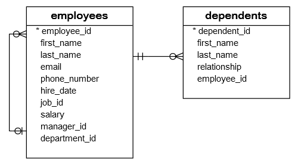
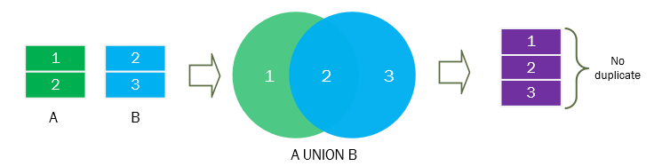
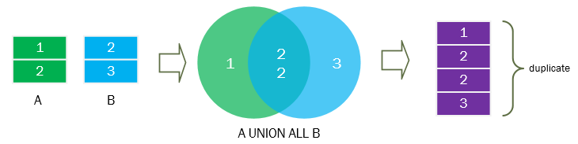
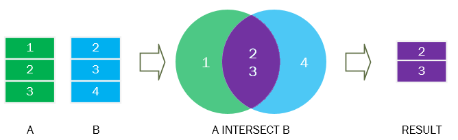
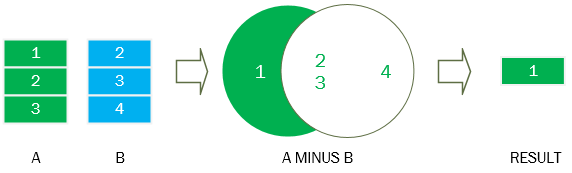

| **Inicio**            | **atrás 3**                | **Siguiente 5**            |
| --------------------- | -------------------------- | -------------------------- |
| [🏠](../../README.md) | [⏪](./3_Consultas_SQL.md) | [⏩](./5_Consultas_SQL.md) |

---

## **Índice**

| Temario                                |
| -------------------------------------- |
| [31. SQL ALL](#31-sql-all)             |
| [32. SQL ANY](#32-sql-any)             |
| [33. SQL EXISTS](#33-sql-exists)       |
| [34. SQL UNION](#34-sql-union)         |
| [35. SQL INTERSECT](#35-sql-intersect) |
| [36. SQL MINUS](#36-sql-minus)         |
| [37. SQL INSERT](#37-sql-insert)       |
| [38. SQL UPDATE](#38-sql-update)       |
| [39. SQL DELETE](#39-sql-delete)       |
| [40. SQL CASE](#40-sql-case)           |

---

# **Tutorial de SQL**

## **31. SQL ALL**

**Resumen :** Aprenderá sobre el operador `ALL` de SQL y cómo usarlo para comparar un valor con un conjunto de valores.

**Introducción al operador SQL ALL**

El operador SQL `ALL` es un operador lógico que compara un valor único con un conjunto de valores de una sola columna devueltos por una subconsulta .

A continuación se ilustra la sintaxis del operador SQL `ALL`:

`WHERE column_name comparison_operator ALL (subquery)`

El operador SQL `ALL` debe ir precedido de un operador de comparación como `>`, `>=`, `<`, `<=`, `<>`, `=` y seguido de una subconsulta . Algunos sistemas de bases de datos como Oracle permiten una lista de valores literales en lugar de una subconsulta.

Tenga en cuenta que si la subconsulta no devuelve ninguna fila, la condición de la cláusula `WHERE` siempre es verdadera. Suponiendo que la subconsulta devuelve una o más filas, la siguiente tabla ilustra el significado del operador SQL `ALL`:

| **Condición** | **Significado**                                                                                                                   |
| ------------- | --------------------------------------------------------------------------------------------------------------------------------- |
| c > ALL(…)    | Los valores de la columna `c` deben ser mayores que el valor más grande del conjunto para evaluarse como verdadero.               |
| c >= ALL(…)   | Los valores de la columna `c` deben ser mayores o iguales que el valor más grande del conjunto para evaluarse como verdadero.     |
| c < ALL(…)    | Los valores de la columna `c` deben ser menores que el valor más bajo del conjunto para que se evalúen como verdaderos.           |
| c >= ALL(…)   | Los valores de la columna `c` deben ser menores o iguales que el valor más bajo del conjunto para que se evalúen como verdaderos. |
| c <> ALL(…)   | Los valores de la columna `c` no deben ser iguales a ningún valor del conjunto para evaluarse como verdadero.                     |
| c = ALL(…)    | Los valores de la columna `c` deben ser iguales a cualquier valor del conjunto para que se evalúen como verdadero.                |

**SQL ALL los ejemplos**

Usaremos la tabla `employees` de la base de datos de muestra para la demostración:


**SQL ALL con el operador mayor que**

La siguiente consulta busca filas cuyos valores en `column_name` son mayores que los valores más grandes devueltos por la subconsulta:

```
SELECT
    *
FROM
    table_name
WHERE
    column_name > ALL (subquery);
```

Por ejemplo, la siguiente declaración busca todos los empleados cuyos salarios son mayores que el salario más alto de los empleados en el departamento `Marketing` cuya identificación es `2`:

```
SELECT
    first_name, last_name, salary
FROM
    employees
WHERE
    salary > ALL (SELECT
            salary
        FROM
            employees
        WHERE
            department_id = 2)
ORDER BY salary;
```

Verifiquémoslo consultando el salario más alto de los empleados del departamento 2:

```
SELECT
    MAX(salary)
FROM
    employees
WHERE
    department_id = 2;
```

Esta consulta arrojó 13,000 un salario inferior a cualquier salario arrojado por la consulta que utilizó el operador `ALL` anterior.

**SQL ALL con el operador mayor o igual que**

A continuación se muestra la sintaxis del operador SQL `ALL` con el operador mayor o igual que:

```
SELECT
    *
FROM
    table_name
WHERE
    column_name >= ALL (subquery);
```

La consulta devuelve todas las filas cuyos valores en `column_name` son mayores o iguales a todos los valores devueltos por la subconsulta.

Por ejemplo, la siguiente consulta busca todos los empleados cuyos salarios son mayores o iguales al salario más alto de los empleados del departamento de Marketing:

```
SELECT
    first_name, last_name, salary
FROM
    employees
WHERE
    salary >= ALL (SELECT
            salary
        FROM
            employees
        WHERE
            department_id = 2)
ORDER BY salary;
```

Como se muestra claramente en la captura de pantalla, el salario de Michaeles 13,000 igual al salario más alto de los empleados del departamento Marketing y se incluye en el conjunto de resultados.

**SQL ALL con el operador menor que**

A continuación se ilustra el operador `ALL` utilizado con el operador menor que:

```
SELECT
    *
FROM
    table_name
WHERE
    column_name < ALL (subquery);
```

Esta consulta devuelve todas las filas cuyos valores en `column_name` son más pequeños que los valores más pequeños devueltos por la subconsulta.

La siguiente declaración encuentra el salario más bajo de los empleados del departamento `Marketing`:

```
SELECT
    MIN(salary)
FROM
    employees
WHERE
    department_id = 2;
```

Para encontrar todos los empleados cuyos salarios son inferiores al salario más bajo de los empleados del departamento `Marketing`, utilice el operador `ALL` con el operador menor que de la siguiente manera:

```
SELECT
    first_name, last_name, salary
FROM
    employees
WHERE
    salary < ALL (SELECT
            salary
        FROM
            employees
        WHERE
            department_id = 2)
ORDER BY salary DESC;
```

**SQL ALL con el operador menor o igual que**

A continuación se muestra la sintaxis del operador `ALL` utilizado con el operador menor o igual que:

```
SELECT
    *
FROM
    table_name
WHERE
    column_name <= ALL (subquery);
```

Por ejemplo, la siguiente declaración busca todos los empleados cuyos salarios son menores o iguales al salario más bajo de los empleados del departamento de `Marketing`:

```
SELECT
    first_name, last_name, salary
FROM
    employees
WHERE
    salary <= ALL (SELECT
            salary
        FROM
            employees
        WHERE
            department_id = 2)
ORDER BY salary DESC;
```

**SQL ALL con el operador no igual a**

La siguiente consulta devuelve todas las filas cuyos valores en `column_name` no son iguales a ningún valor devuelto por la subconsulta:

```
SELECT
    *
FROM
    table_name
WHERE
    column_name <> ALL (subquery);
```

Por ejemplo, para buscar empleados cuyos salarios no sean iguales al salario promedio de cada departamento, utilice la siguiente consulta:

```
SELECT
    first_name, last_name, salary
FROM
    employees
WHERE
    salary <> ALL (SELECT
            AVG(salary)
        FROM
            employees
        GROUP BY department_id)
ORDER BY salary DESC;
```

Observe que la subconsulta encuentra el salario promedio de los empleados por departamento usando la función `AVG()` y la cláusula `GROUP BY`.

**SQL ALL con el operador igual a**

Cuando se utiliza el operador `ALL` con el operador igual a, la consulta encuentra todas las filas cuyos valores en `column_name` son iguales a cualquier valor devuelto por la subconsulta:

```
SELECT
    *
FROM
    table_name
WHERE
    column_name = ALL (subquery);
```

El siguiente ejemplo busca todos los empleados cuyos salarios son iguales al salario más alto de los empleados del departamento `Marketing`:

```
SELECT
    first_name, last_name, salary
FROM
    employees
WHERE
    salary = ALL (SELECT
            MAX(salary)
        FROM
            employees
        WHERE
            department_id = 2);
```

En este tutorial, aprendió a utilizar el operador SQL `ALL` para probar si un valor coincide con un conjunto de valores devueltos por una subconsulta.

[🔼](#índice)

---

## **32. SQL ANY**

**Resumen :** Aprenderá sobre el operador `ANY` de SQL y cómo usarlo para comparar un valor con un conjunto de valores.

**Introducción al operador SQL ANY**

El operador `ANY` es un operador lógico que compara un valor con un conjunto de valores devueltos por una subconsulta. El operador `ANY` debe ir precedido de un operador de comparación `>`, `>=`, `<`, `<=`, `=`, `<>` y seguido de una subconsulta .

A continuación se ilustra la sintaxis del operador `ANY`:

`WHERE column_name comparison_operator ANY (subquery)`

Si la subconsulta no devuelve ninguna fila, la condición se evalúa como falsa. Supongamos que la subconsulta no devuelve cero filas. A continuación se ilustra el significado del operador `ANY` cuando se utiliza con cada operador de comparación:

| **Condición** | **Significado**                                                                                                                     |
| ------------- | ----------------------------------------------------------------------------------------------------------------------------------- |
| x = ANY (…)   | Los valores de la columna `c` deben coincidir con uno o más valores del conjunto para que se evalúen como verdaderos.               |
| x != ANY (…)  | Los valores de la columna `c` no deben coincidir con uno o más valores del conjunto para evaluarse como verdadero.                  |
| x > ANY (…)   | Los valores de la columna `c` deben ser mayores que el valor más pequeño del conjunto para evaluarse como verdadero.                |
| x < ANY (…)   | Los valores de la columna `c` deben ser menores que el valor más grande del conjunto para que se evalúen como verdaderos.           |
| x >= ANY (…)  | Los valores de la columna `c` deben ser mayores o iguales que el valor más pequeño del conjunto para evaluarse como verdadero.      |
| x <= ANY (…)  | Los valores de la columna `c` deben ser menores o iguales que el valor más grande del conjunto para que se evalúen como verdaderos. |

**SQL ANY ejemplo**

Para la demostración, usaremos la tabla `employees` de la base de datos de muestra :


**Ejemplo de SQL ANY con operador igual a**

La siguiente declaración utiliza la función `AVG()` y la cláusula `GROUP BY` para encontrar el salario promedio de cada departamento:

```
SELECT
    ROUND(AVG(salary), 2)
FROM
    employees
GROUP BY
    department_id
ORDER BY
    AVG(salary) DESC;
```

Para encontrar todos los empleados cuyos salarios son iguales al salario promedio de su departamento, utilice la siguiente consulta:

```
SELECT
    first_name,
    last_name,
    salary
FROM
    employees
WHERE
    salary = ANY (
        SELECT
            AVG(salary)
        FROM
            employees
        GROUP BY
            department_id)
ORDER BY
    first_name,
    last_name,
    salary;
```

**Usando SQL ANY con el ejemplo del operador no igual a**

De manera similar, la siguiente consulta busca todos los empleados cuyos salarios no son iguales al salario promedio de cada departamento:

```
SELECT
    first_name,
    last_name,
    salary
FROM
    employees
WHERE
    salary <> ANY (SELECT
            AVG(salary)
        FROM
            employees
        GROUP BY department_id)
ORDER BY
    first_name,
    last_name,
    salary;
```

**Usando SQL ANY con el ejemplo del operador mayor que**

La siguiente consulta busca todos los empleados cuyos salarios son mayores que el salario promedio en cada departamento:

```
SELECT
    first_name,
    last_name,
    salary
FROM
    employees
WHERE
    salary > ANY (SELECT
            AVG(salary)
        FROM
            employees
        GROUP BY department_id)
ORDER BY
    salary;
```

Tenga en cuenta que el salario medio más bajo es 4,150. La consulta anterior devuelve todos los empleados cuyos salarios son superiores al salario más bajo.

**Usando SQL ANY con el ejemplo del operador mayor o igual a**

La siguiente declaración devuelve todos los empleados cuyos salarios son mayores o iguales al salario promedio en cada departamento:

```
SELECT
    first_name,
    last_name,
    salary
FROM
    employees
WHERE
    salary >= ANY (SELECT
            AVG(salary)
        FROM
            employees
        GROUP BY department_id)
ORDER BY first_name , last_name , salary;
```

**Usando SQL ANY con el ejemplo del operador menor que**

La siguiente consulta busca todos los empleados cuyos salarios son inferiores al salario promedio en cada departamento:

```
SELECT
    first_name,
    last_name,
    salary
FROM
    employees
WHERE
    salary < ANY (SELECT
            AVG(salary)
        FROM
            employees
        GROUP BY department_id)
ORDER BY salary DESC;
```

En este ejemplo, los empleados cuyos salarios son inferiores al salario promedio más alto en cada departamento:

**Usando SQL ANY con el ejemplo del operador menor o igual que**

Para buscar empleados cuyos salarios sean menores o iguales al salario promedio en cada departamento, utilice la siguiente consulta:

```
SELECT
    first_name,
    last_name,
    salary
FROM
    employees
WHERE
    salary <= ANY (SELECT
            AVG(salary)
        FROM
            employees
        GROUP BY department_id)
ORDER BY salary DESC;
```

Como se muestra en la captura de pantalla, el conjunto de resultados incluye los empleados cuyos salarios son inferiores o iguales al salario promedio más alto en cada departamento.

Ahora deberías saber cómo utilizar el ANYoperador SQL para formar una condición comparando un valor con un conjunto de valores.

[🔼](#índice)

---

## **33. SQL EXISTS**

**Resumen :** Aprenderá a utilizar el operador SQL `EXISTS` para probar si una subconsulta contiene filas.

**Introducción al operador SQL EXISTS**

El operador SQL `EXISTS` le permite especificar una subconsulta para probar la existencia de filas. A continuación se ilustra la sintaxis del operador `EXISTS`:

`EXISTS (subquery)`

El operador `EXISTS` devuelve verdadero si la subconsulta contiene filas. De lo contrario, devuelve falso.

El operador `EXISTS` finaliza el procesamiento de la consulta inmediatamente una vez que encuentra una fila; por lo tanto, puede aprovechar esta característica del operador `EXISTS` para mejorar el rendimiento de la consulta.

**Ejemplo EXISTS de operador SQL**

Usaremos las tablas `employees` y `dependents` en la base de datos de muestra para la demostración.



La siguiente declaración encuentra todos los empleados que tienen al menos un dependiente:

```
SELECT
    employee_id, first_name, last_name
FROM
    employees
WHERE
    EXISTS( SELECT
            1
        FROM
            dependents
        WHERE
            dependents.employee_id = employees.employee_id);
```

La subconsulta está correlacionada. Para cada fila de la tabla `employees`, la subconsulta comprueba si hay una fila correspondiente en la tabla `dependents`. En caso afirmativo, la subconsulta devuelve uno que hace que la consulta externa incluya la fila actual de la tabla `employees`. Si no hay una fila correspondiente, la subconsulta no devuelve ninguna fila, lo que hace que la consulta externa no incluya la fila actual de la tabla `employees` en el conjunto de resultados.

**SQL NOT EXISTS**

Para negar el operador `EXISTS`, utilice el operador `NOT` de la siguiente manera:

`NOT EXISTS (subquery)`

Por ejemplo, la siguiente consulta busca empleados que no tienen dependientes:

```
SELECT
    employee_id, first_name, last_name
FROM
    employees
WHERE
    NOT EXISTS( SELECT
            1
        FROM
            dependents
        WHERE
            dependents.employee_id = employees.employee_id);
```

**SQL EXISTS y NULL**

Si la subconsulta devuelve `NULL`, el operador `EXISTS` aún devuelve el conjunto de resultados. Esto se debe a que el operador `EXISTS` solo verifica la existencia de la fila devuelta por la subconsulta. No importa si la fila lo es `NULL` o no.

En el siguiente ejemplo, la subconsulta regresa `NULL` pero el operador `EXISTS` aún se evalúa como verdadero:

```
SELECT
    employee_id, first_name, last_name
FROM
    employees
WHERE
    EXISTS( SELECT NULL)
ORDER BY first_name , last_name;
```

La consulta devuelve todas las filas de la tabla `employees`.

En este tutorial, aprendió a utilizar el SQL operador `EXISTS` para probar la existencia de filas devueltas por una subconsulta.

[🔼](#índice)

---

## **34. SQL UNION**

**Resumen :** Le muestra cómo usar SQL `UNION` para combinar dos o más conjuntos de resultados de múltiples consultas y explica la diferencia entre `UNION` y `UNION ALL`.

**Introducción al operador SQL UNION**

El operador `UNION` combina conjuntos de resultados de dos o más declaraciones `SELECT` en un único conjunto de resultados. La siguiente declaración ilustra cómo utilizar el operador `UNION` para combinar conjuntos de resultados de dos consultas:

```
SELECT
    column1, column2
FROM
    table1
UNION [ALL]
SELECT
    column3, column4
FROM
    table2;
```

Para utilizar el operador `UNION`, escriba las declaraciones `SELECT` individuales y únalas con la palabra clave `UNION`.

Las columnas devueltas por las declaraciones `SELECT` deben tener el mismo tipo de datos o tamaño convertible y estar en el mismo orden.

El sistema de base de datos procesa la consulta ejecutando primero dos declaraciones `SELECT`. Luego, combina dos conjuntos de resultados individuales en uno y elimina filas duplicadas. Para eliminar las filas duplicadas, el sistema de base de datos ordena el resultado combinado establecido por cada columna y lo escanea en busca de las filas coincidentes ubicadas una al lado de la otra.

Para conservar las filas duplicadas en el conjunto de resultados, utilice el operador `UNION ALL`.

Supongamos que tenemos dos conjuntos de resultados `A (1,2)` y `B (2,3)`. La siguiente imagen ilustra la `UNION A B`:



Y la siguiente imagen ilustra `A UNION ALL B`



La unión se diferencia de la unión en que la unión combina columnas de varias tablas, mientras que la unión combina filas de las tablas.

**Los ejemplos de UNION SQL**

**Ejemplo de UNION SQL**

Para obtener los datos de la `tabla A`, utilice la siguiente instrucción `SELECT`:

```
SELECT
    id
FROM
    A;
```

| **id** |
| ------ |
| 1      |
| 2      |

Para recuperar los datos de la `tabla B`, utilice la siguiente declaración:

```
SELECT
    id
FROM
    B;
```

| **id** |
| ------ |
| 2      |
| 3      |

Para combinar conjuntos de resultados de estas dos consultas, utilice el operador `UNION` de la siguiente manera:

```
SELECT
	id
FROM
	a
UNION
SELECT
	id
FROM
	b;
```

| **id** |
| ------ |
| 1      |
| 2      |
| 3      |

El conjunto de resultados incluye solo 3 filas porque el operador `UNION` elimina una fila duplicada.

**Ejemplo de UNION SQL TODOS**

Para conservar la fila duplicada, utilice el operador `UNION ALL` de la siguiente manera:

| **id** |
| ------ |
| 1      |
| 2      |
| 2      |
| 3      |

**UNION SQL con ejemplo ORDER BY**

Para ordenar el conjunto de resultados, coloque la cláusula `ORDER BY` después de todas las declaraciones `SELECT` de la siguiente manera:

```
SELECT
	id
FROM
	a
UNION
SELECT
	id
FROM
	b
ORDER BY id DESC;
```

| **id** |
| ------ |
| 3      |
| 2      |
| 1      |

El sistema de base de datos realiza los siguientes pasos:

- Primero, ejecute cada instrucción `SELECT` individualmente.

- En segundo lugar, combine conjuntos de resultados y elimine filas duplicadas para crear el conjunto de resultados combinado.

- En tercer lugar, ordene el resultado combinado establecido por la columna especificada en la cláusula `ORDER BY`.

En la práctica, solemos utilizar el operador `UNION` para combinar datos de diferentes tablas. Consulte las siguientes tablas de empleados y dependientes:


La siguiente declaración utiliza el operador `UNION` para combinar el nombre y apellido de los empleados y dependientes.

```
SELECT
	first_name,
	last_name
FROM
	employees
UNION
SELECT
	first_name,
	last_name
FROM
	dependents
ORDER BY
	last_name;
```

En este tutorial, aprendió a utilizar el operador `UNION` para combinar dos o más conjuntos de resultados de múltiples consultas.

[🔼](#índice)

---

## **35. SQL INTERSECT**

**Resumen :** El operador SQL `INTERSECT` y le muestra cómo aplicarlo para obtener la intersección de dos o más consultas.

**Introducción al operador SQL INTERSECT**

El operador `INTERSECT` es un operador de conjunto que devuelve filas distintas de dos o más conjuntos de resultados de declaraciones `SELECT`.

Supongamos que tenemos dos tablas: `A (1,2)` y `B (2,3)`.

La siguiente imagen ilustra la intersección de las tablas `A` y `B`.



La sección violeta es la intersección de los conjuntos de resultados verde y azul.

Al igual que el operador `UNION` , el operador `INTERSECT` elimina las filas duplicadas del conjunto de resultados final.

La siguiente declaración ilustra cómo utilizar el operador `INTERSECT` para encontrar la intersección de dos conjuntos de resultados.

```
SELECT
	id
FROM
	a
INTERSECT
SELECT
	id
FROM
	b;
```

Para utilizar el operador `INTERSECT`, las columnas de las declaraciones `SELECT` deben seguir las reglas:

- Los tipos de datos de las columnas deben ser compatibles.

- El número de columnas y su orden en las declaraciones `SELECT` deben ser los mismos.

**Ejemplo de operador SQL INTERSECT**

La siguiente instrucción `SELECT` devuelve filas de la `tabla A`:

```
SELECT
	id
FROM
	A;
```

| **id** |
| ------ |
| 1      |
| 2      |

Y la siguiente declaración recupera los datos de la `tabla B`:

```
SELECT
	id
FROM
	B;
```

| **id** |
| ------ |
| 2      |
| 3      |

La siguiente declaración utiliza el operador `INTERSECT` para obtener la intersección de ambas consultas.

```
SELECT
	id
FROM
	a
INTERSECT
SELECT
	id
FROM
	b;
```

| **id** |
| ------ |
| 2      |
| 3      |

**SQL INTERSECT con ORDER BY ejemplo**

Para ordenar el conjunto de resultados devuelto por el operador `INTERSECT`, coloque la cláusula `ORDER BY` al final de todas las declaraciones.

Por ejemplo, la siguiente declaración aplica el operador `INTERSECT` a las tablas `A` y `B` y ordena el resultado combinado establecido por la columna de identificación en orden descendente.

```
SELECT
	id
FROM
	a
INTERSECT
SELECT
	id
FROM
	b
ORDER BY id DESC;
```

| **id** |
| ------ |
| 3      |
| 2      |

**Emular el operador SQL INTERSECT utilizando la cláusula INNER JOIN**

La mayoría de los sistemas de bases de datos relacionales admiten el operador `INTERSECT`, como Oracle Database, Microsoft SQL Server, PostgreSQL, etc. Sin embargo, algunos sistemas de bases de datos no proporcionan el operador `INTERSECT` como MySQL.

Para emular el operador SQL `INTERSECT`, puede utilizar la cláusula `INNER JOIN` de la siguiente manera:

```
SELECT
	a.id
FROM
	a
INNER JOIN b ON b.id = a.id
```

Devuelve las filas de la tabla `A` que tienen filas coincidentes en la tabla `B`, lo que produce el mismo resultado que el operador `INTERSECT`.

Ahora debería tener un buen conocimiento del operador SQL `INTERSECT` y saber cómo usarlo para encontrar las intersecciones de múltiples consultas.

[🔼](#índice)

---

## **36. SQL MINUS**

**Resumen :** Aprenderá a utilizar el operador `MINUS` de SQL para restar un conjunto de resultados de otro.

**Introducción al operador SQL MINUS**

Además de los operadores `UNION`, `UNION ALL` y `INTERSECT`, SQL nos proporciona el operador `MINUS` que le permite restar un conjunto de resultados de otro conjunto de resultados.

A continuación se ilustra la sintaxis del operador `MINUS`.

```
SELECT
	id
FROM
	A
MINUS
SELECT
	id
FROM
	B;
```

Para utilizar el operador `MINUS`, escriba declaraciones `SELECT` individuales y coloque el operador `MINUS` entre ellas. El operador `MINUS` devuelve las filas únicas producidas por la primera consulta pero no por la segunda.

La siguiente imagen ilustra al operador `MINUS`.



Para generar el conjunto de resultados, el sistema de base de datos realiza dos consultas y resta el conjunto de resultados de la primera consulta de la segunda.

Para utilizar el operador `MINUS`, las columnas de las cláusulas `SELECT` deben coincidir en número y deben tener el mismo tipo de datos o, al menos, convertible.

A menudo utilizamos el operador `MINUS` en ETL. Un ETL es un componente de software en un sistema de almacenamiento de datos. ETL significa Extraer, Transformar y Cargar. ETL es responsable de cargar datos de los sistemas de origen en el sistema de almacenamiento de datos.

Después de completar la carga de datos, podemos usar el operador `MINUS` para asegurarnos de que los datos se hayan cargado completamente restando los datos en el sistema de destino de los datos en el sistema de origen.

**Ejemplos de SQL MINUS**

Considere las siguientes tablas `employees` y `dependentsen` la base de datos de ejemplo .


Cada empleado tiene cero o más dependientes, mientras que cada dependiente depende de uno y solo un empleado. La relación entre los dependientes y los empleados es la relación de uno a muchos.

La columna `employee_id` de la tabla `dependents` hace referencia a la columna `employee_id` de la tabla `employees`.

Puede utilizar el operador `MINUS` para buscar empleados que no tengan dependientes. Para hacer esto, reste el conjunto de `employee_id` resultados en la tabla `employees` del `employee_id` conjunto de resultados en la tabla `dependents`.

La siguiente consulta ilustra la idea:

```
SELECT
    employee_id
FROM
    employees
MINUS
SELECT
    employee_id
FROM
    dependents;
```

**SQL MINUS con ORDER BY ejemplo**

Para ordenar el conjunto de resultados devuelto por el operador `MINUS`, coloque la cláusula `ORDER BY` al final de la última declaración `SELECT`.

Por ejemplo, para ordenar los empleados que no tienen dependientes, utilice la siguiente consulta:

```
SELECT
    employee_id
FROM
    employees
MINUS
SELECT
    employee_id
FROM
    dependents
ORDER BY employee_id;
```

Ahora debería tener un buen conocimiento del operador SQL `MINUS` y saber cómo aplicarlo para comparar dos conjuntos de resultados.

[🔼](#índice)

---

## **37. SQL INSERT**

**Resumen :** Aprenderá cómo insertar datos en una tabla usando la instrucción SQL `INSERT`.

**Introducción a la declaración SQL `INSERT`**

SQL proporciona la declaración `INSERT` que le permite insertar una o más filas en una tabla. La declaración `INSERT` le permite:

- Insertar una sola fila en una tabla

- Insertar varias filas en una tabla

- Copie filas de una tabla a otra tabla.

Examinaremos cada función del enunciado `INSERT` en las siguientes secciones.

**Insertar una fila en una tabla**

Para insertar una fila en una tabla, utilice la siguiente sintaxis de la declaración `INSERT`.

```
INSERT INTO table1 (column1, column2,...)
VALUES
	(value1, value2,...);
```

Hay algunos puntos a los que debes prestar atención cuando insertas una nueva fila en una tabla:

- Primero, el número de valores debe ser igual al número de columnas. Además, las columnas y los valores deben ser los correspondientes porque el sistema de base de datos los relacionará por sus posiciones relativas en las listas.

- En segundo lugar, antes de agregar una nueva fila, el sistema de base de datos verifica todas las restricciones de integridad, por ejemplo, restricción de clave externa , restricción de clave primaria , restricción de verificación y no restricción nula . Si se viola una de estas restricciones, el sistema de base de datos emitirá un error y finalizará la declaración sin insertar ninguna fila nueva en la tabla.

No es necesario especificar las columnas si la secuencia de valores coincide con el orden de las columnas de la tabla. Consulte la siguiente declaración `INSERT` que omite la lista de columnas en la cláusula `INSERT INTO`.

```
INSERT INTO table1
VALUES
	(value1, value2,...);
```

Sin embargo, esto no se considera una buena práctica.

Si no especifica una columna y su valor en la declaración `INSERT` cuando inserta una nueva fila, esa columna tomará un valor predeterminado especificado en la estructura de la tabla. El valor predeterminado podría ser 0, el siguiente valor entero en una secuencia, la hora actual, un valor `NULL`, etc. Consulte la siguiente declaración:

```
INSERT INTO (column1, column3)
VALUES
	(column1, column3);
```

En esta sintaxis, `column2` tomará un valor predeterminado.

**Insertar una fila en un ejemplo de tabla**

Usaremos las tablas `employees` y `dependents` en la base de datos de muestra para mostrarle cómo insertar una fila en la tabla.


Para insertar una nueva fila en la tabla `dependents`.

```
INSERT INTO dependents (
	first_name,
	last_name,
	relationship,
	employee_id
)
VALUES
	(
		'Dustin',
		'Johnson',
		'Child',
		178
	);
```

No usamos la columna `department_id` en la declaración `INSERT` porque la columna `dependent_id` es una columna de incremento automático, por lo tanto, el sistema de base de datos usa el siguiente número entero como valor predeterminado cuando inserta una nueva fila.

La columna `employee_id` es una clave externa que vincula la tabla `dependents` con la tabla `employees`. Antes de agregar las nuevas filas, el sistema de base de datos verifica si el valor 178 existe en la columna `employee_id` de la tabla `employees` para asegurarse de que no se viole la restricción de clave externa.

Si la fila se inserta correctamente, el sistema de base de datos devuelve el número de filas afectadas.

`Affected rows: 1`

Puede comprobar si la fila se ha insertado correctamente o no utilizando la siguiente instrucción `SELECT`.

```
SELECT
    *
FROM
    dependents
WHERE
    employee_id = 178;
```

**Insertar varias filas en una tabla**

Para insertar varias filas usando una sola declaración `INSERT`, use la siguiente construcción:

```
INSERT INTO table1
VALUES
	(value1, value2,...),
	(value1, value2,...),
	(value1, value2,...),
	...;
```

Por ejemplo, para insertar dos filas en la tabla `dependents`, utilice la siguiente consulta.

```
INSERT INTO dependents (
	first_name,
	last_name,
	relationship,
	employee_id
)
VALUES
	(
		'Cameron',
		'Bell',
		'Child',
		192
	),
	(
		'Michelle',
		'Bell',
		'Child',
		192
	);
```

El sistema de base de datos devuelve 2 filas afectadas. Puede verificar el resultado utilizando la siguiente declaración.

```
SELECT
    *
FROM
    dependents
WHERE
    employee_id = 192;
```

**Copiar filas de otras tablas**

Puede utilizar la declaración `INSERT` para consultar datos de una o más tablas e insertarlos en otra tabla de la siguiente manera:

```
INSERT INTO table1 (column1, column2)
SELECT
	column1,
	column2
FROM
	table2
WHERE
	condition1;
```

En esta sintaxis, se utiliza un `SELECT` que se denomina subselección en lugar de la cláusula `VALUES`. La subselección puede contener las combinaciones para que pueda combinar datos de varias tablas. Al ejecutar la declaración, el sistema de base de datos evalúa primero la subselección antes de insertar datos.

Supongamos que tiene una tabla llamada `dependents_archive` que tiene la misma estructura que la tabla `dependents`. La siguiente declaración copia todas las filas de la tabla `dependents` a la tabla `dependents_archive`.

```
INSERT INTO dependents_archive
SELECT
	*
FROM
	dependents;
```

Puede verificar la operación de inserción utilizando la siguiente declaración.

```
SELECT
	*
FROM
	dependents_archive;
```

Ahora deberías saber cómo utilizar la instrucción SQL `INSERT` para insertar una o más filas en una tabla.

[🔼](#índice)

---

## **38. SQL UPDATE**

**Resumen :** Aprenderá a utilizar la declaración SQL `UPDATE` para modificar los datos de las filas existentes de una tabla.

**Introducción a la declaración UPDATE de SQL**

Para cambiar los datos existentes en una tabla, utiliza la declaración `UPDATE`. A continuación se muestra la sintaxis de la declaración `UPDATE`:

```
UPDATE table_name
SET column1 = value1,
 column2 = value2
WHERE
	condition;
```

En esta sintaxis:

- Primero, indica la tabla que deseas actualizar en la cláusula `UPDATE`.

- En segundo lugar, especifique las columnas que desea modificar en la cláusula `SET`. Las columnas que no figuran en la cláusula `SET` conservarán sus valores originales.

- En tercer lugar, especifique qué filas actualizar en la cláusula `WHERE`.

La cláusula `UPDATE` afecta a una o más filas de una tabla según la condición de la cláusula `WHERE`. Por ejemplo, si la cláusula `WHERE` contiene una expresión de clave principal , la declaración `UPDATE` cambia solo una fila.

`WHERE` Sin embargo, se modificará cualquier fila que haga que la condición en el se evalúe como verdadera. Debido a que la cláusula `WHERE` es opcional, si la omite, todas las filas de la tabla se verán afectadas.

**Ejemplos de declaraciones de UPDATE de SQL**

Usaremos la tabla de empleados y dependientes para demostrar la declaración `UPDATE`.


**Ejemplo de UPDATE de SQL de una fila**

Supongamos que la identificación de empleada 192 Sarah Bell cambió su apellido de Bella Lopezy necesita actualizar su registro en la tabla `employees`.

Para actualizar el apellido de Sarah de Bella Lopez, utilice la siguiente declaración `UPDATE`:

```
UPDATE employees
SET
    last_name = 'Lopez'
WHERE
    employee_id = 192;
```

El sistema de base de datos actualizó el valor en la columna `last_name` y la fila con `employee_id 192`.

Puede verificarlo utilizando la siguiente declaración `SELECT`.

```
SELECT
	employee_id,
	first_name,
	last_name
FROM
	employees
WHERE
	employee_id = 192;
```

**Ejemplo de UPDATE de SQL de varias filas**

Ahora Nancy quiere cambiar los apellidos de todos sus hijos de Bella Lopez. En este caso, deberá actualizar todos los dependientes de Nancy en la tabla `dependents`.

Antes de actualizar los datos, revisemos las personas dependientes de Nancy.

```
SELECT
	*
FROM
	dependents
WHERE
	employee_id = 192;
```

Para actualizar los apellidos de los dependientes de Nancy, utilice la siguiente declaración `UPDATE`.

```
UPDATE dependents
SET
    last_name = 'Lopez'
WHERE
    employee_id = 192;
```

**UPDATE de SQL con ejemplo de subconsulta**

A veces, cuando los empleados cambian sus apellidos, actualiza la tabla `employees` solo sin actualizar la tabla de `dependientes`.

Para asegurarse de que los apellidos de los niños siempre coincidan con el apellido de los padres en la tabla `employees`, utilice la siguiente declaración:

```
UPDATE dependents
SET last_name = (
	SELECT
		last_name
	FROM
		employees
	WHERE
		employee_id = dependents.employee_id
);
```

`WHERE` Como se omite la cláusula, la declaración `UPDATE` actualizó todas las filas de la tabla `dependents`.

En la cláusula `SET`, en lugar de usar valores literales, usamos una subconsulta para obtener el valor de apellido correspondiente de la tabla `employees`.

En este tutorial, le mostramos cómo utilizar la declaración SQL `UPDATE` para modificar datos existentes en una tabla.

[🔼](#índice)

---

## **39. SQL DELETE**

**Resumen :** Aprenderá a utilizar la declaración SQL `DELETE` para eliminar una o más filas de una tabla.

**Introducción a la declaración DELETE de SQL**

Para eliminar una o más filas de una tabla, utiliza la declaración `DELETE`. La sintaxis general de la declaración `DELETE` es la siguiente:

```
DELETE
FROM
	table_name
WHERE
	condition;
```

Primero, proporcione el nombre de la tabla donde desea eliminar filas.

En segundo lugar, especifique la condición en la cláusula `WHERE` para identificar las filas que deben eliminarse. Si omite la cláusula `WHERE`, se eliminarán todas las filas de la tabla. Por lo tanto, siempre debes utilizar la declaración `DELETE` con precaución.

En términos generales, la declaración `DELETE` no devuelve un resultado establecido como declaración `SELECT`. Sin embargo, devuelve el número de filas eliminadas.

**Ejemplos de sentencias DELETE de SQL**

Usaremos las tablas `employees` y `dependents` para demostrar la afirmación `DELETE`.


**SQL DELETE una fila en una tabla**

Supongamos que David, que tiene el ID de empleado 105, quiere eliminar a Fred de su lista de dependientes. Sabemos que Fredtiene el ID de dependiente 16, por lo que usamos la siguiente declaración `DELETE` para eliminar a Fred de la tabla `dependents`.

```
DELETE FROM dependents
WHERE
    dependent_id = 16;
```

Debido a que la cláusula `WHERE` contiene la expresión de clave principal que identifica a Fred, la declaración `DELETE`elimina solo una fila.

Puede verificar que la fila con el ID de dependiente 16 se haya eliminado utilizando la siguiente declaración:

```
SELECT
    COUNT(*)
FROM
    dependents
WHERE
    dependent_id = 16;
```

**Ejemplo de SQL DELETE varias filas**

Para eliminar varias filas en una tabla, utilice la condición en la cláusula `WHERE` para identificar las filas que deben eliminarse. Por ejemplo, la siguiente declaración utiliza el operador `IN` para incluir a los dependientes de los empleados con la identificación 100, 101 o 102.

```
DELETE FROM dependents
WHERE
    employee_id IN (100 , 101, 102);
```

**QL DELETE filas de tablas relacionadas**

Un empleado puede tener cero o muchos dependientes, mientras que un dependiente pertenece a un solo empleado. La columna `employee_id` de la tabla `dependents` enlaza con la columna `employee_id` de la tabla `employees`.

La relación entre las tablas `employees` y `dependents` es de uno a muchos.

Lógicamente, un dependiente no puede existir sin hacer referencia a un empleado. En otras palabras, cuando elimina a un empleado, sus dependientes también deben eliminarse.

Por ejemplo, para eliminar el ID de empleado 192 y todos los dependientes del empleado, debe ejecutar dos instrucciones `DELETE` de la siguiente manera:

```
DELETE
FROM
	employees
WHERE
	employee_id = 192;

DELETE
FROM
	dependents
WHERE
	employee_id = 192;
```

La mayoría de los sistemas de bases de datos admiten la restricción de clave externa , de modo que cuando se elimina una fila de una tabla, las filas de las tablas de clave externa también se eliminan automáticamente.

Por lo tanto, cuando `DELETE` se ejecuta la siguiente declaración:

```
DELETE
FROM
	employees
WHERE
	employee_id = 192;
```

Todas las filas con `employee_id` 192 también se eliminan automáticamente.

Para eliminar todas las filas de una tabla de manera más eficiente, use la declaración `TRUNCATE TABLE` en lugar de usar la declaración `DELETE` sin cláusula `WHERE`.

Ahora debería comprender la declaración SQL `DELETE` y cómo aplicarla para eliminar una o más filas de una tabla.

[🔼](#índice)

---

## **40. SQL CASE**

**Resumen :** Aprenderá a utilizar la expresión `SQL CASE` para agregar lógica a las declaraciones SQL.

**Introducción a la expresión SQL CASE**

La expresión SQL `CASE` le permite evaluar una lista de condiciones y devuelve uno de los posibles resultados. La expresión `CASE` tiene dos formatos: `CASE simple` y `CASE buscado`.

Puede utilizar la expresión `CASE` en una cláusula o declaración que permita una expresión válida. Por ejemplo, puede utilizar la expresión `CASE` en declaraciones como `SELECT`, `DELETE` y `UPDATE` o en cláusulas como `SELECT`, `ORDER BY` y `HAVING`.

**Expresión CASE simple**

A continuación se ilustra la expresión `CASE` simple:

```
CASE expression
WHEN when_expression_1 THEN
	result_1
WHEN when_expression_2 THEN
	result_2
WHEN when_expression_3 THEN
	result_3
...
ELSE
	else_result
END
```

La expresión `CASE` compara una expresión con un conjunto de expresiones (cuando_expresión_1, cuando_expresión_2, cuando_expresión_3,…) utilizando el operador de igualdad `(=)`. Si desea utilizar otros operadores de comparación, como mayor que `(>)`, menor que `(<)`, etc., utilice la expresión `CASE` buscada.

La declaración `CASE` devuelve `resultado_1`, `resultado_2` o `resultado_3` si la expresión coincide con la expresión correspondiente en la cláusula `WHEN`.

Si la expresión no coincide con ninguna expresión en la cláusula `WHEN`, devuelve `esle_result` en la cláusula `ELSE`. La cláusula `ELSE` es opcional.

Si omite la cláusula `ELSE` y la expresión no coincide con ninguna expresión de la cláusula `WHEN`, la expresión `CASE` devuelve `NULL`.

**Ejemplo de expresión CASE simple**

Echemos un vistazo a la tabla de empleados.


Supongamos que el año actual es 2000.

Podemos usar la expresión `CASE` simple para obtener los aniversarios laborales de los empleados usando la siguiente declaración:

```
SELECT
    first_name,
    last_name,
    hire_date,
    CASE (2000 - YEAR(hire_date))
        WHEN 1 THEN '1 year'
        WHEN 3 THEN '3 years'
        WHEN 5 THEN '5 years'
        WHEN 10 THEN '10 years'
        WHEN 15 THEN '15 years'
        WHEN 20 THEN '20 years'
        WHEN 25 THEN '25 years'
        WHEN 30 THEN '30 years'
    END aniversary
FROM
    employees
ORDER BY first_name;
```

La función AÑO devuelve el año en que el empleado se incorporó a la empresa. Obtenemos el número de años que el empleado lleva en la empresa y restando el año en que el empleado se incorporó a la empresa del año actual (2000).

Obtenemos el número de años que el empleado ha estado en la empresa restando el año en que el empleado se incorporó a la empresa del año actual (2000).

Luego comparamos el resultado con 1, 3, 5, 10, 15, 20, 25, 30. Si el año de servicio es igual a uno de estos números, la expresión `CASE` devuelve el aniversario laboral del empleado.

Si el año de servicios del empleado no coincide con estos números, la expresión `CASE` devuelve `NULL`.

**Expresión CASE buscada**

A continuación se muestra la expresión `CASE` buscada.

```
CASE
WHEN boolean_expression_1 THEN
	result_1
WHEN boolean_expression_2 THEN
	result_2
WHEN boolean_expression_3 THEN
	result_3
ELSE
	else_result
END;
```

El sistema de base de datos evalúa la expresión booleana para cada cláusula `WHEN` en el orden especificado en la expresión `CASE`.

Si la expresión booleana en cada cláusula `WHEN` se evalúa como verdadera, la declaración `CASE` buscada devuelve el resultado en la cláusula `THEN` correspondiente.

Si ninguna expresión booleana devuelve verdadero, la expresión `CASE` devuelve el resultado `else_result` en la cláusula `ELSE`.

Al igual que la expresión `CASE` simple, la cláusula `END` es opcional. Si omite la cláusula `ELSE` y ninguna expresión booleana se evalúa como verdadera, la expresión `CASE` devuelve un valor `NULL`.

**Ejemplo de expresión de búsqueda CASE**

A continuación se ilustra el ejemplo de expresión `CASE` buscada.

```
SELECT
    first_name,
    last_name,
    CASE
        WHEN salary < 3000 THEN 'Low'
        WHEN salary >= 3000 AND salary <= 5000 THEN 'Average'
        WHEN salary > 5000 THEN 'High'
    END evaluation
FROM
    employees;
```

Si el salario es inferior a 3000, la expresión `CASE` devuelve "Bajo". Si el salario está entre 3000 y 5000, devuelve "promedio". Cuando el salario es superior a 5000, la expresión `CASE` devuelve "Alto".

En este tutorial, le presentamos la declaración SQL `CASE` que le permite agregar la lógica `IF THEN ELSE` a las declaraciones SQL.

[🔼](#índice)

---

| **Inicio**            | **atrás 3**                | **Siguiente 5**            |
| --------------------- | -------------------------- | -------------------------- |
| [🏠](../../README.md) | [⏪](./3_Consultas_SQL.md) | [⏩](./5_Consultas_SQL.md) |
