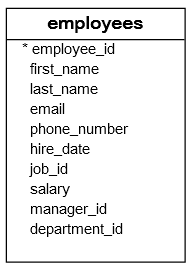

| **Inicio**            | **atrás 4**                | **Siguiente 6**            |
| --------------------- | -------------------------- | -------------------------- |
| [🏠](../../README.md) | [⏪](./4_Consultas_SQL.md) | [⏩](./6_Consultas_SQL.md) |

---

## **Índice**

| Temario                                          |
| ------------------------------------------------ |
| [41. SQL AVG](#41-sql-avg)                       |
| [42. SQL COUNT](#42-sql-count)                   |
| [43. SQL MAX](#43-sql-max)                       |
| [44. SQL MIN](#44-sql-min)                       |
| [45. SQL SUM](#45-sql-sum)                       |
| [46. SQL Data Types](#46-sql-data-types)         |
| [47. SQL CREATE TABLE](#47-sql-create-table)     |
| [48. SQL Identity](#48-sql-identity)             |
| [49. SQL Auto Increment](#49-sql-auto-increment) |
| [50. SQL ALTER TABLE](#50-sql-alter-table)       |

---

# **Tutorial de SQL**

## **41. SQL AVG**

**Resumen :** Le mostraremos cómo usar la función SQL `AVG` para obtener el valor promedio de un conjunto.

**Introducción a la función SQL AVG**

La función SQL `AVG` es una función agregada que calcula el valor promedio de un conjunto. A continuación se ilustra la sintaxis de la función SQL `AVG`:

`AVG([ALL|DISTINCT] expression)`

Si usamos la palabra clave `ALL`, la función `AVG` toma todos los valores en el cálculo. De forma predeterminada, la función `AVG` usa `TODO`, lo especifiquemos o no.

Si especificamos explícitamente la palabra clave `DISTINCT`, la función `AVG` tomará los valores únicos solo en el cálculo.

Por ejemplo, tenemos un conjunto de (1,2,3,3,4) y aplicamos `AVG(ALL)` a este conjunto, la función `AVG` realizará el siguiente cálculo:

`(1+2+3+3+4)/5 = 2.6`

Sin embargo, el `AVG(DISTINCT)` procesará de la siguiente manera:

`(1+2+3+4)/4 = 2.5`

**Ejemplos de funciones SQL AVG**

Usaremos la tabla `employees` de la base de datos de ejemplo para demostrar cómo funciona la función SQL `AVG`. La siguiente imagen ilustra la estructura de la tabla `employees`:



Para calcular el salario promedio de todos los empleados, aplique la función `AVG` a la columna de salario de la siguiente manera:

```
SELECT
    AVG(salary)
FROM
    employees;
```

Apliquemos el operador `DISTINCT` para ver si el resultado cambia:

```
SELECT
    AVG(DISTINCT salary)
FROM
    employees;
```

Cambió porque algunos empleados tienen el mismo salario.

Para redondear el resultado a 2 decimales, utilice la función `REDONDEAR` de la siguiente manera:

```
SELECT
    ROUND(AVG(DISTINCT salary), 2)
FROM
    employees;
```

Para calcular el valor promedio de un subconjunto de valores, agregamos una cláusula `WHERE` a la declaración `SELECT`. Por ejemplo, para calcular el salario promedio de los empleados en el departamento `id` 5, utilizamos la siguiente consulta:

```
SELECT
	AVG(DISTINCT salary)
FROM
	employees
WHERE
	department_id = 5;
```

La siguiente declaración devuelve el salario promedio de los empleados que ocupan el puesto id 6:

```
SELECT
    AVG(salary)
FROM
    employees
WHERE
    job_id = 6;
```

**Ejemplo de SQL AVG con cláusula GROUP BY**

Para calcular los valores medios de los grupos utilizamos la función `AVG` con la cláusula `GROUP BY`. Por ejemplo, la siguiente declaración devuelve los departamentos y el salario promedio de los empleados de cada departamento.

```
SELECT
	department_id,
	AVG(salary)
FROM
	employees
GROUP BY
	department_id;
```

Podemos usar la cláusula de unión interna para unir la tabla `employees` con la tabla `departments` para obtener los datos del nombre del departamento:

```
SELECT
    e.department_id,
    d.department_name,
    AVG(e.salary) AS average_salary
FROM
    employees e
INNER JOIN departments d ON d.department_id = e.department_id
GROUP BY
    e.department_id, d.department_name;  -- Incluir ambos campos en GROUP BY

```

**Ejemplo de SQL AVG con cláusula ORDER BY**

Para ordenar el conjunto de resultados que incluye los resultados de `AVG`, utilice la función `AVG` en la cláusula `ORDER BY` de la siguiente manera:

```
SELECT
    e.department_id,
    d.department_name,
    AVG(e.salary) AS average_salary
FROM
    employees e
INNER JOIN departments d ON d.department_id = e.department_id
GROUP BY
    e.department_id, d.department_name
ORDER BY
    average_salary DESC;  -- Utilizando el alias en ORDER BY
```

**SQL AVG con ejemplo de cláusula HAVING**

Para filtrar un grupo, utilice la función `AVG` en la cláusula `HAVING`. Por ejemplo, la siguiente declaración obtiene el departamento que tiene un salario promedio inferior a 5000:

**SQL AVG con una subconsulta**

Podemos aplicar la función `AVG` varias veces en una sola declaración SQL para calcular el valor promedio de un conjunto de valores promedio.

Por ejemplo, podemos usar la función `AVG` para calcular el salario promedio de los empleados en cada departamento y aplicar la función `AVG` una vez más para calcular el salario promedio de los departamentos.

La siguiente consulta ilustra la idea:

```
SELECT
	AVG(employee_sal_avg)
FROM
	(
		SELECT
			AVG(salary) employee_sal_avg
		FROM
			employees
		GROUP BY
			department_id
	) t;
```

Cómo funciona la consulta.

- La subconsulta devuelve un conjunto de salarios promedio de los empleados de cada departamento.

- La consulta externa devuelve el salario promedio de los departamentos.

En este tutorial, ha aprendido a utilizar la función SQL AVG para calcular el valor promedio de un conjunto.

[🔼](#índice)

---

## **42. SQL COUNT**

**Resumen :** Aprenderá a utilizar la función `COUNT` de SQL para obtener la cantidad de elementos de un grupo.

**Introducción a la función SQL COUNT**

La función SQL `COUNT` es una función agregada que devuelve el número de filas devueltas por una consulta. Puede utilizar la función `COUNT` en la instrucción `SELECT` para obtener la cantidad de empleados, la cantidad de empleados en cada departamento, la cantidad de empleados que tienen un trabajo específico, etc.

A continuación se ilustra la sintaxis de la función `COUNT`:

`COUNT([ALL | DISTINCT] expression);`

El resultado de la función `COUNT` depende del argumento que le pases.

- La palabra clave `ALL` incluirá los valores duplicados en el resultado. Por ejemplo, si tiene un grupo (1, 2, 3, 3, 4, 4) y aplica la función `COUNT`, el resultado es 6. De forma predeterminada, la función `COUNT` usa la palabra clave `ALL`, ya sea que la especifique o no.

- La palabra clave `DISTINCT` cuenta solo valores únicos. Por ejemplo, la función `COUNT` devuelve 4 si la aplicas al grupo (1, 2, 3, 3, 4, 4).
  La expresión es una columna de una tabla donde desea contar el valor.

Otra forma de función `COUNT` que acepta un asterisco (\*) como argumento es la siguiente:

`COUNT(*)`

La función `COUNT(*)` devuelve el número de filas de una tabla en una consulta. Cuenta filas duplicadas y filas que contienen valores nulos.

**Ejemplos de la función COUNT de SQL**

Tomemos algunos ejemplos para ver cómo funciona la función `COUNT`. Usaremos la tabla `employees` en la base de datos de muestra con fines de demostración:


**Ejemplos de COUNT SQL `(*)`**

El siguiente ejemplo utiliza la función `COUNT(*)` para obtener el número de filas de la TABLA `employees`:

```
SELECT
    COUNT(*)
FROM
    employees;
```

El siguiente ejemplo utiliza la función `COUNT(*)` para contar los empleados que trabajan en el departamento con id 6:

```
SELECT
    COUNT(*)
FROM
    employees
WHERE
    department_id = 6;
```

En este ejemplo:

- Primero, la cláusula `WHERE` de filtro departamento con id 6.

- En segundo lugar, la función `COUNT(*)` devuelve el número de filas de la TABLA `employees` con el valor en el ID de departamento 6.

El siguiente ejemplo utiliza la función `COUNT(*)` para obtener la cantidad de empleados con el ID de trabajo 9:

```
SELECT
    COUNT(*)
FROM
    employees
WHERE
    job_id = 9;
```

Cómo funciona.

- Primero, la cláusula `WHERE` incluye las filas de la tabla `employees` con la identificación del trabajo 9.

- En segundo lugar, devuelve `COUNT(*)` el número de filas de la tabla `employees` con el `ID` de trabajo 9.

El siguiente ejemplo utiliza la palabra clave `AS` para asignar un alias de columna`COUNT(*)`:

```
SELECT
    COUNT(*) as employee_count
FROM
    employees
WHERE
    job_id = 9;
```

**SQL COUNT con ejemplos de cláusula GROUP BY**

El siguiente ejemplo utiliza la función `COUNT` con la cláusula `GROUP BY` para encontrar la cantidad de empleados para cada departamento:

```
SELECT
	department_id,
	COUNT(*)
FROM
	employees
GROUP BY
	department_id;
```

Cómo funciona:

- Primero, la cláusula `GROUP BY` agrupa las filas de la tabla `employees` por la identificación del departamento.

- En segundo lugar, la función `COUNT(*)` devuelve el número de filas para cada grupo.

El siguiente ejemplo utiliza la función `COUNT(*)` para obtener la cantidad de empleados por departamento. Además, utiliza una cláusula `INNER JOIN` para incluir el nombre del departamento en el conjunto de resultados:

```
SELECT
	e.department_id,
	department_name,
	COUNT(*)
FROM
	employees e
INNER JOIN departments d
   ON d.department_id = e.department_id
GROUP BY
	e.department_id,
        department_name;
```

**Ejemplo de SQL `COUNT(*)` con cláusula ORDER BY**

El siguiente ejemplo utiliza la cláusula `ORDER BY` para ordenar el número de empleados por departamento:

```
SELECT
    e.department_id,
    d.department_name,
    COUNT(*) AS employee_count  -- Alias para mejorar la claridad
FROM
    employees e
INNER JOIN departments d ON d.department_id = e.department_id
GROUP BY
    e.department_id, d.department_name  -- Incluir ambos campos en GROUP BY
ORDER BY
    employee_count DESC;  -- Utilizando el alias en ORDER BY

```

**Ejemplo de SQL COUNT con cláusula HAVING**

El siguiente ejemplo devuelve el número de empleados por departamento. Además, utiliza una cláusula `HAVING` para seleccionar sólo departamentos que tengan más de cinco empleados:

```
SELECT
    e.department_id,
    d.department_name,
    COUNT(*) AS employee_count  -- Alias para mejorar la claridad
FROM
    employees e
INNER JOIN departments d ON d.department_id = e.department_id
GROUP BY
    e.department_id, d.department_name  -- Incluir ambos campos en GROUP BY
HAVING
    COUNT(*) > 5  -- Filtrar grupos con más de 5 empleados
ORDER BY
    employee_count DESC;  -- Ordenar usando el alias para mayor claridad
```

**Ejemplo de SQL COUNT(expresión DISTINCT)**

El siguiente ejemplo utiliza `COUNT` para obtener el número de valores en la columna `job_id` de la tabla `employees`:

```
SELECT
    COUNT(job_id)
FROM
    employees;
```

La consulta devuelve 40 que incluye los valores duplicados. Para eliminar los duplicados, utilice la palabra clave `DISTINCT` para la función `COUNT` de la siguiente manera:

```
SELECT
    COUNT(DISTINCT job_id)
FROM
    employees;
```

El siguiente ejemplo utiliza la función `COUNT` con la palabra clave `DISTINCT` para obtener el número de administradores:

```
SELECT
    COUNT(DISTINCT manager_id)
FROM
    employees;
```

**Resumen**

- La función `COUNT` devuelve el número de filas de un grupo.

- La palabra clave `ALL` incluye valores duplicados, mientras que la palabra clave `DISTINCT` elimina los valores duplicados en el resultado.

- Devuelve COUNT(\*) el número de filas de una consulta, incluidas las filas duplicadas y las filas que contienen valores nulos.

[🔼](#índice)

---

## **43. SQL MAX**

**Resumen :** Aprenderá cómo encontrar el valor máximo en un grupo utilizando la función SQL `SUM`.

**Introducción a la función SQL MAX**

SQL proporciona la función `MAX` que le permite encontrar el valor máximo en un conjunto de valores. A continuación se ilustra la sintaxis de la función `MAX`.

`MAX(expression)`

La función `MAX` ignora los valores `NULL`.

A diferencia de las funciones `SUM` , `COUNT` y `AVG` , la opción `DISTINCT` no es aplicable a la función `MAX`.

**Ejemplos de funciones SQL MAX**

Usaremos la tabla `employees` para demostrar cómo funciona la función `MAX`.


La siguiente instrucción `SELECT` devuelve el salario más alto (máximo) de los empleados en la tabla `employees`.

```
SELECT
    MAX(salary)
FROM
    employees;
```

Para obtener los empleados que tienen el salario más alto, utiliza una subconsulta de la siguiente manera:

```
SELECT
	employee_id,
	first_name,
	last_name,
	salary
FROM
	employees
WHERE
	salary = (
		SELECT
			MAX(salary)
		FROM
			employees
	);
```

La subconsulta devuelve el salario más alto. La consulta externa obtiene los empleados que tienen el salario igual al salario más alto.

**Ejemplo de SQL MAX con GROUP BY**

Generalmente usamos la función `MAX` junto con la cláusula `GROUP BY` para encontrar el valor máximo por grupo.

Por ejemplo, podemos usar la función `MAX` para encontrar el salario más alto de un empleado en cada departamento de la siguiente manera:

```
SELECT
	department_id,
	MAX(salary)
FROM
	employees
GROUP BY
	department_id;
```

Para incluir los nombres de los departamentos en el resultado, unimos la tabla de empleados con la tabla de departamentos de la siguiente manera:

```
SELECT
    d.department_id,
    d.department_name,
    MAX(e.salary) AS max_salary  -- Alias para mejorar la claridad
FROM
    employees e
INNER JOIN departments d ON d.department_id = e.department_id
GROUP BY
    d.department_id, d.department_name  -- Incluir todos los campos no agregados
```

**Ejemplo de SQL MAX con ORDER BY**

Al igual que otras funciones agregadas, para ordenar el conjunto de resultados según el resultado de la función `MAX`, tenemos que colocar la función `MAX` en la cláusula `ORDER BY`.

Por ejemplo, la siguiente declaración devuelve los salarios más altos de los empleados de cada departamento y ordena el conjunto de resultados en función de los salarios más altos.

```
SELECT
    d.department_id,
    d.department_name,
    MAX(e.salary) AS max_salary
FROM
    employees e
INNER JOIN departments d ON d.department_id = e.department_id
GROUP BY
    d.department_id, d.department_name  -- Incluir todos los campos no agregados en GROUP BY
ORDER BY
    MAX(e.salary) DESC;  -- Ordenar por la función de agregación directamente
```

**SQL MAX con ejemplo de HAVING**

Usamos la función `MAX` en la cláusula `HAVING` para agregar la condición a los grupos resumidos por la cláusula `GROUP BY`.

Por ejemplo, para obtener el departamento que tiene un empleado cuyo salario más alto es superior a 12000, se utiliza la función `MAX` en la cláusula `HAVING` de la siguiente manera:

```
SELECT
    d.department_id,
    d.department_name,
    MAX(e.salary) AS max_salary
FROM
    employees e
INNER JOIN departments d ON d.department_id = e.department_id
GROUP BY
    d.department_id, d.department_name  -- Incluir ambos campos en GROUP BY
HAVING
    MAX(e.salary) > 12000  -- Filtrar por salario máximo mayor a 12000
```

[🔼](#índice)

---

## **44. SQL MIN**

**Resumen :** Le ayuda a dominar la función SQL `MIN` a través de ejemplos prácticos. Después del tutorial, sabrá cómo aplicar la función `MIN` de manera efectiva para encontrar el valor mínimo en un conjunto de valores.

**Introducción a la función SQL MIN**

La función SQL `MIN` devuelve el valor mínimo en un conjunto de valores. A continuación se demuestra la sintaxis de la función `MIN`.

`MIN(expression)`

Al igual que la función `MAX` , la función `MIN` también ignora los valores `NULL` y la opción `DISTINCT` no es aplicable a la función `MIN`.

**Ejemplos de funciones SQL MIN**

Usaremos la tabla `employees` para demostrar la funcionalidad de la función `MIN`.


Para encontrar el salario más bajo (mínimo) de los empleados, aplica la función `MIN` a la columna `salary` de la tabla `employees`.

```
SELECT
    MIN(salary)
FROM
    employees;
```

Para obtener la información del empleado que tiene el salario más bajo, se utiliza la siguiente subconsulta:

```
SELECT
	employee_id,
	first_name,
	last_name,
	salary
FROM
	employees
WHERE
	salary = (
		SELECT
			MIN(salary)
		FROM
			employees
	);
```

Primero, la subconsulta devuelve el salario mínimo. Luego, la consulta externa recupera el empleado cuyo salario es igual al salario más bajo devuelto por la subconsulta.

**Ejemplo de SQL MIN con GROUP BY**

A menudo utilizamos la función `MIN` junto con la cláusula `GROUP BY` para encontrar el valor mínimo en cada grupo.

Por ejemplo, la siguiente consulta devuelve los empleados que tienen los salarios más bajos en cada departamento.

```
SELECT
	department_id,
	MIN(salary)
FROM
	employees
GROUP BY
	department_id;
```

La cláusula `GROUP BY` agrupa a los empleados por departamento. Para cada grupo, la consulta devuelve la fila con el salario más bajo.

El conjunto de resultados no es informativo siempre que veamos los nombres del departamento.

Para combinar el nombre del departamento en el conjunto de resultados, debemos unir la employeestabla usando departmentsla cláusula de unión interna de la siguiente manera:

```
SELECT
    d.department_id,
    d.department_name,
    MIN(e.salary) AS min_salary
FROM
    employees e
INNER JOIN departments d ON d.department_id = e.department_id
GROUP BY
    d.department_id, d.department_name;  -- Incluir `department_name` en `GROUP BY`
```

**Ejemplo de SQL MIN con ORDER BY**

Para ordenar los grupos por el resultado de la función `MIN`, debe colocar la función `MIN` en la cláusula `ORDER BY`.

La siguiente consulta primero recupera el empleado que tiene el salario más bajo en cada departamento y luego ordena estos departamentos por salario en orden ascendente.

```
SELECT
    d.department_id,
    d.department_name,
    MIN(e.salary) AS min_salary  -- Asignación de alias para claridad
FROM
    employees e
INNER JOIN departments d ON d.department_id = e.department_id
GROUP BY
    d.department_id, d.department_name  -- Incluir ambos campos en GROUP BY
ORDER BY
    MIN(e.salary);  -- Ordenar por la función de agregación directamente
```

**SQL MIN con ejemplo de HAVING**

Utilice la cláusula `HAVING` para especificar la condición de filtro para grupos. Para filtrar los grupos según el resultado de la función `MIN`, coloque la función `MIN` en la cláusula `HAVING`.

Por ejemplo, la siguiente consulta recupera los empleados que tienen el salario más bajo en cada departamento. Luego, incluye solo los departamentos cuyo salario es inferior a 3000.

```
SELECT
    d.department_id,
    d.department_name,
    MIN(e.salary) AS min_salary  -- Asignación de alias para claridad
FROM
    employees e
INNER JOIN departments d ON d.department_id = e.department_id
GROUP BY
    d.department_id, d.department_name  -- Incluir `department_name` en `GROUP BY`
HAVING
    MIN(e.salary) < 3000;  -- Filtrar departamentos con salario mínimo menor a 3000
```

[🔼](#índice)

---

## **45. SQL SUM**

**Resumen :** Le presentaremos la función SQL `SUM` que calcula la suma de todos o distintos valores.

**Introducción a la función SQL SUM**

La función SQL `SUM` es una función agregada que devuelve la suma de todos los valores o de distintos valores. Podemos aplicar la función `SUM` solo a la columna numérica.

A continuación se ilustra la sintaxis de la función `SUM`.

`SUM([ALL|DISTINCT] expression)`

El operador TODO le permite aplicar el agregado a todos los valores. La función `SUM` utiliza el operador TODO de forma predeterminada.

Por ejemplo, si tiene un conjunto de (1,2,3,3,NULL). La función `SUM` devuelve 9. Tenga en cuenta que la función `SUM` ignora los valores `NULL`.

Para calcular la suma de valores únicos, utiliza el operador `DISTINCT` , por ejemplo, la `SUMA(DISTINCT)` del conjunto (1,2,3,3,NULL) es 6.

**Ejemplos de funciones SUM SQL**

Usaremos la tabla `employees` para fines de demostración.


Para obtener la suma de los salarios de todos los empleados, aplicamos la función `SUM` a la columna de salario como la siguiente consulta:

```
SELECT
    SUM(salary)
FROM
    employees;
```

Para calcular la suma de los salarios de los empleados que trabajan en el departamento id 5, agregamos una cláusula `WHERE` a la consulta anterior de la siguiente manera:

```
SELECT
    SUM(salary)
FROM
    employees
WHERE
    department_id = 5;
```

**Ejemplo de SQL SUM con cláusula GROUP BY**

A menudo utilizamos la función `SUM` junto con la cláusula `GROUP BY` para calcular las sumas de grupos.

Por ejemplo, para calcular la suma de salarios de los empleados de cada departamento, aplicamos la función `SUM` a la columna `salary` y agrupamos las filas por columna `department_id` como la siguiente consulta:

```
SELECT
	department_id,
	SUM(salary)
FROM
	employees
GROUP BY
	department_id;
```

Para incluir el nombre del departamento en el conjunto de resultados, unimos la tabla `employees` con la tabla `departments` de la siguiente manera:

```
SELECT
    e.department_id,
    d.department_name,
    SUM(e.salary) AS total_salary  -- Asignación de alias para claridad
FROM
    employees e
INNER JOIN departments d ON d.department_id = e.department_id
GROUP BY
    e.department_id, d.department_name;  -- Incluir `department_name` en `GROUP BY`
```

**Ejemplo de SQL SUM con cláusula ORDER BY**

Supongamos que queremos ordenar las sumas de salarios de los departamentos en orden descendente, en este caso, usamos la función `SUM` en la cláusula `ORDER BY` de la siguiente manera:

```
SELECT
    e.department_id,
    d.department_name,
    SUM(e.salary) AS total_salary  -- Asignación de alias para claridad
FROM
    employees e
INNER JOIN departments d ON d.department_id = e.department_id
GROUP BY
    e.department_id, d.department_name  -- Incluir `department_name` en `GROUP BY`
ORDER BY
    SUM(e.salary) DESC;  -- Ordenar por la suma de salario de forma descendente
```

**Ejemplo de función SQL SUM con cláusula HAVING**

Para filtrar grupos según la condición, utilice la cláusula `HAVING`. Si desea filtrar los grupos según el resultado de la función `SUM`, debe colocar la función `SUM` en la cláusula `GROUP BY`.

Por ejemplo, si desea obtener los departamentos y sus sumas de salarios superiores a 3000, utilice la siguiente declaración:

```
SELECT
    e.department_id,
    d.department_name,
    SUM(e.salary) AS total_salary  -- Asignación de alias para claridad
FROM
    employees e
INNER JOIN departments d ON d.department_id = e.department_id
GROUP BY
    e.department_id, d.department_name  -- Incluir `department_name` en `GROUP BY`
HAVING
    SUM(e.salary) > 30000  -- Filtrar departamentos con suma de salarios superior a 30000
ORDER BY
    SUM(e.salary) DESC;  -- Ordenar por la suma de salario de forma descendente
```

[🔼](#índice)

---

## **46. SQL Data Types**

**Resumen :** Aprenderá sobre los tipos de datos SQL más utilizados, incluidos los tipos de datos de cadenas de caracteres, los tipos de datos numéricos y los tipos de datos de fecha y hora.

En una base de datos, cada columna de una tabla tiene un tipo de datos específico. Un tipo de datos especifica el tipo de datos que esa columna puede contener, como cadenas de caracteres, valores numéricos y valores de fecha y hora.

SQL proporciona un conjunto de tipos de datos básicos que puede utilizar para definir columnas de tablas. En este tutorial, cubriremos los tipos de datos SQL más utilizados.

**Tipo de datos de cadena de caracteres**

El tipo de datos de cadena de caracteres representa el tipo de datos de caracteres, incluidos los tipos de caracteres de longitud fija y de longitud variable.

**Tipo de datos de caracteres de longitud fija**

El tipo de datos de caracteres de longitud fija almacena cadenas de caracteres de longitud fija. A continuación se ilustra el tipo de datos de caracteres de longitud fija de SQL:

`CHARACTER (n)`

En esta sintaxis, `n` representa la cantidad de caracteres que puede almacenar la columna. El `n` parámetro es opcional. Si lo omite, el sistema de base de datos utiliza uno de forma predeterminada.

Entonces la siguiente declaración:

`CHARACTER`

es equivalente a lo siguiente:

`CHARACTER (1)`

El valor máximo de `n` depende de la implementación del sistema de base de datos.

La mayoría de los sistemas de bases de datos utilizan `CHAR` en lugar de `CHARACTER` para representar el tipo de datos de caracteres de longitud fija:

`CHAR (n)`

A continuación se define una columna con el tipo de datos de caracteres de longitud fija, que puede almacenar hasta cinco caracteres:

`column_name CHARACTER(5)`

Si almacena una cadena cuya longitud es dos en la columna anterior, entonces el sistema de base de datos rellenará los tres espacios de la cadena para garantizar que cada valor en una columna tenga una longitud fija de cinco.

Un ejemplo de uso del tipo de datos de caracteres de longitud fija es almacenar abreviaturas de estado porque todas las abreviaturas de estado son de dos caracteres, por ejemplo, CA, NY y TX.

**Carácter de longitud variable o VARCHAR**

Para almacenar cadenas de longitud variable en una columna, se utiliza el tipo de datos de caracteres de longitud variable. A continuación se muestra la sintaxis de caracteres de longitud variable de SQL:

`CHARACTER VARYING (n)`

En esta sintaxis, `n` representa el número máximo de caracteres que puede almacenar la columna. Algunos sistemas de bases de datos le permiten especificar la cantidad de bytes que puede almacenar la columna.

La mayoría de los sistemas de bases de datos se utilizan `VARCHAR` para representar tipos de datos de caracteres de longitud variable, como MySQL y Microsoft SQL Server. Oracle usa ambos `VARCHAR2` y `VARCHAR`.

El siguiente ejemplo define una columna con el `VARCHAR` tipo de datos:

`first_name VARCHAR(50)`

Si almacena un valor cuya longitud es 20 en la columna `first_name` , el sistema de base de datos almacena ese valor sin rellenar espacios.

Sin embargo, si almacena un valor cuya longitud es mayor que 50, el sistema de base de datos puede emitir un error.

**Tipos numéricos**

Los valores numéricos se almacenan en las columnas con el tipo de números, normalmente denominados `NUMBER`, `INTEGER`, `REAL` y `DECIMAL`.

Los siguientes son los tipos de datos numéricos SQL:

- BIT(n)

- BIT VARYING (n)

- DECIMAL (p,s)

- INTEGER

- SMALLINT

- BIGINT

- FLOAT(p,s)

- DOUBLE PRECISION (p,s)

- REAL(s)

**tipos decimales**

El `DECIMAL` tipo de datos se utiliza para almacenar valores numéricos exactos en la base de datos, por ejemplo, valores monetarios.

A continuación se define una columna con el `DECIMAL` tipo de datos:

`column_name DECIMAL (p,s)`

En esta sintaxis:

- `p` es la precisión que representa el número de dígitos significativos.

- `s` es la escala que representa el número de dígitos después del punto decimal.

Los valores máximos de `p` y `s` dependen de la implementación de cada sistema de base de datos.

A continuación se define la columna de salario con 12 dígitos que incluyen 4 dígitos después del punto decimal:

`salary DECIMAL (12,4)`

La columna de salario puede almacenar un número con un valor de hasta `99,999,999.9999`

**INT**

El tipo de datos entero almacena números enteros, tanto positivos como negativos. Los ejemplos de números enteros son 10, 0, -10 y 2010.

La mayoría de los sistemas de bases de datos utilizan `INT` para representar el tipo de número entero:

`INT`

Algunas variaciones de los tipos de datos enteros son `BIGINT` y `SMALLINT`.

**Tipos de datos de punto FLOAT**

Los tipos de datos de punto `float` representan valores numéricos aproximados. La precisión y escala de los decimales de coma `float` son variables en longitud y prácticamente ilimitadas.

Los siguientes son ejemplos del `FLOAT` tipo de datos:

```
FLOAT
FLOAT(10)
FLOAT(50)
```

**Tipos de fecha y hora**

Los tipos de datos de fecha y hora se utilizan para almacenar información relacionada con fechas y horas. SQL admite los siguientes tipos de datos de fecha y hora:

- DATE

- TIME

- TIMESTAMP

**tipo de datos FECHA**

El `DATE` tipo de datos representa valores de fecha que incluyen tres partes: año, mes y día. Normalmente, el rango del `DATE` tipo de datos es de `0001-01-01` a `9999-12-31`.

El valor de la fecha generalmente se especifica en la forma:

`'YYYY-DD-MM'`

Por ejemplo, el siguiente `DATE` valor es December 31, 2020:

`'2020-12-31'`

**tipo de datos de TIEMPO**

El `TIME` tipo de datos almacena valores que representan una hora del día en horas, minutos y segundos.

Los `TIME` valores deben especificarse de la siguiente forma:

`'HH:MM:SS'`

Se puede utilizar un valor fraccionario opcional para almacenar nanosegundos como:

`'10:59:30.9999'`

**Tipo de datos de marca de tiempo**

El `TIMESTAMP` tipo de datos representa valores de marca de tiempo que incluyen valores `DATE` y `TIME`.

Los `TIMESTAMP` valores se especifican de la siguiente forma:

`TIMESTAMP 'YYYY-MM-DD HH:MM:SS'`

Observe que hay un separador de espacio entre las partes de fecha y hora.

Ahora, debería tener una breve descripción general de los tipos de datos SQL, incluidos los tipos de datos de cadena de caracteres, los tipos de datos numéricos y los tipos de datos de fecha y hora.

[🔼](#índice)

---

## **47. SQL CREATE TABLE**

**Resumen :** Aprenderá a utilizar la declaración SQL `CREATE TABLE` para crear nuevas tablas.

**Introducción a la declaración CREATE TABLE de SQL**

Hasta ahora, ha aprendido varias formas de consultar datos de una o más tablas en la base de datos de muestra. Es hora de aprender a crear tus propias tablas.

Una tabla es una colección de datos almacenados en una base de datos. Una tabla consta de columnas y filas. Para crear una nueva tabla, utilice la declaración `CREATE TABLE` con la siguiente sintaxis:

```
CREATE TABLE table_name(
     column_name_1 data_type default value column_constraint,
     column_name_2 data_type default value column_constraint,
     ...,
     table_constraint
);
```

La información mínima requerida para crear una nueva tabla es un nombre de tabla y un nombre de columna.

El nombre de la tabla, dado por `table_name`, debe ser único dentro de la base de datos. Si crea una tabla cuyo nombre es el mismo que el que ya existe, el sistema de base de datos emitirá un error.

En la declaración `CREATE TABLE`, especifica una lista de definiciones de columnas separadas por comas. Cada definición de columna se compone de un nombre de columna, un tipo de datos de columna , un valor predeterminado y una o más restricciones de columna.

El tipo de datos de una columna especifica el tipo de datos que esa columna puede almacenar. El tipo de datos de la columna puede ser numérico, caracteres, fecha, etc.

La restricción de columna controla qué tipo de valor se puede almacenar en la columna. Por ejemplo, la restricción `NOT NULL` garantiza que la columna no contenga ningún valor `NULL`.

Una columna puede tener varias restricciones de columna. Por ejemplo, la columna `username` de la tabla `users` puede tener restricciones `NOT NULL` y `UNIQUE`.

En caso de que una restricción contenga varias columnas, se utiliza la restricción de tabla. Por ejemplo, si una tabla tiene la clave principal que consta de dos columnas, en este caso deberá utilizar la restricción `PRIMARY KEY` de tabla.

**Ejemplos de CREAR TABLA de SQL**

Suponga que tiene que almacenar los datos de capacitación de los empleados en la base de datos con el requisito de que cada empleado pueda tomar cero o muchos cursos de capacitación, y que cada curso de capacitación pueda ser tomado por cero o muchos empleados.

Miró la base de datos actual y no encontró ningún lugar para almacenar esta información, por lo tanto, decidió crear nuevas tablas.

La siguiente declaración crea la tabla `courses`:

```
CREATE TABLE courses (
    course_id INT IDENTITY(1,1) PRIMARY KEY,
    course_name VARCHAR(50) NOT NULL
);
```

La tabla `courses` tiene dos columnas: `course_id` y `course_name`.

Es `course_id` la columna de clave principal de la tabla `courses`. Cada tabla tiene una y sólo una clave principal que identifica de forma única cada fila de la tabla. Es una buena práctica definir una clave principal para cada tabla.

El tipo de datos de `course_id` es un número entero indicado por la palabra clave `INT`. Además, el valor de la columna `course_id` es `AUTO_INCREMENT`. Significa que cuando inserta una nueva fila en la tabla `courses` sin proporcionar el valor de la columna `course_id`, el sistema de base de datos generará un valor entero para la columna.

Almacena `course_name` los nombres de los cursos. Su tipo de datos es la cadena de caracteres `(VARCHAR)` con una longitud máxima de 50. La `NOT NULL` restricción garantiza que no haya valores `NULL` almacenados en la columna `course_name`.

Ahora tienes la tabla para almacenar los datos del curso. Para almacenar los datos de entrenamiento, cree una nueva tabla denominada entrenamiento de la siguiente manera.

```
CREATE TABLE trainings (
    employee_id INT,
    course_id INT,
    taken_date DATE,
    PRIMARY KEY (employee_id , course_id)
);
```

La trainingstabla consta de tres columnas:

- La columna `employee_id` almacena la identificación de los empleados que realizaron el curso.

- La columna `course_id` almacena el curso que tomó ese empleado.

- La columna `taken_date` almacena la fecha en que el empleado realizó el curso.

Debido a que la clave principal de la tabla `trainings` consta de dos columnas: `employee_id` y `course_id`, tuvimos que usar la `PRIMARY KEY` restricción de la tabla.

En este tutorial, ha aprendido cómo utilizar la declaración SQL `CREATE TABLE` para crear una nueva tabla en la base de datos.

[🔼](#índice)

---

## **48. SQL Identity**

**Resumen :** Aprenderá a utilizar `GENERATED AS IDENTITY` para crear la columna de identidad SQL para una tabla.

**Introducción a la columna de SQL Identity**

La columna de identidad SQL es una columna cuyos valores se generan automáticamente cuando agrega una nueva fila a la tabla . Para definir una columna de identidad, utilice la `GENERATED AS IDENTITY` propiedad de la siguiente manera:

`column_name data_type GENERATED { ALWAYS | BY DEFAULT } AS IDENTITY[ ( sequence_option ) ]`

En esta sintaxis:

- Puede ser cualquier tipo de datos `data_type` entero .

- Genera `GENERATED ALWAYS` números enteros secuenciales para la columna de identidad. Si intenta insertar (o actualizar ) un valor en la columna`GENERATED ALWAYS AS IDENTITY`, el sistema de base de datos generará un error.

- Genera `GENERATED BY DEFAULT` números enteros secuenciales para la columna de identidad. Sin embargo, si proporciona un valor para insertar o actualizar, el sistema de base de datos usará ese valor para insertar en lugar de usar el valor generado automáticamente.

**Ejemplos de columnas de identidad SQL**

**A) GENERATED ALWAYS ejemplo**

Primero, crea una tabla llamada `ranks` que tiene la columna `rank_id` como columna de identidad:

```
CREATE TABLE ranks (
    rank_id INT IDENTITY(1,1) PRIMARY KEY,
    rank_name CHAR(50) NOT NULL -- Asumiendo que deseas una longitud de 50 caracteres
);
```

En segundo lugar, inserte una nueva fila en la tabla `ranks`:

```
INSERT INTO ranks (rank_name)
VALUES
    ('A');
```

Debido a que la columna `rank_id` tiene la propiedad `GENERATED AS IDENTITY`, el sistema de base de datos genera un número entero secuencial para ella, como se muestra en el resultado de la consulta a continuación:

```
SELECT
    *
FROM
    ranks;
```

En tercer lugar, inserte una nueva fila proporcionando valores para las columnas `rank_id` y `rank_name`:

```
-- Habilitar la inserción de valores explícitos en la columna IDENTITY
SET IDENTITY_INSERT ranks ON;

INSERT INTO ranks (rank_id, rank_name)
VALUES
    (2, 'B');

-- Deshabilitar la inserción de valores explícitos en la columna IDENTITY
SET IDENTITY_INSERT ranks OFF;
```

**b) GENERATED BY DEFAULT AS IDENTITY ejemplo**

Primero, suelte la rankstabla y recréela. Usamos la `GENERATED BY DEFAULT AS IDENTITY` propiedad esta vez:

```
-- Eliminar la tabla si ya existe
DROP TABLE IF EXISTS ranks;

-- Crear la nueva tabla
CREATE TABLE ranks (
    rank_id INT IDENTITY(1,1) PRIMARY KEY,
    rank_name CHAR(50) NOT NULL -- Asumiendo que deseas un tamaño de 50 caracteres
);
```

Segundo, inserte una fila en la tabla `ranks`:

```
INSERT INTO ranks (rank_name)
VALUES
    ('A');
```

Funciona como se esperaba.

En tercer lugar, inserte otra fila con un valor para la columna `rank_id`:

```
-- Habilitar la inserción de valores explícitos en la columna IDENTITY
SET IDENTITY_INSERT ranks ON;

INSERT INTO ranks (rank_id, rank_name)
VALUES
    (2, 'B');

-- Deshabilitar la inserción de valores explícitos en la columna IDENTITY
SET IDENTITY_INSERT ranks OFF;
```

Tenga en cuenta que, a diferencia del ejemplo anterior que utiliza `GENERATED ALWAYS AS IDENTITY`, esta declaración también funciona.

**C) Ejemplo de opciones de secuencia**

Puede especificar los valores iniciales y de incremento para la columna de identidad con la siguiente sintaxis:

```
START WITH starting_value
INCREMENT BY increment_value;
```

Vea el siguiente ejemplo:

```
-- Primero, eliminar la tabla si ya existe
IF OBJECT_ID('ranks', 'U') IS NOT NULL
    DROP TABLE ranks;

-- Crear la tabla con la columna autoincremental correctamente configurada
CREATE TABLE ranks (
    rank_id INT IDENTITY(10, 10) PRIMARY KEY,
    rank_name CHAR(50) NOT NULL  -- Debes especificar una longitud para CHAR
);
```

En este ejemplo, el valor generado automáticamente para la columna `rank_id` comienza con 10 y el valor de incremento también es 10.

Primero, inserte una nueva fila en la tabla `ranks`:

```
INSERT INTO ranks (rank_name)
VALUES
    ('A');
```

El valor inicial de la columna `rank_id` es diez, como se muestra a continuación:

```
SELECT
    *
FROM
    ranks;
```

En segundo lugar, inserte otra fila en la tabla `ranks`:

```
INSERT INTO ranks (rank_name)
VALUES
    ('B');
```

El valor `rank_id` de la segunda fila es 20 debido a la opción de valor de incremento.

```
SELECT
    *
FROM
    ranks;
```

En este tutorial, aprendió cómo definir la columna de identidad SQL usando el archivo `GENERATED AS IDENTITY`.

[🔼](#índice)

---

## **49. SQL Auto Increment**

**Resumen :** Aprenderá a utilizar el incremento automático de SQL para definir una columna cuyos valores son números enteros secuenciales que se generan automáticamente.

Al diseñar una tabla, a menudo utilizamos la clave primaria sustituta cuyos valores son números enteros secuenciales generados automáticamente por el sistema de base de datos.

Esta columna de clave principal se conoce como columna de identidad o de incremento automático.

Cuando se inserta una nueva fila en la columna de incremento automático, se utiliza un entero secuencial generado automáticamente para la inserción.

Por ejemplo, si el valor de la primera fila es 1, entonces el valor de la segunda fila es 2, y así sucesivamente.

Algunos sistemas de bases de datos le permiten definir los valores iniciales y de incremento. Por ejemplo, cuando el valor inicial es 10 y el valor de incremento es 20, los números enteros secuenciales son 10, 20, 30, etc.

Los distintos sistemas de bases de datos implementan la columna de incremento automático de forma diferente. Veamos cómo se implementa la columna de incremento automático de SQL en algunos de los principales sistemas de bases de datos.

**Columna de incremento automático de SQL**

usa propiedades `AUTO_INCREMENT` para definir una columna de incremento automático. Vea el siguiente ejemplo:

```
CREATE TABLE leave_requests (
    request_id INT IDENTITY(1,1) PRIMARY KEY,
    employee_id INT NOT NULL,
    start_date DATE NOT NULL,
    end_date DATE NOT NULL,
    leave_type INT NOT NULL
);
```

En este ejemplo, creamos una nueva tabla denominada `leave_requestscon` la columna `request_id` de incremento automático.

En este tutorial, ha aprendido a utilizar la columna de incremento automático de SQL para definir una columna cuyos valores son números secuenciales generados automáticamente.

[🔼](#índice)

---

## **50. SQL ALTER TABLE**

**Resumen :** Le muestra cómo usar SQL `ALTER TABLE` para cambiar la estructura de las tablas existentes en la base de datos.

Una vez que crea una nueva tabla , es posible que desee cambiar su estructura porque los requisitos comerciales cambian. Para modificar la estructura de una tabla, se utiliza la declaración `ALTER TABLE`. La declaración `ALTER TABLE` le permite realizar las siguientes operaciones en una tabla existente:

- Agregue una nueva columna usando la cláusula `ADD`.

- Modifique el atributo de una columna, como restricción, valor predeterminado, etc., utilizando la cláusula `MODIFY`.

- Elimine columnas usando la cláusula `DROP`.

- Examinaremos cada operación en detalle en las siguientes secciones.

**Columna SQL ALTER TABLE AGREGAR**

La siguiente declaración ilustra la cláusula `ALTER TABLE` cláusula `ADD` que le permite agregar una o más columnas a una tabla.

```
ALTER TABLE table_name
ADD new_colum data_type column_constraint [AFTER existing_column];
```

Para agregar una o más columnas a una tabla, debe realizar los siguientes pasos:

- Primero, especifique la tabla a la que desea agregar la columna indicada por la cláusula `table_name` posterior `ALTER TABLE`.

- En segundo lugar, coloque la nueva definición de columna después de la cláusula `ADD`. Si desea especificar el orden de la nueva columna en la tabla, puede utilizar la cláusula opcional `AFTER existing_column`.

Tenga en cuenta que si omite la cláusula `AFTER`, todas las columnas nuevas se agregarán después de la última columna de la tabla.

Veamos algunos ejemplos de cómo agregar nuevas columnas a la tabla `courses` que creamos en el tutorial de creación de tablas.

La siguiente declaración agrega una nueva columna denominada `credit_hours` a la tabla `courses`.

`ALTER TABLE courses ADD credit_hours INT NOT NULL;`

Puede agregar varias columnas a una tabla utilizando una sola declaración `ALTER TABLE`. Por ejemplo, la siguiente declaración agrega las columnas feey a la tabla y coloca estas columnas después de la columna. `max_limit courses course_name`

```
ALTER TABLE courses
ADD
    fee NUMERIC(10, 2),
    max_limit INT;
```

**Columna MODIFICAR TABLA ALTERAR SQL**

La cláusula `MODIFY` le permite cambiar algunos atributos de la columna existente, por ejemplo `NOT NULL`, `UNIQUE` y tipo de datos .

La siguiente declaración le muestra la sintaxis de la declaración `ALTER TABLE` con la cláusula `DROP`.

```
ALTER TABLE table_name
MODIFY column_definition;
```

Observa que debes modificar los atributos de las columnas de una tabla que no tiene datos. Porque cambiar los atributos de una columna en una tabla que ya tiene datos puede provocar una pérdida permanente de datos.

Por ejemplo, si el tipo de datos de la columna es `VARCHAR`, y lo cambia a `INT`, el sistema de base de datos tiene que convertir los datos a `VARCHAR` a `INT`. la conversión falla, el sistema de base de datos puede usar el valor predeterminado de la columna, que puede no ser el que usted esperado.

La siguiente declaración `ALTER TABLE MODIFY` cambia el atributo de la `fee` columna a `NOT NULL`.

```
ALTER TABLE courses
ALTER COLUMN fee NUMERIC(10, 2) NOT NULL;
```

**Columnas SQL ALTER TABLE DROP**

Cuando una columna de una tabla está obsoleta y no es utilizada por ningún otro objeto de la base de datos, como activadores , vistas , procedimientos almacenados y almacenados, debe eliminarla de la tabla.

Para eliminar una o más columnas, utilice la siguiente sintaxis:

```
ALTER TABLE table_name
DROP column_name,
DROP colum_name,
...
```

Por ejemplo, para eliminar la columna `fee` de la tabla `courses`, utilice la siguiente declaración.

`ALTER TABLE courses DROP COLUMN fee;`

Para eliminar más de una columna al mismo tiempo, utilice varias cláusulas `DROP COLUMN` separadas por una coma (,).

Por ejemplo, la siguiente declaración elimina el `max_limity` de `credit_hours` de la tabla `courses`.

```
ALTER TABLE courses
DROP COLUMN max_limit;

ALTER TABLE courses
DROP COLUMN credit_hours;
```

En este tutorial, ha aprendido paso a paso cómo utilizar la declaración SQL `ALTER TABLE` para agregar, modificar y eliminar una o más columnas en una tabla.

[🔼](#índice)

---

| **Inicio**            | **atrás 4**                | **Siguiente 6**            |
| --------------------- | -------------------------- | -------------------------- |
| [🏠](../../README.md) | [⏪](./4_Consultas_SQL.md) | [⏩](./6_Consultas_SQL.md) |
