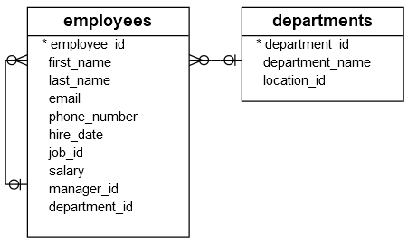
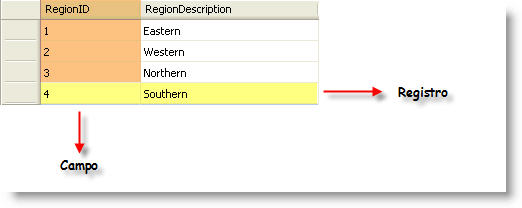
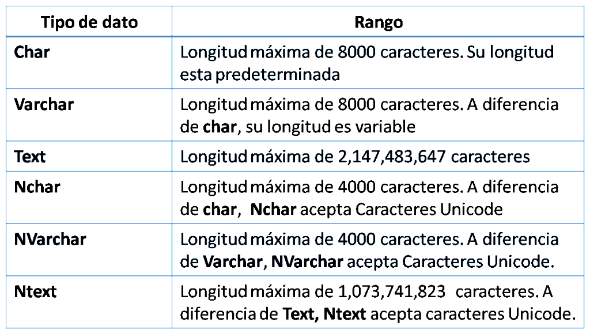

| **Inicio**            | **atrás 5**                | **Siguiente 7**          |
| --------------------- | -------------------------- | ------------------------ |
| [🏠](../../README.md) | [⏪](./5_Consultas_SQL.md) | [⏩](7_Consultas_SQL.md) |

---

## **Índice**

| Temario                                                                                     |
| ------------------------------------------------------------------------------------------- |
| [51. SQL ADD COLUMN](#51-sql-add-column)                                                    |
| [52. SQL DROP COLUMN](#52-sql-drop-column)                                                  |
| [53. SQL DROP TABLE](#53-sql-drop-table)                                                    |
| [54. SQL TRUNCATE TABLE](#54-sql-truncate-table)                                            |
| [55. SQL Views](#55-sql-views)                                                              |
| [56. SQL Triggers](#56-sql-triggers)                                                        |
| [57. ¿Qué es una Base de Datos?](#57-¿qué-es-una-base-de-datos)                             |
| [58. Que es una Tabla, campos y registros](#58-que-es-una-tabla-campos-y-registros)         |
| [59. Definiendo una Tabla, Campos y Registros](#59-definiendo-una-tabla-campos-y-registros) |
| [60. ¿Qué es un Tipo de Dato?](#60-¿qué-es-un-tipo-de-dato)                                 |

---

# **Tutorial de SQL**

## **51. SQL ADD COLUMN**

**Resumen :** Aprenderá a utilizar la cláusula SQL `ADD COLUMN` de la declaración `ALTER TABLE` para agregar una o más columnas a una tabla existente.

**Descripción ADD COLUMN general de la cláusula SQL**

Para agregar una nueva columna a una tabla, utilice la `ALTER TABLE ADD COLUMN` siguiente declaración:

```
ALTER TABLE table_name
ADD [COLUMN] column_definition;
```

En esta declaración,

- Primero, especifique la tabla a la que desea agregar la nueva columna.

- En segundo lugar, especifique la definición de la columna después de la cláusula `ADD COLUMN`.

La sintaxis típica de `column_definitiones` la siguiente:

`column_name data_type constraint;`

Si desea agregar varias columnas a una tabla existente utilizando una sola declaración, utilice la siguiente sintaxis:

```
ALTER TABLE table_name
ADD [COLUMN] column_definition,
ADD [COLUMN] column_definition,
 ...;
```

Diferentes sistemas de bases de datos respaldan la declaración `ALTER TABLE ADD COLUMN` con algunas variaciones menores. Consulte la siguiente sección para obtener referencias.

**ADD COLUMN Ejemplos de SQL**

La siguiente declaración crea una nueva tabla denominada candidates:

```
CREATE TABLE candidates (
    id INT PRIMARY KEY,
    first_name VARCHAR(100) NOT NULL,
    last_name VARCHAR(100) NOT NULL,
    email VARCHAR(255) NOT NULL UNIQUE
);
```

Para agregar la `phone` columna a la tabla `candidates`, utilice la siguiente declaración:

```
ALTER TABLE candidates
ADD phone VARCHAR(50);

```

Para agregar tres columnas: dirección particular, fecha de nacimiento y cuenta de LinkedIn a la candidatestabla, utilice la siguiente declaración:

```
ALTER TABLE candidates
ADD home_address VARCHAR(255),
    dob DATE,
    linkedin_account VARCHAR(255);
```

**Declaración SQL ADD COLUMN en algunos sistemas de bases de datos comunes**

La siguiente sección le proporciona la sintaxis de la declaración `ALTER TABLE ADD COLUMN` en algunos sistemas de bases de datos comunes.

Agregue una columna a una tabla en SQL Server :

```
ALTER TABLE table_name
ADD column_definition;
```

Agregue varias columnas a una tabla en SQL Server:

```
ALTER TABLE table_name
ADD
    column_definition,
    column_definition,
    ...;
```

En este tutorial, ha aprendido sobre la cláusula SQL `ADD COLUMN` de la declaración `ALTER TABLE` para agregar una o más columnas a una tabla existente.

[🔼](#índice)

---

## **52. SQL DROP COLUMN**

**Resumen :** Aprenderá a utilizar la cláusula SQL `DROP COLUMN` para eliminar una o más columnas de una tabla existente.

**Introducción a la declaración SQL DROP COLUMN**

A veces, es posible que desee eliminar una o más columnas no utilizadas de una tabla existente. Para hacerlo, utilice lo `ALTER TABLE` siguiente:

```
ALTER TABLE table_name
DROP COLUMN column_name1,
[DROP COLUMN column_name2];
```

En esta sintaxis:

- `table_name` es el nombre de la tabla que contiene las columnas que está eliminando.

- `column_name1`, `column_name2` son las columnas que estás eliminando.

La sintaxis anterior es compatible con MySQL y PostgreSQL .

Oracle y SQL Server tienen una sintaxis ligeramente diferente:

```
ALTER TABLE table_name
  DROP COLUMN
    column_name1,
    [column_name2];
```

**DROP COLUMN Ejemplos de SQL**

La siguiente declaración crea una nueva tabla denominada personspara la demostración:

```
CREATE TABLE persons (
    person_id INT PRIMARY KEY,
    first_name VARCHAR(255) NOT NULL,
    last_name VARCHAR(255) NOT NULL,
    date_of_birth DATE NOT NULL,
    phone VARCHAR(25),
    email VARCHAR(255)
);
```

**A) Ejemplo de eliminación de una columna**

La siguiente declaración elimina la columna `email` de la tabla `persons`:

```
ALTER TABLE persons
DROP COLUMN email;
```

**B) Ejemplo de eliminación de varias columnas**

La siguiente declaración elimina las columnas `date_of_birth` y `phone`:

```
ALTER TABLE persons
DROP COLUMN date_of_birth;

ALTER TABLE persons
DROP COLUMN phone;
```

En este tutorial, aprendió cómo usar la declaración SQL `DROP COLUMN` para eliminar una o más columnas de una tabla.

[🔼](#índice)

---

## **53. SQL DROP TABLE**

**Resumen :** Aprenderá a utilizar la declaración SQL `DROP TABLE` para eliminar una o más tablas en una base de datos.

**Introducción a la declaración SQL DROP TABLE**

A medida que la base de datos evolucione, necesitaremos eliminar tablas obsoletas o redundantes de la base de datos. Para eliminar una tabla, usamos la declaración `DROP TABLE`.

A continuación se ilustra la sintaxis de la declaración `DROP TABLE`.

`DROP TABLE [IF EXISTS] table_name;`

Para eliminar una tabla existente, especifique el nombre de la tabla después de la cláusula `DROP TABLE`. Si la tabla que se elimina no existe, el sistema de base de datos emite un error.

Para evitar el error de eliminar una tabla inexistente, utilizamos la cláusula opcional `IF EXISTS`. Si usamos la opción `IF EXISTS`, el sistema de base de datos no arrojará ningún error si eliminamos una tabla inexistente. En su lugar, algunos sistemas de bases de datos emiten una advertencia o un aviso.

Tenga en cuenta que no todos los sistemas de bases de datos admiten esta opción `IF EXISTS`. Los que sí admiten la opción `IF EXISTS` son MySQL , PostgreSQL y SQL Server 2016.

La declaración `DROP TABLE` elimina permanentemente tanto los datos como la estructura de una tabla. Algunos sistemas de bases de datos requieren que la tabla esté vacía antes de poder eliminarla de la base de datos. Esto le ayuda a evitar eliminar accidentalmente una tabla que todavía está en uso.

Para eliminar todos los datos de una tabla, puede utilizar la instrucción `DELETE` o `TRUNCATE TABLE`.

Para eliminar una tabla a la que hace referencia una restricción de clave externa de otra tabla, debe deshabilitar o eliminar la restricción externa antes de eliminar la tabla.

**Ejemplos de TABLA DROP de SQL**

Creemos una nueva tabla para practicar la declaración `DROP TABLE`.

La siguiente declaración crea una nueva tabla denominada `emergency_contacts` que almacena los contactos de emergencia de los empleados.

```
CREATE TABLE emergency_contacts (
    id INT IDENTITY(1,1) PRIMARY KEY,
    first_name VARCHAR(50) NOT NULL,
    last_name VARCHAR(50) NOT NULL,
    relationship VARCHAR(50) NOT NULL,
    employee_id INT NOT NULL
);
```

La siguiente declaración deja caer la tabla `emergency_contacts`:

`DROP TABLE emergency_contacts;`

**SQL DROP TABLE: eliminar varias tablas**

La declaración `DROP TABLE` le permite eliminar varias tablas al mismo tiempo. Para hacer esto, debe especificar una lista de tablas separadas por comas después de la cláusula `DROP TABLE` de la siguiente manera:

`DROP TABLE table_name1,table_name2,...;`

Luego, el sistema de base de datos elimina todas las tablas una por una.

**Resumen**

Utilice la instrucción SQL `DROP TABLE` para eliminar una o más tablas de la base de datos.

[🔼](#índice)

---

## **54. SQL TRUNCATE TABLE**

**Resumen :** Aprenderá a utilizar la instrucción SQL `TRUNCATE TABLE` para eliminar todos los datos de una tabla de forma eficiente y rápida.

**Introducción a la declaración SQL TRUNCATE TABLE**

Para eliminar todos los datos de una tabla, utilice la declaración `DELETE` sin cláusula `WHERE`. Para una tabla grande que tiene unos pocos millones de filas, la declaración `DELETE` es lenta y no eficiente.

Para eliminar rápidamente todas las filas de una tabla grande, utilice la siguiente declaración `TRUNCATE TABLE`:

`TRUNCATE TABLE table_name;`

En esta sintaxis, especifica `table_name` que desea eliminar datos después de la cláusula `TRUNCATE TABLE`.

Algunos sistemas de bases de datos como MySQL y PostgreSQL le permiten omitir la palabra clave `TABLE` , por lo que la declaración `TRUNCATE TABLE` es tan simple como sigue:

`TRUNCATE table_name;`

Cuando emite la declaración `TRUNCATE TABLE`, el sistema de base de datos elimina todas las filas de la tabla desasignando las páginas de datos asignadas por la tabla. Al hacer esto, el `RDBMS` puede reducir los recursos para el registro y la cantidad de bloqueos que deben adquirirse.

Para truncar varias tablas a la vez, puede utilizar una lista de nombres de tablas separados por comas después de la cláusula `TRUNCATE TABLE` de la siguiente manera:

`TRUNCATE TABLE table_name1, table_name2, ...;`

No todos los sistemas de bases de datos admiten esta forma de declaración `TRUNCATE TABLE`. Si está utilizando uno que no lo hace, debe emitir varias declaración `TRUNCATE TABLE` para truncar varias tablas.

**SQL TRUNCAR TABLA versus ELIMINAR**

Lógicamente el enunciado `TRUNCATE TABLE` y el enunciado `DELETE` sin cláusula `WHERE` dan el mismo efecto que elimina todos los datos de una tabla. Sin embargo, tienen algunas diferencias:

- Cuando utiliza la declaración `DELETE`, el sistema de base de datos registra las operaciones. Y con un poco de esfuerzo, puedes revertir los datos que se eliminaron. Sin embargo, cuando usa la declaración `TRUNCATE TABLE`, no tiene posibilidad de revertirla, excepto que la usa en una transacción que no se ha confirmado.

- Para eliminar datos de una tabla a la que hace referencia una restricción de clave externa, no puede utilizar la declaración `TRUNCATE TABLE`. En este caso, debe utilizar la declaración `DELETE` en su lugar.

- La declaración `TRUNCATE TABLE` no activa el activador de eliminación si la tabla tiene los activadores asociados.

- Algunos sistemas de bases de datos restablecen el valor de una columna de incremento automático (o identidad, secuencia, etc.) a su valor inicial después de ejecutar la declaración `TRUNCATE TABLE`. No es el caso de la declaración `DELETE`.

- La declaración `DELETE` con una cláusula `WHERE` elimina datos parciales de una tabla, mientras que la declaración `TRUNCATE TABLE` siempre elimina todos los datos de la tabla.

**Ejemplos de TABLA TRUNCADA de SQL**

Echemos un vistazo a un ejemplo de truncamiento de una tabla.

Primero, cree una nueva tabla `big_table` con el siguiente nombre:

```
CREATE TABLE big_table (
    id INT IDENTITY(1,1) PRIMARY KEY,
    val INT
);

```

En segundo lugar, ejecute la siguiente declaración tantas veces como desee para insertar datos de muestra en la tabla `big_table`:

```
INSERT INTO big_table (val)
VALUES
	(RAND(100000));
```

Tenga en cuenta que si utiliza un sistema de base de datos que admita procedimientos almacenados, puede colocar esta declaración dentro de un bucle. Por ejemplo, el siguiente procedimiento almacenado en MySQL carga datos en la tabla `big_table` con el número de filas especificadas por el numparámetro.

```
CREATE PROCEDURE load_big_table_data
    @num INT
AS
BEGIN
    DECLARE @counter INT = 0;

    WHILE @counter < @num
    BEGIN
        INSERT INTO big_table(val)
        VALUES (CAST(RAND() * 1000000 AS INT));
        SET @counter = @counter + 1;
    END
END;
GO
```

La siguiente declaración llama al `load_big_table_data` procedimiento almacenado para insertar 10.000 filas en la tabla `big_table`.

`EXEC load_big_table_data 10000;`

En tercer lugar, para eliminar todos los datos de `big_table`, utilice la siguiente declaración:

`TRUNCATE TABLE big_table;`

Como puede ver, qué rápida `TRUNCATE TABLE` es la declaración.

Ahora debería saber cómo utilizar la declaración `TRUNCATE TABLE` para eliminar rápidamente todos los datos de una tabla grande y comprender las diferencias entre las declaraciones `TRUNCATE TABLE` y `DELETE`.

[🔼](#índice)

---

## **55. SQL Views**

**Resumen :** Le presenta el concepto de vistas SQL y le muestra cómo administrar las vistas en la base de datos.

**Introducción a las vistas SQL**

Una base de datos relacional consta de varias tablas relacionadas, por ejemplo, empleados, departamentos, trabajos, etc. Cuando desee ver los datos de estas tablas, utilice la instrucción `SELECT` con cláusulas `JOIN` o `UNION`.

SQL le proporciona otra forma de ver los datos mediante el uso de vistas. Una vista es como una tabla virtual producida al ejecutar una consulta. El sistema de gestión de bases de datos relacionales (RDBMS) almacena una vista como un nombre `SELECT` en el catálogo de la base de datos.

Siempre que emite una declaración `SELECT` que contiene un nombre de vista, el `RDBMS` ejecuta la consulta que define la vista para crear la tabla virtual. Luego, esa tabla virtual se utiliza como tabla de origen de la consulta.

**¿Por qué necesitas usar las vistas?**

Las vistas le permiten almacenar consultas complejas en la base de datos. Por ejemplo, en lugar de emitir una consulta SQL compleja cada vez que desee ver los datos, sólo necesita realizar una consulta simple de la siguiente manera:

```
SELECT column_list
FROM view_name;
```

Las vistas lo ayudan a empaquetar los datos para un grupo específico de usuarios. Por ejemplo, puede crear una vista de los datos salariales de los empleados del departamento de Finanzas.

Las vistas ayudan a mantener la seguridad de la base de datos. En lugar de dar a los usuarios acceso a las tablas de la base de datos, se crea una vista para revelar solo los datos necesarios y otorgar a los usuarios acceso a la vista.

**Creando vistas SQL**

Para crear una vista, utilice la declaración `CREATE VIEW` de la siguiente manera:

```
CREATE VIEW view_name AS
SELECT column1, column2, ...
FROM table_name
WHERE condition;
```

Primero, especifique el nombre de la vista después de la cláusula `CREATE VIEW`.

En segundo lugar, cree una declaración `SELECT` para consultar datos de varias tablas.

Por ejemplo, la siguiente declaración crea la vista de contactos de empleados basada en los datos de las tablas `employees` y `departments`.



```
CREATE VIEW employee_contacts AS
    SELECT TOP 100 PERCENT
        first_name,
        last_name,
        email,
        phone_number,
        department_name
    FROM
        employees e
            INNER JOIN
        departments d ON d.department_id = e.department_id
    ORDER BY first_name;
```

De forma predeterminada, los nombres de las columnas de la vista son los mismos que los de la columna especificada en la declaración `SELECT`. Si desea cambiar el nombre de las columnas en la vista, incluya los nuevos nombres de las columnas después de la cláusula `CREATE VIEW` de la siguiente manera:

```
CREATE VIEW EmployeeView
    (EmployeeFirstName, EmployeeLastName, EmployeeEmail)
AS
SELECT
    first_name,
    last_name,
    email
FROM
    employees
WHERE
    department_id = 1;
```

Por ejemplo, la siguiente declaración crea una vista cuyos nombres de columna no son los mismos que los nombres de columna de las tablas base.

```
CREATE VIEW payroll (EmployeeFirstName, EmployeeLastName, Job, Compensation) AS
    SELECT TOP 100 PERCENT
        e.first_name,
        e.last_name,
        j.job_title,
        e.salary
    FROM
        employees e
    INNER JOIN
        jobs j ON j.job_id = e.job_id
    ORDER BY
        e.first_name;
```

**Consultar datos de vistas**

Consultar datos de vistas es lo mismo que consultar datos de tablas. La siguiente declaración selecciona datos de la vista `employee_contacts`.

```
SELECT
    *
FROM
    employee_contacts;
```

Por supuesto, puedes aplicar filtrado o agrupación de la siguiente manera:

```
SELECT
    job,
    MIN(compensation),
    MAX(compensation),
    AVG(compensation)
FROM
    payroll
WHERE
    job LIKE 'A%'
GROUP BY job;
```

**Modificar vistas SQL**

Para modificar una vista, ya sea agregando nuevas columnas a la vista o eliminando columnas de una vista, se utiliza la misma declaración `CREATE OR REPLACE VIEW`.

```
IF OBJECT_ID('dbo.view_name', 'V') IS NOT NULL
    DROP VIEW dbo.view_name;
GO

CREATE VIEW dbo.view_name AS
SELECT column1, column2, ...
FROM table_name
WHERE condition;
```

La declaración crea una vista si no existe o cambia la vista actual si ya existe.

Por ejemplo, la siguiente declaración cambia la vista de nómina agregando la columna de departamento y cambiando el nombre de la columna de compensación a columna de salario.

```
IF OBJECT_ID('dbo.payroll', 'V') IS NOT NULL
    DROP VIEW dbo.payroll;
GO

CREATE VIEW dbo.payroll (EmployeeFirstName, EmployeeLastName, Job, Department, Compensation) AS
SELECT
    e.first_name,
    e.last_name,
    j.job_title,
    d.department_name,
    e.salary
FROM
    employees e
    INNER JOIN
    jobs j ON j.job_id = e.job_id
    INNER JOIN
    departments d ON d.department_id = e.department_id
ORDER BY
    e.first_name
OFFSET 0 ROWS;  -- Agregar OFFSET 0 ROWS para incluir ORDER BY de manera válida
GO
```

```
SELECT
    *
FROM
    payroll;
```

**Eliminar vistas SQL**

Para eliminar una vista de la base de datos, utilice la declaración `DROP VIEW`:

`DROP VIEW view_name;`

La declaración `DROP VIEW` elimina solo la vista, no las tablas base.

Por ejemplo, para eliminar la vista de nómina, utilice la siguiente declaración:

`DROP VIEW payroll;`

En este tutorial, ha aprendido sobre las vistas SQL y sus usos prácticos. Ahora debe saber qué son las vistas y cómo crearlas, modificarlas y eliminarlas en la base de datos.

[🔼](#índice)

---

## **56. SQL Triggers**

**Resumen :** Aprenderá sobre el concepto de activadores SQL y cómo desarrollar activadores simples en el sistema de base de datos.

**Introducción a los desencadenadores SQL**

Un disparador es un fragmento de código ejecutado automáticamente en respuesta a un evento específico ocurrido en una tabla de la base de datos.

Un disparador siempre está asociado con una tabla en particular. Si se elimina la tabla , todos los activadores asociados también se eliminan automáticamente.

Se invoca un desencadenador antes o después del siguiente evento:

**INSERT :** cuando se inserta una nueva fila

**UPDATE :** cuando se actualiza una fila existente

**DELETE :** cuando se elimina una fila.

Cuando emite una declaración `INSERT`, `UPDATE` o `DELETE`, el sistema de gestión de bases de datos relacionales `(RDBMS)` activa el activador correspondiente.

En algunos `RDMBS`, también se invoca un disparador en el resultado de ejecutar una declaración que llama a la declaración `INSERT`, `UPDATE` o `DELETE`. Por ejemplo, MySQL tiene `LOAD DATA INFILE` , que lee filas de un archivo de texto y las inserta en una tabla a una velocidad muy alta, invoca los disparadores `BEFORE INSERT` y `AFTER INSERT`.

Por otro lado, una declaración puede eliminar filas de una tabla pero no invoca los desencadenantes asociados. Por ejemplo, la instrucción `TRUNCATE TABLE` elimina todas las filas de la tabla pero no invoca los activadores `BEFORE DELETE` y `AFTER DELETE`.

**Sintaxis de la declaración de creación del desencadenador**

Para crear un disparador, utilice la siguiente declaración:

```
CREATE TRIGGER trigger_name [BEFORE|AFTER] event
ON table_name trigger_type
BEGIN
  -- trigger_logic
END;
```

Examinemos la sintaxis con más detalle:

- Primero, especifique el nombre del activador después de la cláusula `CREATE TRIGGER`.

- A continuación, utilice la palabra clave `BEFORE` o `AFTER` para determinar cuándo debe ocurrir el disparador en respuesta a un evento específico, por ejemplo `INSERT`, `UPDATE`, o `DELETE`.

- Luego, especifique el nombre de la tabla a la que se vincula el desencadenador.

- Después, especifique el tipo de activador utilizando `FOR EACH ROW` o `FOR EACH STATEMENT`. Discutiremos más sobre esto en la siguiente sección.

- Finalmente, coloque la lógica del disparador en el BLOQUE `BEGIN ... END`.

Además de usar el código en el bloque `BEGIN END`, puede ejecutar un procedimiento almacenado de la siguiente manera:

```
CREATE TRIGGER trigger_name
[BEFORE|AFTER] event
ON table_name trigger_type
EXECUTE stored_procedure_name;
```

**Activador de nivel de fila frente a activador de nivel de declaración**

Hay dos tipos de desencadenadores: desencadenadores a nivel de fila y de declaración.

Un disparador de nivel de fila se ejecuta cada vez que una fila se ve afectada por una declaración `UPDATE`. Si la declaración `UPDATE` afecta a 10 filas, el activador de nivel de fila se ejecutará 10 veces, cada vez por fila. Si la declaración `UPDATE` no afecta a ninguna fila, el activador de nivel de fila no se ejecuta en absoluto.

A diferencia del disparador de nivel de fila, un disparador de nivel de declaración se llama una vez independientemente de cuántas filas afecte la declaración `UPDATE`. Tenga en cuenta que si la declaración `UPDATE` no afectó a ninguna fila, el activador se ejecutará igualmente.

Al crear un disparador, puede especificar si un disparador es de nivel de fila o de instrucción usando `FOR EACH ROW` o `FOR EACH STATEMENT` respectivamente.

**Usos del disparador SQL**

Normalmente utiliza los desencadenadores en los siguientes escenarios:

- Modificaciones de la tabla de registro. Algunas tablas tienen datos confidenciales, como el correo electrónico del cliente, el salario de los empleados, etc., y desea registrar todos los cambios. En este caso, puede crear el activador `UPDATE` para insertar los cambios en una tabla separada.

- Haga cumplir la integridad compleja de los datos. En este escenario, puede definir desencadenadores para validar los datos y reformatearlos si es necesario. Por ejemplo, puede transformar los datos antes de insertarlos o actualizarlos usando un activador `BEFORE INSERT` o `BEFORE UPDATE`.

**Ejemplo de disparador SQL**

Usaremos la tabla `employees` en la base de datos de muestra para la demostración.


Supongamos que queremos registrar los cambios de valores en la columna `salary`. Para hacer esto, creamos una tabla separada para almacenar los cambios y usamos un disparador para insertar los cambios en esta tabla.

La siguiente declaración crea la tabla `salary_changes`.

```
CREATE TABLE salary_changes (
    employee_id INT,
    changed_at DATETIME DEFAULT CURRENT_TIMESTAMP,
    old_salary DECIMAL(8 , 2 ),
    new_salary DECIMAL(8 , 2 ),
    PRIMARY KEY (employee_id , changed_at)
);
```

La tabla `salary_changes` registra la identificación del empleado, el salario anterior, el salario nuevo y la hora de los cambios. Tenga en cuenta que la columna `change_at` utiliza la hora actual como predeterminada para registrar la hora en la que se produce el cambio.

El siguiente disparador `before_update_salary` registra los cambios salariales en la tabla `salary_changes`.

```
CREATE TRIGGER before_update_salary
ON employees
AFTER UPDATE
AS
BEGIN
    SET NOCOUNT ON;

    -- Insertar en salary_changes si el salario ha cambiado
    INSERT INTO salary_changes(employee_id, old_salary, new_salary)
    SELECT
        i.employee_id,
        d.salary, -- Salario antiguo
        i.salary  -- Salario nuevo
    FROM
        inserted i
    INNER JOIN
        deleted d ON i.employee_id = d.employee_id
    WHERE
        i.salary <> d.salary; -- Solo si el salario ha cambiado
END;
GO
```

En el cuerpo del disparador insertamos los cambios si el nuevo salario es diferente al anterior.

Tenga en cuenta que dentro del cuerpo del disparador, usamos las palabras clave `OLD` y `NEW` para acceder a las columnas en las filas afectadas por un disparador.

Probemos el disparador aumentando el salario del empleado cuya identificación es 102 5%.

Primero, verifique el salario actual del empleado 102:

```
SELECT
    employee_id,
    first_name,
    last_name,
    salary
FROM
    employees
WHERE
    employee_id = 110;
```

En segundo lugar, aumentar el salario en un 5% emitiendo el siguiente `UPDATE` comunicado.

```
UPDATE employees
SET
    salary = salary * 1.05
WHERE
    employee_id = 110;
```

En tercer lugar, consulte la tabla `salary_changes` para ver si se ha invocado el activador.

```
SELECT
    *
FROM
    salary_changes;
```

Como puede ver, la tabla `salary_changes` tiene una nueva entrada. Significa que el disparador se ha invocado correctamente.

**Modificar desencadenantes**

Para cambiar la definición del activador, utilice la declaración `CREATE OR REPLACE TRIGGER`.

Básicamente, `CREATE OR REPLACE TRIGGER` crea un nuevo disparador si no existe y cambia el disparador si existe.

La declaración `CREATE OR REPLACE TRIGGER` es similar a la `CREATE TRIGGER` siguiente:

```
CREATE OR REPLACE TRIGGER trigger_name
[BEFORE|AFTER] event
ON table_name trigger_type
BEGIN
  -- trigger_logic
END;
```

**Eliminar desencadenantes**

Para eliminar un disparador, utilice la siguiente declaración `DROP TRIGGER`:

`DROP TRIGGER [IF EXISTS] trigger_name;`

La opción `IF EXISTS` le permite eliminar un disparador si existe. Si el disparador no existe, entonces la declaración no hace nada. Sin embargo, si no tiene la opción `IF EXISTS`, el sistema de base de datos puede emitir un error si intenta eliminar un activador no existente.

Nuevamente, si elimina una tabla , también se eliminan todos los activadores asociados con la tabla. La siguiente declaración elimina el desencadenante `before_update_salary`:

`DROP TRIGGER IF EXISTS before_update_salary;`

Ahora debería tener un buen conocimiento de los activadores de SQL y saber cómo crear un activador en el sistema de base de datos.

[🔼](#índice)

---

## **57. ¿Qué es una Base de Datos?**

Una base de datos es un conjunto organizado y estructurado de información que se almacena de manera electrónica en un sistema informático. Esta información puede ser cualquier tipo de datos, desde textos hasta imágenes o videos.

Las bases de datos se utilizan para gestionar grandes cantidades de información, facilitar su acceso y su búsqueda, así como para garantizar su seguridad y privacidad. Algunos ejemplos de bases de datos incluyen:

1. **Una base de datos de una empresa:**

   Una empresa puede utilizar una base de datos para almacenar información sobre sus clientes, sus productos, sus empleados, sus ventas, sus ingresos y sus gastos. Esta información puede ser consultada y actualizada por los diferentes departamentos de la empresa para tomar decisiones informadas y mejorar su rendimiento.

2. **Una base de datos de un sitio web:**

   un sitio web puede utilizar una base de datos para almacenar la información de sus usuarios, como sus nombres, correos electrónicos, contraseñas y preferencias. Esta información se utiliza para personalizar la experiencia de los usuarios en el sitio web y mejorar su satisfacción.

3. **Una base de datos de un hospital:**

   Un hospital puede utilizar una base de datos para almacenar información sobre sus pacientes, sus diagnósticos, sus tratamientos y sus historias clínicas. Esta información se utiliza para gestionar el cuidado de los pacientes, coordinar los servicios médicos y garantizar la calidad de la atención sanitaria.

En resumen, una base de datos es una herramienta fundamental para la gestión de información en cualquier ámbito, ya sea empresarial, educativo, científico o social. Su uso permite mejorar la eficiencia y la efectividad en la toma de decisiones, así como garantizar la privacidad y la seguridad de la información.


[🔼](#índice)

---

## **58. Que es una Tabla, campos y registros**

En SQL Server, una tabla es un objeto que se utiliza para almacenar datos de manera estructurada. Estos datos se organizan en filas y columnas, y cada fila representa un registro o instancia de datos. Cada columna, a su vez, se llama campo o atributo y almacena un tipo de datos específico, como números, textos, fechas, etc.

A continuación, explicaré con más detalle cada uno de estos conceptos, utilizando un ejemplo de una tabla que almacena información sobre clientes:

- **Campos o atributos:**

  Son las columnas de la tabla que representan una propiedad o característica del objeto que se está almacenando. En nuestro ejemplo, algunos de los campos pueden ser el nombre del cliente, la dirección, el número de teléfono, el correo electrónico, etc. Cada campo debe tener un nombre único y un tipo de datos específico que indique qué tipo de información se puede almacenar en él.

- **Registros o instancias:**

  Son las filas de la tabla que contienen la información específica de un objeto o entidad que se está almacenando. En nuestro ejemplo, cada registro correspondería a un cliente diferente y contendría su información personal. Por ejemplo, un registro podría contener el nombre "Juan Pérez", la dirección "Calle 123, Ciudad X", el número de teléfono "555-1234", etc.

- **Tabla:**

  Es el objeto que almacena los campos y registros que componen los datos. En nuestro ejemplo, la tabla se podría llamar "Clientes" y contendría todos los campos y registros correspondientes a la información de los clientes.

A continuación, presento un ejemplo de cómo se crearía la tabla `"Clientes"` en SQL Server:

```
CREATE TABLE Clientes (
    Id INT PRIMARY KEY,
    Nombre VARCHAR(50),
    Direccion VARCHAR(100),
    Telefono VARCHAR(15),
    CorreoElectronico VARCHAR(50)
);

```

En este ejemplo, la tabla `"Clientes"` se compone de cinco campos: `"Id"`, `"Nombre"`, `"Direccion"`, `"Telefono"` y `"CorreoElectronico"`. El campo `"Id"` se define como la clave primaria de la tabla, lo que significa que se utiliza como identificador único de cada registro.

Para agregar registros a la tabla, se utiliza la siguiente sintaxis:

```
INSERT INTO Clientes (Id, Nombre, Direccion, Telefono, CorreoElectronico)
VALUES (1, 'Juan Pérez', 'Calle 123, Ciudad X', '555-1234', 'juan.perez@email.com');
```

En este ejemplo, se agrega un nuevo registro a la tabla `"Clientes"` con los valores especificados para cada campo. Cada vez que se agrega un nuevo registro, se crea una nueva fila en la tabla que representa esa información.

En resumen, una tabla en SQL Server es una estructura que se utiliza para almacenar datos de manera organizada y estructurada. Los campos representan las propiedades o características de los objetos que se están almacenando, mientras que los registros contienen la información específica de cada objeto. La tabla es el objeto que contiene los campos y registros y que se utiliza para manipular y consultar los datos almacenados en ella.


[🔼](#índice)

---

## **59. Definiendo una Tabla, Campos y Registros**

En SQL Server, una tabla es un objeto que se utiliza para almacenar datos de manera estructurada. Estos datos se organizan en filas y columnas, y cada fila representa un registro o instancia de datos. Cada columna, a su vez, se llama campo o atributo y almacena un tipo de datos específico, como números, textos, fechas, etc.

A continuación, explicaré con más detalle cada uno de estos conceptos, utilizando un ejemplo de una tabla que almacena información sobre productos:

- **Campos o atributos:**

  Son las columnas de la tabla que representan una propiedad o característica del objeto que se está almacenando. En nuestro ejemplo, algunos de los campos pueden ser el nombre del producto, la descripción, el precio, la cantidad en stock, etc. Cada campo debe tener un nombre único y un tipo de datos específico que indique qué tipo de información se puede almacenar en él.

- **Registros o instancias:**

  Son las filas de la tabla que contienen la información específica de un objeto o entidad que se está almacenando. En nuestro ejemplo, cada registro correspondería a un producto diferente y contendría su información como el nombre del producto, la descripción, el precio, la cantidad en stock, etc.

- **Tabla:**

  Es el objeto que almacena los campos y registros que componen los datos. En nuestro ejemplo, la tabla se podría llamar `"Productos"` y contendría todos los campos y registros correspondientes a la información de los productos.

A continuación, presento un ejemplo de cómo se crearía la tabla `"Productos"` en SQL Server:

```
CREATE TABLE Productos (
    Id INT PRIMARY KEY,
    Nombre VARCHAR(50),
    Descripcion VARCHAR(100),
    Precio DECIMAL(10,2),
    CantidadEnStock INT
);
```

En este ejemplo, la tabla `"Productos"` se compone de cinco campos: `"Id"`, `"Nombre"`, `"Descripcion"`, `"Precio"` y `"CantidadEnStock"`. El campo `"Id"` se define como la clave primaria de la tabla, lo que significa que se utiliza como identificador único de cada registro.

Para agregar registros a la tabla, se utiliza la siguiente sintaxis:

```
INSERT INTO Productos (Id, Nombre, Descripcion, Precio, CantidadEnStock)
VALUES (1, 'Computadora Portátil', 'Marca X, Modelo Y', 1500.00, 10);
```

En este ejemplo, se agrega un nuevo registro a la tabla `"Productos"` con los valores especificados para cada campo. Cada vez que se agrega un nuevo registro, se crea una nueva fila en la tabla que representa esa información.

En resumen, una tabla en SQL Server es una estructura que se utiliza para almacenar datos de manera organizada y estructurada. Los campos representan las propiedades o características de los objetos que se están almacenando, mientras que los registros contienen la información específica de cada objeto. La tabla es el objeto que contiene los campos y registros y que se utiliza para manipular y consultar los datos almacenados en ella.



[🔼](#índice)

---

## **60. ¿Qué es un Tipo de Dato?**

En SQL Server, un tipo de dato es un conjunto de valores y operaciones que se pueden realizar sobre esos valores. Cada campo en una tabla debe tener un tipo de dato específico que determine qué tipo de información se puede almacenar en él y qué operaciones se pueden realizar sobre esos datos.

Existen diferentes tipos de datos en SQL Server, cada uno de ellos diseñado para manejar diferentes tipos de información. A continuación, se explican algunos de los tipos de datos más comunes en SQL Server, junto con ejemplos de su uso:

1. **Números enteros:**

   Se utilizan para almacenar números enteros sin decimales. Algunos ejemplos de tipos de datos numéricos enteros son `INT` (entero de 32 bits) y `BIGINT` (entero de 64 bits). Ejemplo:

```
CREATE TABLE Ejemplo (
    Id INT,
    CantidadEnStock BIGINT
);
```

2. **Números con decimales:**

   Se utilizan para almacenar números con decimales. Algunos ejemplos de tipos de datos numéricos con decimales son `FLOAT` (número con coma flotante) y `DECIMAL` (número decimal preciso). Ejemplo:

```
CREATE TABLE Ejemplo (
    Id INT,
    Precio FLOAT,
    Descuento DECIMAL(5,2)
);
```

3. **Cadenas de caracteres:**

   Se utilizan para almacenar texto y caracteres. Algunos ejemplos de tipos de datos de cadenas de caracteres son `VARCHAR` (cadena de caracteres de longitud variable) y `CHAR` (cadena de caracteres de longitud fija). Ejemplo:

```
CREATE TABLE Ejemplo (
    Id INT,
    Nombre VARCHAR(50),
    Descripcion CHAR(20)
);
```

4. **Fechas y tiempos:**

   Se utilizan para almacenar información sobre fechas y tiempos. Algunos ejemplos de tipos de datos de fechas y tiempos son `DATE` (fecha), `TIME` (tiempo), `DATETIME` (fecha y hora) y `TIMESTAMP` (marca de tiempo). Ejemplo:

```
CREATE TABLE Ejemplo (
    Id INT,
    FechaDeCreacion DATE,
    HoraDeActualizacion TIME,
    FechaYHora DATETIME
);
```

5. **Booleanos:**

   Se utilizan para almacenar valores de verdad (verdadero o falso). En SQL Server, el tipo de dato booleano se llama `BIT` y se utiliza para almacenar valores 1 o 0, donde 1 representa verdadero y 0 representa falso. Ejemplo:

```
CREATE TABLE Ejemplo (
    Id INT,
    Activo BIT
);
```

En resumen, en SQL Server, un tipo de dato es un conjunto de valores y operaciones que se pueden realizar sobre esos valores. Cada campo en una tabla debe tener un tipo de dato específico que determine qué tipo de información se puede almacenar en él y qué operaciones se pueden realizar sobre esos datos. Al elegir el tipo de dato correcto para cada campo, se puede asegurar que los datos se almacenen de manera eficiente y se puedan manipular y consultar de manera adecuada.



[🔼](#índice)

---

| **Inicio**            | **atrás 5**                | **Siguiente 7**          |
| --------------------- | -------------------------- | ------------------------ |
| [🏠](../../README.md) | [⏪](./5_Consultas_SQL.md) | [⏩](7_Consultas_SQL.md) |
