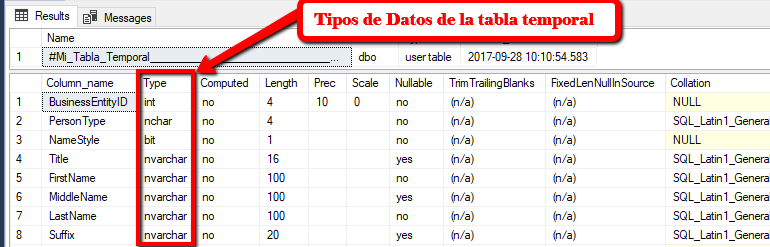
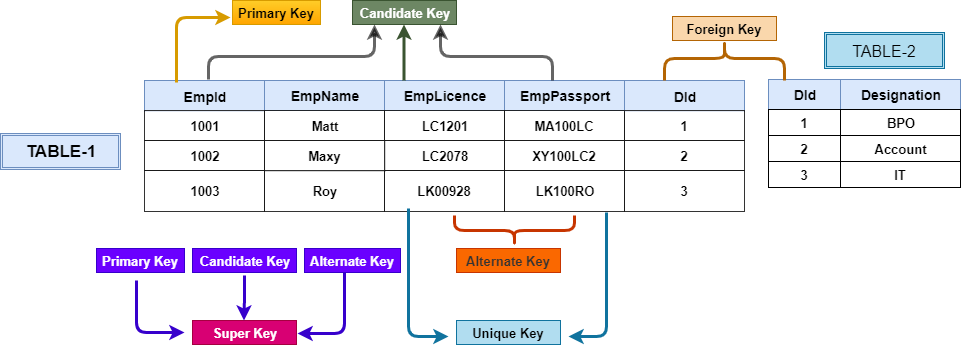
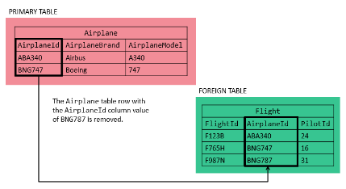
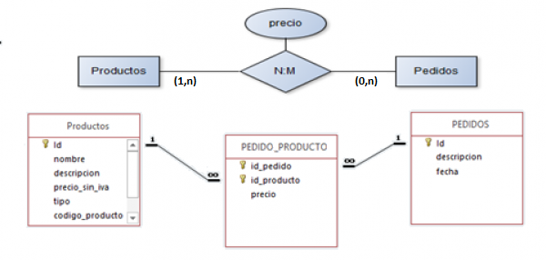
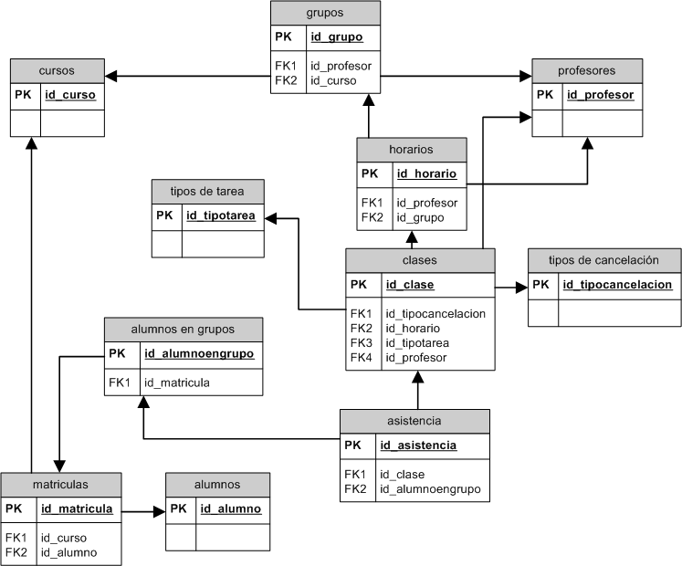
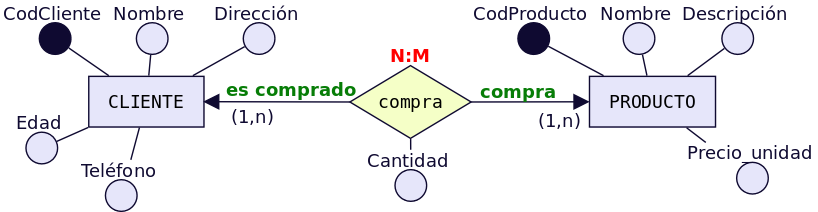

| **Inicio**            | **atrás 6**                | **Siguiente 8**            |
| --------------------- | -------------------------- | -------------------------- |
| [🏠](../../README.md) | [⏪](./6_Consultas_SQL.md) | [⏩](./8_Consultas_SQL.md) |

---

## **Índice**

| Temario                                                                                                                                  |
| ---------------------------------------------------------------------------------------------------------------------------------------- |
| [61. Tipos de Datos existentes y cómo elegir el adecuado](#61-tipos-de-datos-existentes-y-cómo-elegir-el-adecuado)                       |
| [62. ¿Qué es una Primary Key?](#62-¿qué-es-una-primary-key)                                                                              |
| [63. ¿Qué es una Foreign Key?](#63-¿qué-es-una-foreign-key)                                                                              |
| [64. ¿Qué es la propiedad IDENTITY?](#64-¿qué-es-la-propiedad-identity)                                                                  |
| [65. Normalización de Base de Datos](#65-normalización-de-base-de-datos)                                                                 |
| [66. Modelando el Diagrama Entidad Relación DER y definiendo las FK](#66-modelando-el-diagrama-entidad-relación-der-y-definiendo-las-fk) |
| [67. Comando SELECT FROM](#67-comando-select-from)                                                                                       |
| [68. Comando INSERT](#68-comando-insert)                                                                                                 |
| [69. Comando DELETE](#69-comando-delete)                                                                                                 |
| [70. Comando UPDATE](#70-comando-update)                                                                                                 |

---

# **Tutorial de SQL**

## **61. Tipos de Datos existentes y cómo elegir el adecuado**

En SQL Server, existen diferentes tipos de datos que se utilizan para almacenar diferentes tipos de información. Es importante elegir el tipo de dato correcto para cada campo en una tabla para asegurarse de que los datos se almacenen de manera eficiente y se puedan manipular y consultar de manera adecuada. A continuación, se explican los tipos de datos más comunes en SQL Server y cómo elegir el adecuado.

1. **Números enteros:**

   Se utilizan para almacenar números enteros sin decimales. Algunos ejemplos de tipos de datos numéricos enteros son `INT` (entero de 32 bits) y `BIGINT` (entero de 64 bits). Se debe elegir un tipo de dato entero cuando se desea almacenar datos como identificadores únicos, conteos de elementos o cualquier otro tipo de dato que no requiera decimales.

```
CREATE TABLE Empleados (
    Id INT,
    Edad BIGINT
);
```

2. **Números con decimales:**

   Se utilizan para almacenar números con decimales. Algunos ejemplos de tipos de datos numéricos con decimales son `FLOAT` (número con coma flotante) y `DECIMAL` (número decimal preciso). Se debe elegir un tipo de dato con decimales cuando se desea almacenar datos como precios, porcentajes o cualquier otro tipo de dato que requiera decimales.

```
CREATE TABLE Productos (
    Id INT,
    Precio FLOAT,
    Descuento DECIMAL(5,2)
);
```

3. **Cadenas de caracteres:**

   Se utilizan para almacenar texto y caracteres. Algunos ejemplos de tipos de datos de cadenas de caracteres son `VARCHAR` (cadena de caracteres de longitud variable) y `CHAR` (cadena de caracteres de longitud fija). Se debe elegir un tipo de dato de cadena de caracteres cuando se desea almacenar datos como nombres, direcciones o cualquier otro tipo de dato que requiera texto.

```
CREATE TABLE Clientes (
    Id INT,
    Nombre VARCHAR(50),
    Direccion CHAR(20)
);
```

4. **Fechas y tiempos:**

   Se utilizan para almacenar información sobre fechas y tiempos. Algunos ejemplos de tipos de datos de fechas y tiempos son `DATE` (fecha), `TIME` (tiempo), `DATETIME` (fecha y hora) y `TIMESTAMP` (marca de tiempo). Se debe elegir un tipo de dato de fecha y tiempo cuando se desea almacenar datos como fechas de nacimiento, fechas de creación de registros o cualquier otro tipo de dato que requiera una referencia temporal.

```
CREATE TABLE Ordenes (
    Id INT,
    FechaDeCreacion DATE,
    HoraDeActualizacion TIME,
    FechaYHora DATETIME
);
```

5. **Booleanos:**

   Se utilizan para almacenar valores de verdad (verdadero o falso). En SQL Server, el tipo de dato booleano se llama `BIT` y se utiliza para almacenar valores 1 o 0, donde 1 representa verdadero y 0 representa falso. Se debe elegir un tipo de dato booleano cuando se desea almacenar datos que representen opciones binarias, como si un elemento está activo o inactivo.

```
CREATE TABLE Articulos (
    Id INT,
    Activo BIT
);
```



[🔼](#índice)

---

## **62. ¿Qué es una Primary Key?**

Una Primary Key (clave primaria en español) es un tipo de restricción que se utiliza en SQL Server para garantizar la unicidad y la integridad referencial de los datos en una tabla. Una clave primaria se define en una o más columnas de una tabla y se utiliza para identificar de forma única cada fila en la tabla. A continuación, se explica en detalle cómo funciona una clave primaria en SQL Server con ejemplos.

**Ejemplo:**

Supongamos que tenemos una tabla de Empleados que se ve así:

```
CREATE TABLE Empleados (
    Id INT,
    Nombre VARCHAR(50),
    Edad INT,
    Departamento VARCHAR(50)
);
```

Para definir una clave primaria en esta tabla, se podría usar la columna `"Id"` como clave primaria, ya que cada empleado tendría un identificador único. Para hacerlo, se utilizaría la siguiente sintaxis:

```
ALTER TABLE Empleados ADD CONSTRAINT PK_Empleados PRIMARY KEY (Id);
```

Esta instrucción agrega una restricción de clave primaria llamada `"PK_Empleados"` a la tabla `"Empleados"` y define la columna `"Id"` como la clave primaria.

Una vez que se ha definido una clave primaria en una tabla, no se permitirá la inserción de filas duplicadas. Si se intenta insertar una fila que viola la restricción de clave primaria, se producirá un error. Por ejemplo, si intentamos insertar dos filas con el mismo valor en la columna `"Id"`, obtendremos un error de clave primaria duplicada.

Además, una clave primaria se puede utilizar como una clave externa en otras tablas para establecer relaciones entre ellas. Por ejemplo, si tenemos otra tabla llamada `"Ordenes"` que se ve así:

```
CREATE TABLE Ordenes (
    Id INT,
    Fecha DATE,
    EmpleadoId INT,
    CONSTRAINT FK_Ordenes_Empleados FOREIGN KEY (EmpleadoId)
        REFERENCES Empleados(Id)
);
```

En esta tabla, la columna `"EmpleadoId"` se ha definido como una clave externa que se refiere a la columna `"Id"` en la tabla `"Empleados"`. La restricción de clave externa garantiza que solo se puedan insertar valores en la columna `"EmpleadoId"` que existan en la tabla `"Empleados"` como valores de la columna `"Id"`.

En resumen, una clave primaria en SQL Server es una restricción que se utiliza para garantizar la unicidad e integridad referencial de los datos en una tabla. Se define en una o más columnas de una tabla y se utiliza para identificar de forma única cada fila en la tabla. Además, se puede utilizar como una clave externa en otras tablas para establecer relaciones entre ellas.



[🔼](#índice)

---

## **63. ¿Qué es una Foreign Key?**

Una Foreign Key (clave foránea en español) es una restricción que se utiliza en SQL Server para establecer una relación entre dos tablas. Una clave foránea se define en una tabla como una referencia a la clave primaria de otra tabla y se utiliza para mantener la integridad referencial entre las dos tablas. A continuación, se explica en detalle cómo funciona una clave foránea en SQL Server con ejemplos.

**Ejemplo:**

Supongamos que tenemos dos tablas: `"Empleados"` y `"Departamentos"`. La tabla `"Empleados"` se ve así:

```
CREATE TABLE Empleados (
    Id INT PRIMARY KEY,
    Nombre VARCHAR(50),
    Edad INT,
    DepartamentoId INT
);
```

En esta tabla, la columna `"Id"` se ha definido como la clave primaria. La tabla `"Departamentos"` se ve así:

```
CREATE TABLE Departamentos (
    Id INT PRIMARY KEY,
    Nombre VARCHAR(50)
);
```

En esta tabla, la columna `"Id"` se ha definido como la clave primaria.

Para establecer una relación entre las dos tablas, se puede agregar una clave foránea a la tabla `"Empleados"` que haga referencia a la clave primaria de la tabla `"Departamentos"`. Para hacerlo, se utilizaría la siguiente sintaxis:

```
ALTER TABLE Empleados ADD CONSTRAINT FK_Empleados_Departamentos FOREIGN KEY (DepartamentoId)
    REFERENCES Departamentos(Id);
```

Esta instrucción agrega una restricción de clave foránea llamada `"FK_Empleados_Departamentos"` a la tabla `"Empleados"` y define la columna `"DepartamentoId"` como la clave foránea. La restricción de clave foránea garantiza que solo se puedan insertar valores en la columna `"DepartamentoId"` que existan en la tabla `"Departamentos"` como valores de la columna `"Id"`.

Una vez que se ha definido una clave foránea en una tabla, se pueden establecer relaciones entre las dos tablas. Por ejemplo, para obtener el nombre del departamento al que pertenece un empleado, se podría usar la siguiente consulta:

```
SELECT e.Nombre AS NombreEmpleado, d.Nombre AS NombreDepartamento
FROM Empleados e
JOIN Departamentos d ON e.DepartamentoId = d.Id
WHERE e.Id = 1;
```

En esta consulta, se utiliza la cláusula `JOIN` para combinar las filas de las dos tablas `"Empleados"` y `"Departamentos"` en función de la igualdad de valores de la columna `"DepartamentoId"` en la tabla `"Empleados"` y la columna `"Id"` en la tabla `"Departamentos"`. El resultado de la consulta sería el nombre del empleado con el identificador 1 y el nombre del departamento al que pertenece.

En resumen, una clave foránea en SQL Server es una restricción que se utiliza para establecer una relación entre dos tablas. Se define en una tabla como una referencia a la clave primaria de otra tabla y se utiliza para mantener la integridad referencial entre las dos tablas. Una vez que se ha definido una clave foránea en una tabla, se pueden establecer relaciones entre las dos tablas y acceder a los datos de ambas tablas mediante consultas.



[🔼](#índice)

---

## **64. ¿Qué es la propiedad IDENTITY?**

La propiedad `IDENTITY` en SQL Server se utiliza para generar automáticamente valores únicos y secuenciales para una columna en una tabla. Cuando se define una columna con la propiedad `IDENTITY`, SQL Server asigna automáticamente un valor numérico único y creciente a cada fila que se inserta en la tabla. A continuación, se explica en detalle cómo funciona la propiedad `IDENTITY` en SQL Server con ejemplos.

**Ejemplo:**

Supongamos que queremos crear una tabla llamada `"Clientes"` con una columna de identificación única para cada cliente. Para hacer esto, podemos utilizar la propiedad `IDENTITY` en SQL Server de la siguiente manera:

```
CREATE TABLE Clientes (
    Id INT IDENTITY(1,1) PRIMARY KEY,
    Nombre VARCHAR(50),
    Email VARCHAR(50)
);
```

En esta tabla, se ha definido la columna `"Id"` con la propiedad `IDENTITY`. El primer valor que se asignará a esta columna será 1 y se incrementará automáticamente en 1 para cada fila insertada. Los dos parámetros utilizados en la definición de la propiedad `IDENTITY` son "1" y "1". El primer parámetro indica el valor inicial de la secuencia (en este caso, 1), y el segundo parámetro indica el incremento que se utilizará para generar el siguiente valor de la secuencia (en este caso, también 1).

Una vez que se ha definido la propiedad `IDENTITY` en una columna, los valores se generarán automáticamente al insertar filas en la tabla. Por ejemplo, para insertar un nuevo cliente en la tabla `"Clientes"`, se puede usar la siguiente sintaxis:

```
INSERT INTO Clientes (Nombre, Email)
VALUES ('Juan Pérez', 'juanperez@example.com');
```

En esta instrucción `INSERT`, no se especifica un valor para la columna `"Id"`. SQL Server generará automáticamente un valor único y secuencial para esta columna.

La propiedad `IDENTITY` es útil para garantizar que cada fila de una tabla tenga un valor único y secuencial en una columna. Esto es especialmente útil para tablas grandes donde la generación manual de valores únicos para cada fila sería ineficiente. También es útil para tablas donde es importante tener un identificador único y secuencial para cada fila, como en una tabla de facturas o pedidos.

En resumen, la propiedad `IDENTITY` en SQL Server se utiliza para generar automáticamente valores únicos y secuenciales para una columna en una tabla. Cuando se define una columna con la propiedad `IDENTITY`, SQL Server asigna automáticamente un valor numérico único y creciente a cada fila que se inserta en la tabla. La propiedad `IDENTITY` es útil para garantizar que cada fila de una tabla tenga un valor único y secuencial en una columna, y es especialmente útil para tablas grandes donde la generación manual de valores únicos para cada fila sería ineficiente.

[🔼](#índice)

---

## **65. Normalización de Base de Datos**

La normalización es un proceso mediante el cual se organizan las tablas de una base de datos para eliminar la redundancia de datos y garantizar la integridad de la información. La normalización se divide en varias formas o niveles, cada uno de los cuales se refiere a un conjunto de reglas que deben seguirse para garantizar que una base de datos esté bien estructurada.

A continuación, se explica cada nivel de normalización en SQL Server con ejemplos.

- **Primera forma normal (1NF):**

La primera forma normal se refiere a la eliminación de valores repetidos y agrupados en una sola tabla. Por ejemplo, supongamos que tenemos una tabla de clientes con la siguiente estructura:

**Tabla Clientes:**

| Id_Cliente | Nombre | Dirección         | Teléfono |
| ---------- | ------ | ----------------- | -------- |
| 1          | Juan   | Calle 1, Ciudad A | 555-1234 |
| 2          | María  | Calle 2, Ciudad B | 555-5678 |
| 3          | José   | Calle 1, Ciudad A | 555-9012 |

En esta tabla, la dirección se repite para los clientes 1 y 3, lo que indica una falta de normalización. Para corregir esto, se puede crear una tabla de direcciones separada:

**Tabla Direcciones:**

| Id_Direccion | Dirección         |
| ------------ | ----------------- |
| 1            | Calle 1, Ciudad A |
| 2            | Calle 2, Ciudad B |

**Tabla Clientes:**

| Id_Cliente | Nombre | Id_Direccion | Teléfono |
| ---------- | ------ | ------------ | -------- |
| 1          | Juan   | 1            | 555-1234 |
| 2          | María  | 2            | 555-5678 |
| 3          | José   | 1            | 555-9012 |

En esta estructura, se ha creado una tabla separada para las direcciones, y se ha referenciado el `ID` de la dirección en la tabla de clientes.

**Segunda forma normal (2NF):**

La segunda forma normal se refiere a la eliminación de dependencias parciales. Una dependencia parcial ocurre cuando una columna no clave depende solo de una parte de la clave. Por ejemplo, supongamos que tenemos una tabla de pedidos con la siguiente estructura:

**Tabla Pedidos:**

| Id_Pedido | Id_Producto | Nombre_Producto | Precio_Unitario | Cantidad |
| --------- | ----------- | --------------- | --------------- | -------- |
| 1         | 1001        | Producto A      | 10.00           | 2        |
| 2         | 1001        | Producto A      | 10.00           | 1        |
| 3         | 1002        | Producto B      | 20.00           | 3        |

En esta tabla, la columna `"Nombre_Producto"` depende solo del `"Id_Producto"`, y no de la clave completa `"Id_Pedido"`. Para corregir esto, se puede separar la información del producto en una tabla separada:

**Tabla Productos:**

| Id_Producto | Nombre_Producto | Precio_Unitario |
| ----------- | --------------- | --------------- |
| 1001        | Producto A      | 10.00           |
| 1002        | Producto B      | 20.00           |

**Tabla Pedidos:**

| Id_Pedido | Id_Producto | Cantidad |
| --------- | ----------- | -------- |
| 1         | 1001        | 2        |
| 2         | 1001        | 1        |
| 3         | 1002        | 3        |

En esta nueva estructura, la información del producto se ha movido a su propia tabla, y se ha referenciado el `ID` del producto en la tabla de pedidos.

- **Tercera forma normal (3NF):**

La tercera forma normal se refiere a la eliminación de dependencias transitivas. Una dependencia transitiva ocurre cuando una columna no clave depende de otra columna no clave. Por ejemplo, supongamos que tenemos una tabla de empleados con la siguiente estructura:

**Tabla Empleados:**

| Id_Empleado | Nombre | Departamento | Jefe_Departamento |
| ----------- | ------ | ------------ | ----------------- |
| 1           | Juan   | Ventas       | María             |
| 2           | María  | Ventas       | NULL              |
| 3           | José   | Finanzas     | Juan              |

En esta tabla, la columna `"Jefe_Departamento"` depende de la columna `"Nombre"`, y no directamente de la clave `"Id_Empleado"`. Para corregir esto, se puede crear una tabla separada para los departamentos y sus jefes:

**Tabla Departamentos:**

| Id_Departamento | Nombre_Departamento | Jefe_Departamento |
| --------------- | ------------------- | ----------------- |
| 1               | Ventas              | María             |
| 2               | Finanzas            | Juan              |

**Tabla Empleados:**

| Id_Empleado | Nombre | Id_Departamento |
| ----------- | ------ | --------------- |
| 1           | Juan   | 1               |
| 2           | María  | 1               |
| 3           | José   | 2               |

En esta nueva estructura, se ha creado una tabla separada para los departamentos, y se ha referenciado el `ID` del departamento en la tabla de empleados.

En resumen, la normalización es un proceso importante en la construcción de una base de datos bien estructurada y eficiente. Cada nivel de normalización tiene sus propias reglas y requisitos, y se deben seguir cuidadosamente para garantizar que la base de datos esté bien diseñada y sea fácil de mantener y actualizar.


[🔼](#índice)

---

## **66. Modelando el Diagrama Entidad Relación DER y definiendo las FK**

Modelar un Diagrama Entidad Relación (DER) es una técnica muy útil para diseñar una base de datos relacional. En un `DER`, se representan las entidades y relaciones que existen entre ellas en un diagrama gráfico, lo que facilita la comprensión y el diseño de la base de datos.

Para crear una base de datos relacional en SQL Server a partir de un `DER`, es necesario convertir las entidades y relaciones del `DER` en tablas y relaciones de clave foránea en la base de datos. A continuación, explicaremos cómo hacer esto con un ejemplo.



Para convertir esto en una base de datos relacional en SQL Server, primero creamos una tabla para cada entidad. Cada tabla tendrá columnas para cada atributo de la entidad, y una columna para la clave primaria. En este caso, las tablas podrían verse así:



En resumen, para convertir un DER en una base de datos relacional en SQL Server, debemos crear una tabla para cada entidad en el DER, agregar claves primarias a cada tabla, agregar claves foráneas en las tablas que tienen relaciones, y agregar tablas intermedias para representar relaciones de muchos a muchos.



[🔼](#índice)

---

## **67. Comando SELECT FROM**

En SQL Server, los comandos `SELECT` y `FROM` se utilizan para recuperar datos de una base de datos. El comando `SELECT` se utiliza para especificar las columnas que deseas seleccionar, mientras que el comando `FROM` se utiliza para especificar la tabla de la cual deseas obtener los datos.

En el caso específico de la base de datos,
[Northwind](../../Data/northwind.sql)
que es una base de datos de ejemplo proporcionada por Microsoft, podemos utilizar estos comandos para realizar consultas y obtener información relacionada con productos, clientes, empleados, pedidos, etc.

Aquí tienes un ejemplo básico de cómo utilizar los comandos `SELECT` y `FROM` en SQL Server con la base de datos `Northwind`:

Supongamos que deseas obtener información sobre todos los productos disponibles en la base de datos. La tabla que contiene esta información en la base de datos Northwind se llama "`Products`". La consulta para obtener todos los productos sería la siguiente:

`SELECT * FROM Products;`

En esta consulta, el asterisco (`*`) se utiliza como comodín para seleccionar todas las columnas de la tabla "`Products`". Esto significa que la consulta devolverá todas las filas y columnas de la tabla "`Products`".

Si solo deseas seleccionar columnas específicas, en lugar de todas, puedes enumerarlas después del comando `SELECT`. Por ejemplo, si solo quieres obtener el nombre y el precio de los productos, la consulta sería la siguiente:

`SELECT ProductName, UnitPrice FROM Products;`

Esta consulta devolverá todas las filas de la tabla "`Products`", pero solo las columnas "`ProductName`" y "`UnitPrice`".

También puedes agregar condiciones a tu consulta utilizando la cláusula `WHERE`. Por ejemplo, si solo deseas obtener los productos cuyo precio sea mayor que `10`, la consulta sería la siguiente:

`SELECT ProductName, UnitPrice FROM Products WHERE UnitPrice > 10;`

Esta consulta devolverá todas las filas de la tabla "`Products`" donde el valor de la columna "`UnitPrice`" sea mayor que `10`.

Además, puedes combinar varias tablas en una consulta utilizando la cláusula `JOIN`. Por ejemplo, si deseas obtener información sobre los pedidos junto con los detalles de los productos asociados, puedes combinar las tablas "`Orders`" y "`OrderDetails`" de la siguiente manera:

```
SELECT Orders.OrderID, Products.ProductName, [Order Details].Quantity FROM Orders
JOIN [Order Details] ON Orders.OrderID = [Order Details].OrderID
JOIN Products ON [Order Details].ProductID = Products.ProductID;
```

En esta consulta, utilizamos la cláusula `JOIN` para combinar las tablas "`Orders`", "`OrderDetails`" y "`Products`" utilizando las claves primarias y extranjeras correspondientes.

Estos son solo algunos ejemplos básicos de cómo utilizar los comandos `SELECT` y `FROM` en SQL Server con la base de datos Northwind. Estos comandos son fundamentales en SQL para recuperar datos de manera selectiva y estructurada de una base de datos.

[🔼](#índice)

---

## **68. Comando INSERT**

En SQL Server, el comando `INSERT` se utiliza para insertar nuevos registros en una tabla. Permite especificar los valores de las columnas para cada nuevo registro que se desea agregar.

Aquí tienes un ejemplo detallado de cómo utilizar el comando `INSERT` en SQL Server con la base de datos Northwind:

Supongamos que deseas agregar un nuevo producto a la tabla

"`Products`" en la base de datos Northwind. La tabla "`Products`" contiene las siguientes columnas: `ProductID`, `ProductName`, `SupplierID`, `CategoryID`, `QuantityPerUnit`, `UnitPrice`, `UnitsInStock`, `UnitsOnOrder` y `ReorderLevel`.

La sintaxis básica de la sentencia INSERT es la siguiente:

`INSERT INTO table_name (column1, column2, ..., columnN) VALUES (value1, value2, ..., valueN);`

En el caso de agregar un nuevo producto a la tabla "`Products`", la consulta sería similar a esto:

```
INSERT INTO Products (ProductName, SupplierID, CategoryID, QuantityPerUnit, UnitPrice, UnitsInStock, UnitsOnOrder, ReorderLevel)
VALUES ('New Product', 1, 1, '10 boxes', 10.99, 100, 20, 10);
```

En esta consulta, se especifica la tabla "`Products`" y se enumeran las columnas en las que se insertarán los valores correspondientes. Luego, se utiliza la cláusula `VALUES` para proporcionar los valores para cada columna en el mismo orden en el que se enumeraron las columnas.

En el ejemplo anterior, se está insertando un nuevo producto con los siguientes valores:

- **ProductName:** 'New Product'
- **SupplierID:** 1
- **CategoryID:** 1
- **QuantityPerUnit:** '10 boxes'
- **UnitPrice:** 10.99
- **UnitsInStock:** 100
- **UnitsOnOrder:** 20
- **ReorderLevel:** 10

Después de ejecutar esta consulta, se agregará un nuevo registro a la tabla "`Products`" con los valores proporcionados.

Es importante tener en cuenta que si una columna tiene una restricción de clave primaria o restricciones de integridad, debes asegurarte de proporcionar valores únicos y válidos para esas columnas.

También es posible insertar múltiples registros en una sola sentencia `INSERT` utilizando la siguiente sintaxis:

```
INSERT INTO table_name (column1, column2, ..., columnN)
VALUES (value1, value2, ..., valueN),
       (value1, value2, ..., valueN),
       (value1, value2, ..., valueN),
       ...
```

En resumen, el comando `INSERT` se utiliza para agregar nuevos registros a una tabla en SQL Server. Puedes especificar los valores de las columnas para cada nuevo registro utilizando la cláusula `VALUES`. Esto te permite insertar datos de manera controlada y estructurada en tu base de datos.

[🔼](#índice)

---

## **69. Comando DELETE**

En SQL Server, el comando `DELETE` se utiliza para eliminar uno o varios registros de una tabla. Permite especificar una condición para identificar los registros que se desean eliminar.

Aquí tienes una explicación detallada de cómo utilizar el comando `DELETE` en SQL Server con la base de datos Northwind:

Supongamos que deseas eliminar un producto de la tabla "`Products`" en la base de datos Northwind. La tabla "`Products`" contiene información sobre los productos, como el nombre, el precio, el stock, etc.

La sintaxis básica de la sentencia `DELETE` es la siguiente:

`DELETE FROM table_name WHERE condition;`

En el caso de eliminar un producto de la tabla "`Products`", la consulta sería similar a esto:

`DELETE FROM Products WHERE ProductID = 1;`

En esta consulta, se especifica la tabla "`Products`" de la cual se desea eliminar registros. Luego, se utiliza la cláusula `WHERE` para indicar la condición que debe cumplirse para que los registros sean eliminados. En este ejemplo, se está eliminando el producto cuyo `ProductID` es igual a `1`.

Después de ejecutar esta consulta, se eliminará el registro del producto que cumpla con la condición especificada.

Es importante tener en cuenta que si no se especifica una condición utilizando la cláusula `WHERE`, se eliminarán todos los registros de la tabla. Por lo tanto, es recomendable tener cuidado al utilizar el comando `DELETE` sin una condición adecuada.

También es posible combinar el comando `DELETE` con la cláusula `FROM` para eliminar registros de varias tablas al mismo tiempo. Por ejemplo, si deseas eliminar todos los pedidos de un cliente específico y también eliminar los registros correspondientes en la tabla "`OrderDetails`", puedes utilizar la siguiente consulta:

```
DELETE Orders, OrderDetails
FROM Orders
JOIN OrderDetails ON Orders.OrderID = OrderDetails.OrderID
WHERE Orders.CustomerID = 'ALFKI';
```

En este ejemplo, se están eliminando los registros de las tablas "`Orders`" y "`OrderDetails`" utilizando la cláusula `JOIN` para combinar las tablas según una condición específica. La condición `WHERE` especifica que se eliminarán los pedidos del cliente con el `CustomerID` igual a '`ALFKI`'.

En resumen, el comando `DELETE` se utiliza para eliminar registros de una tabla en SQL Server. Puedes especificar una condición utilizando la cláusula `WHERE` para identificar los registros que se deben eliminar. Esto te permite eliminar datos de manera controlada y precisa en tu base de datos.

[🔼](#índice)

---

## **70. Comando UPDATE**

En SQL Server, el comando `UPDATE` se utiliza para modificar los valores de uno o varios registros en una tabla. Permite actualizar los datos existentes en función de una condición especificada.

Aquí tienes una explicación detallada de cómo utilizar el comando `UPDATE` en SQL Server con la base de datos Northwind:

Supongamos que deseas actualizar el precio de un producto en la tabla "`Products`" de la base de datos Northwind. La tabla "`Products`" contiene información sobre los productos, como el nombre, el precio, el stock, etc.

La sintaxis básica de la sentencia `UPDATE` es la siguiente:

`UPDATE table_name SET column1 = value1, column2 = value2, ..., columnN = valueN WHERE condition;`

En el caso de actualizar el precio de un producto en la tabla "`Products`", la consulta sería similar a esto:

`UPDATE Products SET UnitPrice = 19.99 WHERE ProductID = 1;`

En esta consulta, se especifica la tabla "`Products`" y se utiliza la cláusula `SET` para indicar las columnas que se desean actualizar y los nuevos valores correspondientes. La cláusula `WHERE` se utiliza para especificar la condición que debe cumplirse para que se actualicen los registros. En este ejemplo, se está actualizando el precio (`UnitPrice`) del producto cuyo `ProductID` es igual a `1`, estableciéndolo en `19.99`.

Después de ejecutar esta consulta, el valor del precio del producto se actualizará en la tabla "`Products`" según la condición especificada.

Es importante tener en cuenta que si no se especifica una condición utilizando la cláusula `WHERE`, se actualizarán todos los registros de la tabla con los nuevos valores proporcionados. Por lo tanto, es recomendable tener cuidado al utilizar el comando `UPDATE` sin una condición adecuada.

También es posible combinar el comando `UPDATE` con la cláusula `FROM` para actualizar registros utilizando datos de otras tablas. Por ejemplo, si deseas actualizar el precio de los productos de una categoría específica utilizando información de la tabla "`Categories`", puedes utilizar la siguiente consulta:

```
UPDATE Products
SET UnitPrice = UnitPrice * 1.1
FROM Products
JOIN Categories ON Products.CategoryID = Categories.CategoryID
WHERE Categories.CategoryName = 'Beverages';
```

En este ejemplo, se están actualizando los precios (`UnitPrice`) de los productos en la tabla "`Products`" multiplicándolos por `1.1`. La cláusula `FROM` se utiliza para combinar la tabla "`Products`" con la tabla "`Categories"` según una condición específica. La condición `WHERE` especifica que se actualizarán los productos que pertenezcan a la categoría con el nombre '`Beverages`'.

En resumen, el comando `UPDATE` se utiliza para modificar los valores de uno o varios registros en una tabla en SQL Server. Puedes utilizar la cláusula `SET` para indicar las columnas que se desean actualizar y los nuevos valores correspondientes. La cláusula `WHERE` se utiliza para especificar la condición que debe cumplirse para que se actualicen los registros. Esto te permite actualizar los datos existentes de manera controlada y precisa en tu base de datos.

[🔼](#índice)

---

| **Inicio**            | **atrás 6**                | **Siguiente 8**          |
| --------------------- | -------------------------- | ------------------------ |
| [🏠](../../README.md) | [⏪](./6_Consultas_SQL.md) | [⏩](8_Consultas_SQL.md) |
